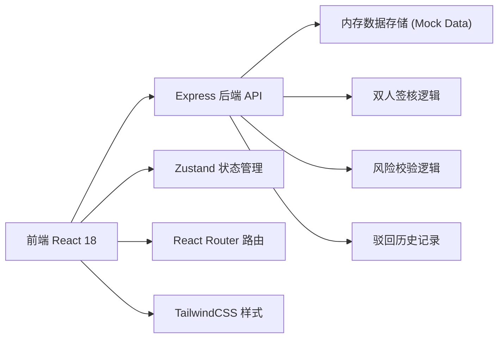
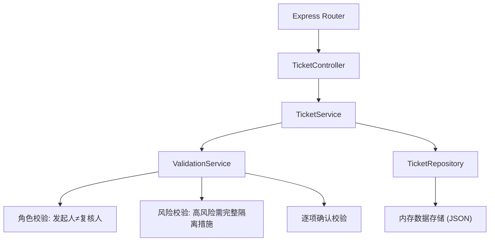
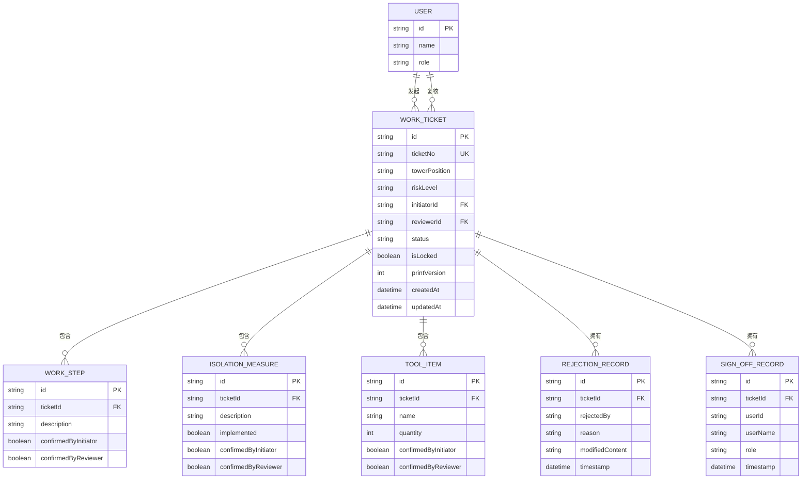

## 1. 架构设计



## 2. 技术描述
- **前端**：React@18 + TypeScript + TailwindCSS@3 + React Router DOM + Zustand + lucide-react
- **后端**：Express@4 + TypeScript + CORS
- **初始化工具**：vite-init (react-express-ts 模板)
- **数据存储**：使用内存数据 + JSON 文件预置数据，模拟数据库持久化

## 3. 路由定义
| 路由 | 页面 | 用途 |
|-------|------|------|
| / | 作业票列表页 | 查看所有作业票，按状态筛选搜索 |
| /create | 发起作业票表单页 | 创建新作业票 |
| /review | 复核工作台 | 待复核作业票列表和签核操作 |
| /ticket/:id | 作业票详情/打印预览 | 查看详情、修改驳回票、打印预览 |

## 4. API 定义

### 4.1 TypeScript 类型定义

```typescript
// 作业票状态
type TicketStatus = 'pending_review' | 'rejected' | 'approved' | 'high_risk_incomplete' | 'locked';

// 风险等级
type RiskLevel = 'low' | 'medium' | 'high';

// 用户
interface User {
  id: string;
  name: string;
  role: 'initiator' | 'reviewer' | 'both';
}

// 作业步骤
interface WorkStep {
  id: string;
  description: string;
  confirmedByInitiator: boolean;
  confirmedByReviewer: boolean;
}

// 隔离措施
interface IsolationMeasure {
  id: string;
  description: string;
  implemented: boolean;
  confirmedByInitiator: boolean;
  confirmedByReviewer: boolean;
}

// 工具清单
interface ToolItem {
  id: string;
  name: string;
  quantity: number;
  confirmedByInitiator: boolean;
  confirmedByReviewer: boolean;
}

// 驳回记录
interface RejectionRecord {
  id: string;
  timestamp: string;
  rejectedBy: string;
  reason: string;
  modifiedContent?: string;
}

// 签核记录
interface SignOffRecord {
  userId: string;
  userName: string;
  timestamp: string;
  role: 'initiator' | 'reviewer';
}

// 作业票
interface WorkTicket {
  id: string;
  ticketNo: string;
  towerPosition: string;
  towerConfirmedByInitiator: boolean;
  towerConfirmedByReviewer: boolean;
  workSteps: WorkStep[];
  isolationMeasures: IsolationMeasure[];
  tools: ToolItem[];
  riskLevel: RiskLevel;
  riskConfirmedByInitiator: boolean;
  riskConfirmedByReviewer: boolean;
  initiatorId: string;
  initiatorName: string;
  reviewerId: string;
  reviewerName: string;
  status: TicketStatus;
  rejectionHistory: RejectionRecord[];
  signOffs: SignOffRecord[];
  isLocked: boolean;
  printVersion: number;
  createdAt: string;
  updatedAt: string;
}
```

### 4.2 API 端点

| 方法 | 路径 | 说明 |
|------|------|------|
| GET | /api/tickets | 获取所有作业票，支持 status 和 keyword 查询 |
| GET | /api/tickets/:id | 获取单张作业票详情 |
| POST | /api/tickets | 创建新作业票 |
| PUT | /api/tickets/:id | 更新作业票（发起人修改驳回的票） |
| POST | /api/tickets/:id/approve | 复核通过（含风险校验、角色校验、逐项确认校验） |
| POST | /api/tickets/:id/reject | 驳回作业票（必填驳回原因） |
| POST | /api/tickets/:id/lock | 锁定已通过的作业票 |
| POST | /api/tickets/:id/print | 记录打印版本号 |
| GET | /api/users | 获取用户列表 |

## 5. 服务器架构



## 6. 数据模型

### 6.1 ER 图



### 6.2 预置数据说明
预置 8 张以上作业票，覆盖状态：
- 待复核 (pending_review)：2-3张
- 驳回 (rejected)：1-2张，包含驳回历史
- 通过 (approved)：1-2张
- 高风险缺项 (high_risk_incomplete)：1张，高风险且隔离措施不完整
- 已锁定 (locked)：1-2张，已通过并锁定

预置 5-6 个用户，包含发起人角色、复核人角色和双角色用户。
