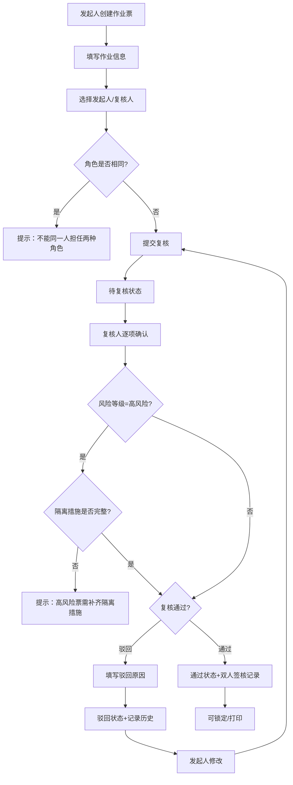

## 1. 产品概述
桅骨风车双人复核作业票系统是一套用于风电运维作业的安全管控系统，通过发起人创建作业票、复核人二次确认的双人签核机制，确保塔位作业的安全性和合规性。系统面向风电运维团队，解决单人作业审批风险高、隔离措施落实不到位的问题。

## 2. 核心功能

### 2.1 用户角色
| 角色 | 说明 | 核心权限 |
|------|------|----------|
| 发起人 | 运维工程师，创建作业票 | 发起作业票、填写作业信息、查看驳回原因并修改、打印作业票 |
| 复核人 | 运维班长/安全员，二次审核 | 复核作业票、通过/驳回、锁定已通过作业票 |

### 2.2 功能模块
1. **作业票列表页**：按状态筛选、搜索、查看全部作业票
2. **发起作业票表单**：填写塔位、作业步骤、隔离措施、工具清单、风险等级
3. **复核工作台**：展示待复核作业票、双人签核确认、风险校验提示
4. **风险校验**：高风险作业票自动校验隔离措施完整性
5. **驳回修改记录**：记录每次驳回原因和修改历史
6. **打印预览**：生成可打印的作业票格式，记录打印版本

### 2.3 页面详情
| 页面名称 | 模块名称 | 功能描述 |
|-----------|-------------|---------------------|
| 作业票列表页 | 顶部导航 | 系统名称、用户切换、发起按钮 |
| 作业票列表页 | 筛选栏 | 按状态筛选（待复核/驳回/通过/高风险缺项/已锁定）、搜索 |
| 作业票列表页 | 票列表卡片 | 展示票号、塔位、发起人、复核人、状态、风险等级、操作按钮 |
| 发起表单页 | 表单主体 | 塔位、作业步骤、隔离措施、工具清单、风险等级表单 |
| 发起表单页 | 角色校验 | 选择发起人后自动校验不能与复核人为同一人 |
| 发起表单页 | 提交操作 | 暂存、提交复核 |
| 复核工作台页 | 待办列表 | 展示待复核的作业票 |
| 复核工作台页 | 复核详情 | 逐项确认塔位、作业步骤、隔离措施、工具清单、风险等级 |
| 复核工作台页 | 风险校验 | 高风险票校验隔离措施，缺项时禁止通过 |
| 复核工作台页 | 签核操作 | 通过、驳回（需填写原因）、锁定 |
| 详情/打印页 | 详情展示 | 展示作业票完整信息、双人签核、驳回历史 |
| 详情/打印页 | 打印预览 | 打印样式、版本记录 |

## 3. 核心流程
发起人登录系统后创建作业票，填写塔位信息、作业步骤、隔离措施、工具清单并评估风险等级，提交后进入待复核状态。复核人在复核工作台逐项确认所有信息，系统自动校验：同一人不能同时担任发起和复核角色；高风险作业票必须隔离措施完整才能通过。复核通过后作业票生效，可锁定和打印；驳回则返回发起人修改，系统记录驳回原因和修改历史。

## 4. 用户界面设计
### 4.1 设计风格
- **主色调**：工业深蓝（#1e3a5f）搭配警示橙（#ea580c），体现工业安全专业感
- **辅助色**：成功绿（#16a34a）、警告黄（#ca8a04）、危险红（#dc2626）对应不同状态
- **按钮风格**：方形微圆角（4px），2px边框，hover有轻微上浮效果
- **字体**：标题使用思源黑体Bold，正文使用思源黑体Regular，等宽字体展示票号
- **布局风格**：卡片式布局，顶部导航+左侧筛选+右侧内容区
- **图标**：使用 lucide-react 线性图标，与工业风格统一

### 4.2 页面设计概述
| 页面名称 | 模块名称 | UI元素 |
|-----------|-------------|-------------|
| 作业票列表页 | 顶部导航栏 | 深色背景、系统标题、用户切换下拉、主操作按钮 |
| 作业票列表页 | 状态筛选栏 | Tab式筛选，选中项有底部橙色下划线高亮 |
| 作业票列表页 | 列表卡片 | 白色卡片、票号等宽字体、状态徽章、风险等级色条、操作按钮 |
| 发起表单页 | 表单 | 分组折叠面板、每项必填校验、隔离措施列表支持增删 |
| 复核工作台页 | 待办卡片 | 待办数量角标、逐项确认勾选框、风险高亮提示 |
| 详情/打印页 | 打印区域 | 简洁黑白打印样式、签核签名区、版本号水印 |

### 4.3 响应式
桌面端优先设计，支持平板横屏适配，窄屏下筛选栏折叠为下拉选择。
