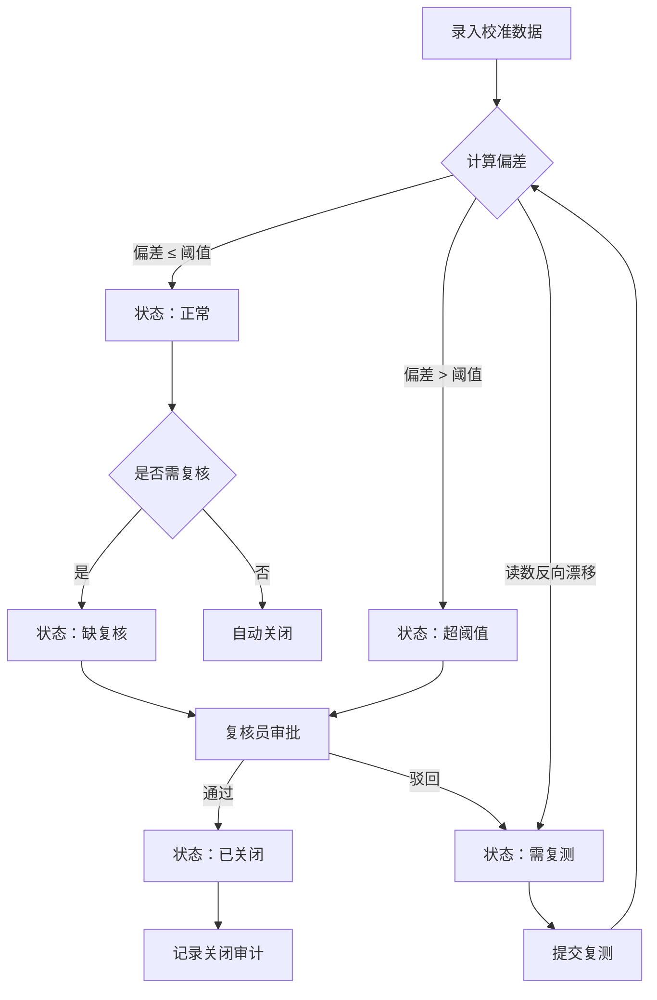

## 1. 产品概述

桅骨风车传感器校准异常处理台是一套面向风力发电运维团队的传感器校准异常管理工具，用于录入、分类、跟踪和关闭传感器校准过程中出现的各类异常，确保传感器读数偏差在可控范围内并留有完整审计链路。

## 2. 核心功能

### 2.1 用户角色

| 角色 | 注册方式 | 核心权限 |
|------|----------|----------|
| 运维工程师 | 管理员分配 | 录入异常、提交复测、查看队列 |
| 复核员 | 管理员分配 | 复核异常、驳回或通过、关闭异常 |
| 系统管理员 | 管理员分配 | 管理阈值规则、规则版本、审计查询 |

### 2.2 功能模块

1. **异常队列页**：全局异常列表，按状态过滤，支持搜索与排序
2. **校准详情页**：录入/查看单条异常的完整校准数据与状态流转
3. **阈值规则页**：管理偏差阈值规则及其版本历史
4. **复测记录页**：查看某条异常的全部复测历史
5. **复核面板页**：复核员集中审批待复核异常
6. **关闭原因页**：记录关闭异常的原因与审计信息

### 2.3 页面详情

| 页面名称 | 模块名称 | 功能描述 |
|----------|----------|----------|
| 异常队列 | 筛选栏 | 按状态（正常/需复测/超阈值/缺复核/已关闭）过滤，按传感器编号/塔位搜索 |
| 异常队列 | 列表区 | 展示异常编号、传感器编号、塔位、偏差值、状态、处理人、时间，支持排序 |
| 校准详情 | 录入表单 | 传感器编号、安装塔位、校准前读数、校准后读数、偏差阈值、处理人、复核意见 |
| 校准详情 | 状态标签 | 系统自动计算并展示当前状态（正常/需复测/超阈值/缺复核/已关闭） |
| 校准详情 | 流转时间线 | 展示该异常的所有状态变更记录 |
| 阈值规则 | 规则列表 | 展示当前生效的偏差阈值规则，支持新增/编辑 |
| 阈值规则 | 版本历史 | 展示规则的历史版本与变更记录 |
| 复测记录 | 复测列表 | 展示某异常的所有复测记录（校准前/后读数、偏差、复测人、时间） |
| 复测记录 | 新增复测 | 对"需复测"状态的异常提交新的校准读数 |
| 复核面板 | 待复核列表 | 展示所有待复核异常，含复核意见输入 |
| 复核面板 | 审批操作 | 通过（→已关闭/正常）或驳回（→需复测） |
| 关闭原因 | 关闭表单 | 选择关闭类型（已修复/误报/重复上报/其他）并填写详细原因 |
| 关闭原因 | 审计日志 | 展示关闭操作的操作人、时间、原因 |

## 3. 核心流程

用户录入传感器校准数据 → 系统自动计算偏差并分类状态（正常/需复测/超阈值） → 复核员审核 → 驳回则进入需复测 → 复测后重新提交 → 复核通过后可关闭 → 全程记录状态流转与审计

## 4. 用户界面设计

### 4.1 设计风格

- 主色调：深海蓝 (#0A1628) + 钢铁灰 (#1B2A4A)，强调工业运维氛围
- 辅助色：琥珀警示 (#F59E0B) 用于超阈值，翡翠绿 (#10B981) 用于正常，冰蓝 (#38BDF8) 用于交互
- 按钮风格：圆角矩形，略带3D阴影效果，操作按钮使用填充色，辅助按钮使用描边
- 字体：标题使用 Noto Sans SC Bold，正文使用 Noto Sans SC Regular，数据使用 JetBrains Mono
- 布局风格：左侧导航 + 右侧内容区，卡片式模块
- 图标风格：线性图标，2px 线宽，圆角端点

### 4.2 页面设计概述

| 页面名称 | 模块名称 | UI元素 |
|----------|----------|--------|
| 异常队列 | 筛选栏 | 状态标签组（胶囊按钮）、搜索输入框、塔位下拉 |
| 异常队列 | 列表区 | 表格布局、状态徽章、行悬停高亮、斑马纹 |
| 校准详情 | 录入表单 | 双列布局表单、输入校验提示、自动计算偏差 |
| 校准详情 | 状态标签 | 彩色徽章、动画过渡 |
| 校准详情 | 流转时间线 | 竖向时间线、节点颜色区分状态 |
| 阈值规则 | 规则列表 | 卡片网格、版本号标签 |
| 阈值规则 | 版本历史 | 时间线折叠面板 |
| 复测记录 | 复测列表 | 表格 + 展开行详情 |
| 复核面板 | 待复核列表 | 卡片列表、内嵌复核意见文本框 |
| 复核面板 | 审批操作 | 通过（绿色）/ 驳回（红色）按钮 |
| 关闭原因 | 关闭表单 | 模态对话框、下拉选择 + 文本域 |
| 关闭原因 | 审计日志 | 时间线 + 详情卡片 |

### 4.3 响应式设计

- 桌面端优先（1440px 基准）
- 平板端（768px-1024px）：侧边导航折叠为汉堡菜单，表格简化列
- 移动端（<768px）：单列布局，表格转为卡片列表
