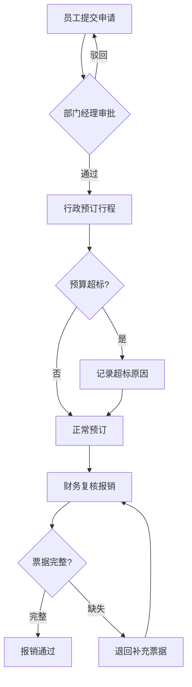

# 差旅预订超标审批与报销核验系统 PRD

## 1. 产品概述

**项目名称**: 差旅报销管理系统 (Travel Expense Management System)

**项目简介**:
针对企业差旅费用管控的系统，实现差旅申请、预算审批、行程预订、报销核验全流程数字化管理。

**目标用户**:
- 普通员工：提交差旅申请
- 部门经理：审批差旅预算
- 行政人员：预订机票酒店
- 财务人员：复核报销单据

**核心价值**:
- 规范差旅审批流程，减少人为失误
- 实时追踪预算执行情况
- 票据完整性核验，杜绝报销漏洞
- 多维度统计分析，辅助成本管控

---

## 2. 核心功能

### 2.1 用户角色与权限

| 角色 | 申请差旅 | 审批预算 | 预订行程 | 复核报销 | 系统管理 |
|------|---------|---------|---------|---------|---------|
| 员工 | ✓ | - | - | - | - |
| 部门经理 | ✓ | ✓ | - | - | - |
| 行政 | - | - | ✓ | - | - |
| 财务 | - | - | - | ✓ | - |
| 管理员 | ✓ | ✓ | ✓ | ✓ | ✓ |

### 2.2 功能模块

**1. 差旅申请模块**
- 新建差旅申请（目的地、出差日期、预计费用、事由）
- 查看申请历史和状态
- 上传相关票据

**2. 预算审批模块**
- 部门经理查看待审批申请
- 审批通过/驳回操作
- 填写审批意见和预算调整

**3. 行程预订模块**
- 行政根据申请预订机票、酒店
- 标记预订状态和实际费用
- 超标原因记录

**4. 报销核验模块**
- 财务复核报销单据完整性
- 检查票据是否缺失（缺失时禁止通过）
- 核对实际费用与预算差异

**5. 统计报表模块**
- 按部门汇总差旅费用
- 按城市分析出差频次
- 按超标原因分析超支情况
- 按报销周期聚合数据

### 2.3 页面详情

| 页面名称 | 模块名称 | 功能描述 |
|---------|---------|---------|
| 登录页 | 用户认证 | 用户登录、角色识别 |
| 申请列表页 | 申请管理 | 展示当前用户差旅申请列表，支持筛选 |
| 申请详情页 | 申请详情 | 显示出差人、城市、酒店航班、预算差异、票据、历史节点 |
| 新建申请页 | 申请表单 | 填写出差信息、上传预算附件 |
| 审批列表页 | 审批管理 | 待审批申请列表（部门经理） |
| 预订管理页 | 行程预订 | 行政预订机票酒店（HTMX动态更新） |
| 报销复核页 | 报销核验 | 财务复核票据完整性 |
| 统计报表页 | 数据统计 | 多维度聚合数据展示 |

---

## 3. 核心流程

### 3.1 差旅申请审批流程

### 3.2 票据核验规则

- 机票：必须包含电子客票行程单
- 酒店：必须包含发票
- 餐饮：必须包含发票（如超标需特殊审批）
- 票据缺失时，系统禁止财务提交"报销通过"操作

---

## 4. 预置样本数据

### 4.1 正常报销案例
- 员工：张三
- 目的地：上海
- 预算：5000元，实际：4800元
- 票据：完整

### 4.2 酒店超标案例
- 员工：李四
- 目的地：北京
- 预算酒店：400元/晚，实际：650元/晚
- 超标原因：旺季上调

### 4.3 行程变更案例
- 员工：王五
- 原定行程：3天，变更为5天
- 费用增加：2000元

### 4.4 票据缺失案例
- 员工：赵六
- 缺少酒店发票
- 状态：等待补充票据

---

## 5. 用户界面设计

### 5.1 设计风格
- **整体风格**: 企业级管理后台，简洁专业
- **配色方案**:
  - 主色：#2563EB（蓝色）
  - 辅助色：#64748B（灰蓝）
  - 强调色：#10B981（绿色通过）、#EF4444（红色拒绝/警告）
  - 背景色：#F8FAFC（浅灰白）
- **字体**: Inter + Noto Sans SC
- **布局**: 侧边导航 + 内容区

### 5.2 组件样式
- 卡片式布局，带圆角和阴影
- 按钮：圆角12px，主色填充
- 状态标签：圆角药丸形
- HTMX 加载指示器：旋转动画

### 5.3 响应式策略
- 桌面端优先设计
- 平板适配（断点：1024px）
- 移动端基础支持（断点：768px）

---

## 6. 字段设计

### 6.1 差旅申请表
| 字段名 | 类型 | 说明 |
|-------|------|-----|
| id | UUID | 主键 |
| applicant | FK(User) | 申请人 |
| department | FK(Department) | 部门 |
| destination_city | VARCHAR(50) | 目的地城市 |
| purpose | TEXT | 出差事由 |
| estimated_budget | DECIMAL(10,2) | 预计预算 |
| start_date | DATE | 开始日期 |
| end_date | DATE | 结束日期 |
| status | ENUM | 状态：草稿/待审批/待预订/待报销/已完成/已驳回 |
| created_at | DATETIME | 创建时间 |

### 6.2 行程预订表
| 字段名 | 类型 | 说明 |
|-------|------|-----|
| id | UUID | 主键 |
| travel | FK(Travel) | 关联差旅申请 |
| flight_info | JSON | 航班信息 |
| hotel_info | JSON | 酒店信息 |
| actual_cost | DECIMAL(10,2) | 实际费用 |
| over_budget_reason | TEXT | 超标原因（可为空） |
| booking_status | ENUM | 待预订/已预订/已确认 |

### 6.3 报销单表
| 字段名 | 类型 | 说明 |
|-------|------|-----|
| id | UUID | 主键 |
| travel | FK(Travel) | 关联差旅申请 |
| total_actual_cost | DECIMAL(10,2) | 实际总费用 |
| receipt_status | ENUM | 完整/缺失/待补充 |
| missing_receipts | TEXT | 缺失票据描述 |
| finance_comments | TEXT | 财务复核意见 |
| review_status | ENUM | 待复核/已通过/已退回 |

### 6.4 历史节点表
| 字段名 | 类型 | 说明 |
|-------|------|-----|
| id | UUID | 主键 |
| travel | FK(Travel) | 关联差旅申请 |
| action_type | VARCHAR(50) | 动作类型 |
| actor | FK(User) | 操作人 |
| comment | TEXT | 操作备注 |
| created_at | DATETIME | 操作时间 |

---

## 7. 验收标准

### 7.1 功能验收
- [ ] 用户可登录并根据角色看到不同功能
- [ ] 员工可创建、提交差旅申请
- [ ] 部门经理可审批申请
- [ ] 行政可预订行程并标记超标原因
- [ ] 财务可复核报销单，票据缺失时禁止通过
- [ ] 详情页展示完整出差信息

### 7.2 预置数据验收
- [ ] 包含正常报销案例
- [ ] 包含酒店超标案例
- [ ] 包含行程变更案例
- [ ] 包含票据缺失案例

### 7.3 统计验收
- [ ] 按部门聚合统计数据
- [ ] 按城市聚合统计数据
- [ ] 按超标原因聚合统计数据
- [ ] 按报销周期聚合统计数据
