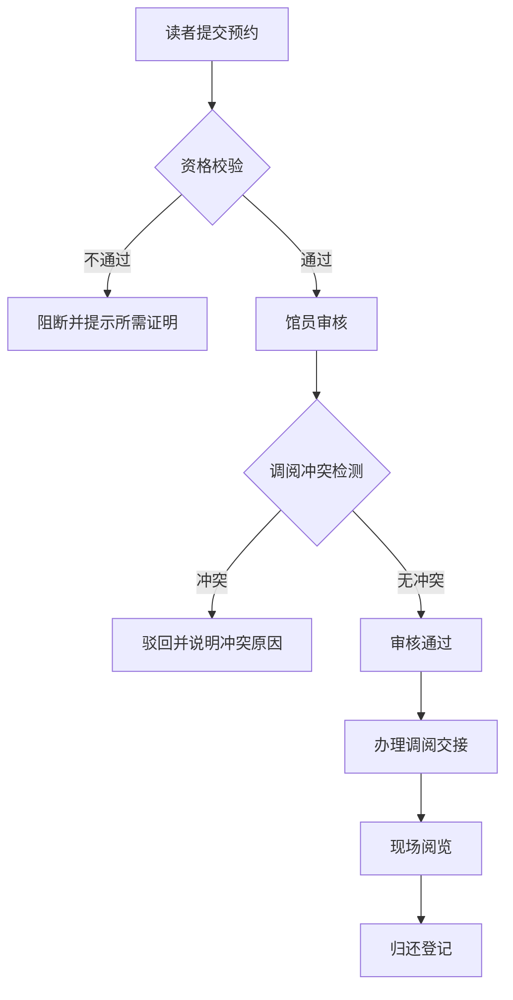
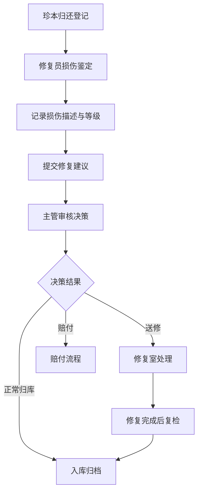

# 图书馆珍本阅览预约与损伤鉴定系统 - 产品需求文档

## 1. 产品概述

图书馆珍本阅览预约与损伤鉴定系统是一套面向古籍/珍本馆藏管理的全流程业务系统，覆盖珍本从读者预约、馆员调阅、现场阅览到归库损伤鉴定的完整生命周期。系统旨在规范珍本调阅流程、明确交接责任、追踪损伤状况，并为馆藏保护提供数据支撑。

- **核心问题**：珍本调阅流程不透明、损伤责任难以界定、缺乏系统化的鉴定与归库决策机制
- **目标用户**：读者（研究人员/学生）、馆员、修复员、馆藏主管
- **产品价值**：实现珍本调阅全流程可追溯，损伤鉴定标准化，归库决策数据化

## 2. 核心功能

### 2.1 用户角色

| 角色 | 注册方式 | 核心权限 |
|------|----------|----------|
| 读者 | 管理员创建/自助注册 | 提交预约申请、查看预约状态、阅览珍本 |
| 馆员 | 管理员分配 | 审核预约、办理调阅与归还交接、维护书目信息 |
| 修复员 | 管理员分配 | 损伤鉴定、记录损伤描述与等级、提交修复建议 |
| 主管 | 管理员分配 | 最终决策（归库/修复/赔付）、查看统计报表、管理用户 |

### 2.2 功能模块

1. **珍本书目管理**：珍本信息录入与维护、馆藏分类、状态管理
2. **预约管理**：读者提交预约、资格校验、预约列表与详情
3. **调阅审核**：馆员审核预约、调阅冲突检测、办理交接
4. **阅览管理**：阅览时段记录、现场交接、归还登记
5. **损伤鉴定**：修复员鉴定损伤、记录描述与等级、历史比对
6. **归库决策**：主管决策归库/修复/赔付、记录决策理由
7. **统计分析**：多维度统计报表、数据可视化
8. **历史追溯**：每册珍本的完整流转历史与时间线

### 2.3 页面详情

| 页面名称 | 模块名称 | 功能描述 |
|----------|----------|----------|
| 首页 | 概览卡片、快捷入口 | 展示待办事项统计、珍本总数、今日预约等 |
| 书目列表页 | 筛选、搜索、卡片列表 | 按馆藏类别、状态筛选珍本，支持搜索 |
| 书目详情页 | 基本信息、历史时间线、预约记录 | 展示珍本详情、完整历史节点、损伤记录 |
| 预约列表页 | 状态筛选、分页 | 按状态查看预约申请 |
| 预约提交页 | 表单、资格校验 | 读者填写预约信息，实时校验资格 |
| 预约详情页 | 预约信息、操作按钮、交接记录 | 完整展示预约全流程信息与操作入口 |
| 损伤鉴定页 | 损伤描述、等级评定、修复建议 | 修复员记录鉴定结果 |
| 归库决策页 | 决策选项、理由填写 | 主管做出最终决策 |
| 统计页 | 多维度图表 | 按馆藏类别、预约人类型、损伤等级、处理时长聚合统计 |

## 3. 核心流程

### 3.1 预约与调阅流程

读者提交珍本预约申请，系统自动校验预约资格（如读者类型、证明材料、历史违规记录）。资格不足时阻断申请并明确告知所需补充的证明材料。资格通过后，馆员审核预约，检测调阅时间冲突。审核通过后办理调阅交接，读者在指定时段到馆阅览。

### 3.2 归库与损伤鉴定流程

珍本归还后，由修复员进行损伤鉴定，记录损伤描述、评定损伤等级、提交修复建议。最后由主管做出最终决策：正常归库、送修复室修复、或要求读者赔付。

## 4. 用户界面设计

### 4.1 设计风格

- **设计主题**：典雅学术风，体现古籍珍本的文化厚重感
- **主色调**：深栗色 (#5D2906) 作为主色，搭配米黄色 (#F5EFE0) 背景，营造古籍质感
- **辅助色**：墨青色 (#2C5F5D) 用于强调元素，朱砂红 (#8B2635) 用于警示与损伤标记
- **字体**：标题使用衬线字体（如 Noto Serif SC），正文使用清晰易读的无衬线字体
- **按钮风格**：圆角矩形，带有细腻的边框与微妙的阴影，悬停时有深度变化
- **布局风格**：卡片式布局，留白充足，层次分明，左侧导航 + 右侧内容区
- **装饰元素**：细边框分隔、淡色底纹、卷草纹边角装饰

### 4.2 页面设计概览

| 页面名称 | 模块名称 | UI 元素 |
|----------|----------|---------|
| 首页 | 概览仪表盘 | 四色统计卡片、待办事项列表、快捷操作按钮 |
| 书目列表 | 卡片网格 | 珍本封面缩略图、书名、馆藏类别标签、状态徽章 |
| 书目详情 | 双栏布局 | 左侧基本信息卡片，右侧历史时间线 + 损伤记录 |
| 预约详情 | 时间线+信息块 | 顶部书目摘要，中部流程时间线，底部操作区 |
| 统计页 | 图表网格 | 柱状图、饼图、环形图、数据表格 |

### 4.3 响应式

- 桌面端优先设计，适配 1280px 以上屏幕
- 平板端：侧边栏收起为图标导航，内容区自适应
- 移动端：底部 Tab 导航，卡片垂直堆叠

### 4.4 交互细节

- 时间线节点：点击可展开查看详情，状态变化有平滑过渡动画
- HTMX 局部刷新：表单提交、状态变更不刷新整页
- 悬停效果：卡片微上浮、按钮深度变化、链接下划线动画
- 加载状态：骨架屏 + 渐入动画
