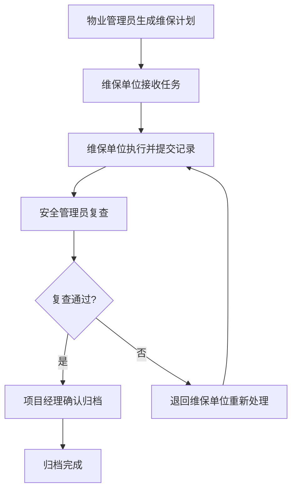
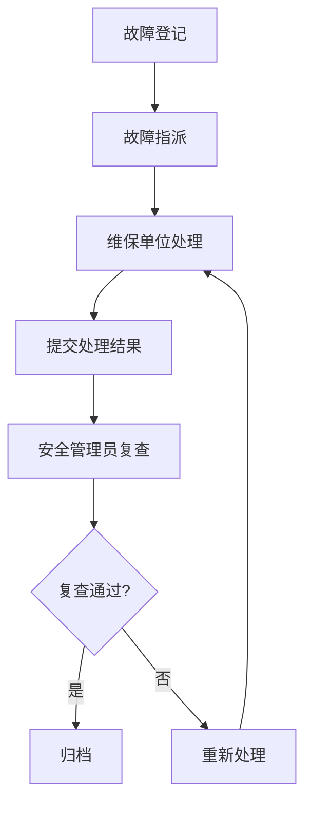

# 物业电梯维保计划执行与故障复查系统 - 产品需求文档

## 1. 产品概述

物业电梯维保计划执行与故障复查系统是一款面向物业管理场景的专业化电梯维保管理平台。系统围绕单台电梯实现从计划维保、故障处理到复查归档的闭环管理，解决传统维保管理中信息不透明、流程不规范、超期风险预警缺失等问题。

**核心价值：**
- 实现维保计划、执行、复查全流程数字化管理
- 超期风险实时预警，保障电梯安全运行
- 多维度看板聚合，便于管理层决策分析

**目标用户：**
- 物业管理员：生成维保计划
- 维保单位：提交维保记录
- 安全管理员：复查维保与故障处理结果
- 项目经理：确认归档或退回

---

## 2. 功能模块

### 2.1 用户角色

| 角色 | 职责 | 核心权限 |
|------|------|----------|
| 物业管理员 | 生成电梯维保计划，跟进执行进度 | 创建计划、查看电梯列表、指派维保单位 |
| 维保单位 | 接收维保任务，执行并提交维保记录 | 提交维保记录、上传附件、处理故障 |
| 安全管理员 | 复查维保记录和故障处理结果 | 复查确认、风险评级、生成复查意见 |
| 项目经理 | 最终审核，确认归档或退回 | 归档确认、退回处理、查看统计看板 |

### 2.2 功能模块划分

1. **电梯管理** - 电梯档案、楼栋信息、安装位置
2. **维保计划** - 计划生成、执行跟踪、到期预警
3. **故障管理** - 故障登记、处理记录、复查确认
4. **复查归档** - 历史节点追溯、附件管理、归档确认
5. **统计看板** - 多维度数据聚合、风险预警展示

---

## 3. 核心页面

### 3.1 电梯详情页

| 模块 | 功能描述 |
|------|----------|
| 基本信息 | 电梯编号、型号、所在楼栋、安装日期 |
| 维保项列表 | 当前维保计划、项目清单、标准要求 |
| 故障描述 | 故障类型、发生时间、紧急程度、描述详情 |
| 附件占位 | 维保记录照片、故障现场照片、维修凭证 |
| 历史节点 | 时间轴展示：计划创建→执行→复查→归档/退回 |

### 3.2 维保看板页（多维度聚合）

| 聚合维度 | 说明 |
|----------|------|
| 按小区聚合 | 统计各小区电梯维保状态 |
| 按维保单位聚合 | 展示各维保单位任务数量和完成率 |
| 按故障类型聚合 | 电梯困人、门故障、通讯故障等分类统计 |
| 按超期天数聚合 | 0-3天、4-7天、7-15天、15天以上分级展示 |

### 3.3 风险预警面板

- **超期提醒**：维保超期时自动生成风险提示，卡片醒目展示
- **故障未修复预警**：超过24小时未处理的故障高亮警示
- **业主投诉标记**：关联投诉记录的电梯突出显示

---

## 4. 业务流程

### 4.1 主流程（维保计划执行）

### 4.2 故障处理流程

---

## 5. 预置样本数据

| 样本类型 | 状态描述 |
|----------|----------|
| 正常维保 | 计划执行中或已完成，维保单位按时提交记录 |
| 维保超期 | 已超期3天以上，未提交维保记录 |
| 故障未修复 | 电梯困人故障已登记，超过24小时未处理 |
| 业主投诉 | 业主通过APP投诉电梯异响，已关联电梯档案 |

---

## 6. UI设计指导

### 6.1 设计风格
- **主题**：专业可靠的物业管理风格，采用深蓝色为主色调
- **布局**：左侧导航栏 + 右侧内容区，卡片式信息展示
- **交互**：时间轴清晰展示流程节点，状态标签区分不同类型

### 6.2 颜色规范
| 用途 | 颜色 |
|------|------|
| 主色 | #1E40AF (深蓝) |
| 成功 | #059669 (绿色) |
| 警告 | #D97706 (橙色) |
| 危险 | #DC2626 (红色) |
| 信息 | #2563EB (蓝色) |

### 6.3 状态标签
| 状态 | 颜色 |
|------|------|
| 待执行 | 灰色 #6B7280 |
| 执行中 | 蓝色 #2563EB |
| 待复查 | 橙色 #D97706 |
| 已归档 | 绿色 #059669 |
| 已退回 | 红色 #DC2626 |
| 超期 | 红色 #DC2626 + 闪烁动画 |

---

## 7. 数据预置

系统初始化时预置以下样本数据：

1. **3个小区**：阳光花园、幸福里、锦绣城
2. **6台电梯**：每个小区2台
3. **4家维保单位**：各负责不同区域
4. **4类维保记录**：正常、维保超期、故障未修复、业主投诉
5. **若干历史节点**：展示完整流程追溯
