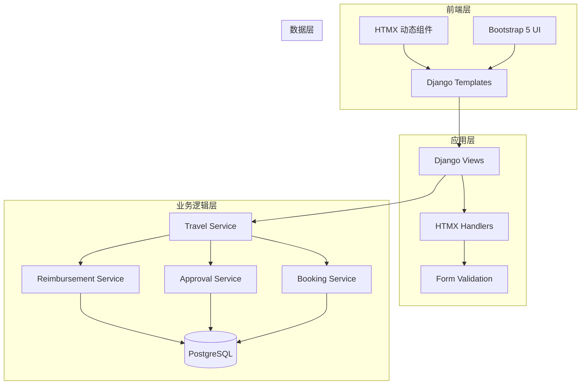

# 差旅报销管理系统 - 技术架构文档

## 1. 架构设计



---

## 2. 技术栈

| 层级 | 技术 | 版本 |
|------|------|------|
| 框架 | Django | 5.x |
| 前端 | HTMX | 1.9.x |
| UI框架 | Bootstrap | 5.3.x |
| 数据库 | PostgreSQL | 15+ |
| Python | Python | 3.11+ |

---

## 3. 项目结构

```
travel_expense/
├── config.yaml                 # 配置文件
├── manage.py
├── travel_expense/
│   ├── __init__.py
│   ├── settings.py
│   ├── urls.py
│   └── wsgi.py
├── core/
│   ├── __init__.py
│   ├── models.py              # 核心数据模型
│   ├── admin.py
│   ├── forms.py               # 表单定义
│   ├── views.py               # 视图函数
│   ├── urls.py                # 路由配置
│   ├── services/
│   │   ├── __init__.py
│   │   ├── travel_service.py
│   │   ├── approval_service.py
│   │   ├── booking_service.py
│   │   ├── reimbursement_service.py
│   │   └── statistics_service.py
│   ├── htmx/
│   │   ├── __init__.py
│   │   └── handlers.py        # HTMX 处理器
│   └── migrations/
├── templates/
│   ├── base.html
│   ├── travel/
│   │   ├── list.html
│   │   ├── detail.html
│   │   ├── create.html
│   │   ├── approval_list.html
│   │   ├── booking.html
│   │   ├── reimbursement.html
│   │   └── statistics.html
│   └── partials/
│       ├── travel_card.html
│       ├── status_badge.html
│       ├── receipt_checker.html
│       └── history_timeline.html
├── fixtures/
│   └── sample_data.json       # 预置样本数据
└── tests/
    ├── __init__.py
    ├── test_models.py
    ├── test_views.py
    └── test_services.py
```

---

## 4. 数据模型

### 4.1 ER 图

```mermaid
erDiagram
    User ||--o{ Travel : submits
    Department ||--o{ Travel : belongs_to
    Travel ||--|o| Booking : has_one
    Travel ||--|o| Reimbursement : has_one
    Travel ||--o{ HistoryNode : has_many
    User ||--o{ HistoryNode : performed_by

    User {
        uuid id PK
        string username
        string email
        string role
        uuid department_id FK
    }

    Department {
        uuid id PK
        string name
        string code
    }

    Travel {
        uuid id PK
        uuid applicant_id FK
        uuid department_id FK
        string destination_city
        text purpose
        decimal estimated_budget
        date start_date
        date end_date
        enum status
        datetime created_at
    }

    Booking {
        uuid id PK
        uuid travel_id FK
        json flight_info
        json hotel_info
        decimal actual_cost
        text over_budget_reason
        enum booking_status
    }

    Reimbursement {
        uuid id PK
        uuid travel_id FK
        decimal total_actual_cost
        enum receipt_status
        text missing_receipts
        text finance_comments
        enum review_status
    }

    HistoryNode {
        uuid id PK
        uuid travel_id FK
        uuid actor_id FK
        string action_type
        text comment
        datetime created_at
    }
```

---

## 5. 路由定义

| 路由 | 方法 | 功能 | 权限 |
|------|------|------|------|
| `/` | GET | 首页/仪表盘 | 登录用户 |
| `/travel/` | GET | 差旅申请列表 | 登录用户 |
| `/travel/create/` | GET/POST | 新建申请 | 员工/经理 |
| `/travel/<id>/` | GET | 申请详情 | 申请人/经理/行政/财务 |
| `/travel/<id>/submit/` | POST | 提交申请 | 申请人 |
| `/travel/approval/` | GET | 待审批列表 | 部门经理 |
| `/travel/<id>/approve/` | POST | 审批操作 | 部门经理 |
| `/travel/booking/` | GET | 预订管理 | 行政 |
| `/travel/<id>/booking/` | GET/POST | 行程预订 | 行政 |
| `/travel/reimbursement/` | GET | 报销复核 | 财务 |
| `/travel/<id>/reimburse/` | POST | 报销操作 | 财务 |
| `/travel/statistics/` | GET | 统计报表 | 管理员 |
| `/api/travel/<id>/htmx/` | GET | HTMX详情片段 | HTMX请求 |
| `/api/travel/<id>/receipt-check/` | GET | 票据检查 | HTMX请求 |

---

## 6. 核心业务逻辑

### 6.1 状态机

```
草稿(DRAFT) --> 待审批(PENDING_APPROVAL) --> 待预订(PENDING_BOOKING)
                                                      |
                                                      v
待报销(PENDING_REIMBURSEMENT) <-- 已预订(BOOKED) <---+
        |
        v
已完成(COMPLETED)  或  已驳回(REJECTED)
```

### 6.2 票据核验规则

```python
def validate_receipts(reimbursement):
    """
    票据完整性核验
    返回: (is_valid, missing_list)
    """
    missing = []

    # 检查机票票据
    if not reimbursement.has_flight_receipt:
        missing.append("电子客票行程单")

    # 检查酒店票据
    if not reimbursement.has_hotel_receipt:
        missing.append("酒店发票")

    # 餐饮票据（如果有餐饮报销）
    if reimbursement.has_meal_expense and not reimbursement.has_meal_receipt:
        missing.append("餐饮发票")

    return (len(missing) == 0, missing)
```

### 6.3 超标原因枚举

| 原因代码 | 描述 |
|---------|------|
| SEASONAL_HIGH | 旺季价格上调 |
| LOCATION_PRICE | 地点价格差异 |
| EMERGENCY_TRIP | 紧急出差无法提前预订 |
| EVENT_SPECIAL | 展会/会议期间价格上浮 |
| QUALITY_REQUIREMENT | 业务需要的品质要求 |
| OTHER | 其他原因 |

---

## 7. 预置样本数据

### 7.1 用户数据

| 用户名 | 角色 | 部门 |
|-------|------|------|
| employee_zhang | 员工 | 销售部 |
| employee_li | 员工 | 市场部 |
| employee_wang | 员工 | 技术部 |
| employee_zhao | 员工 | 运营部 |
| manager_chen | 部门经理 | 销售部 |
| admin_wu | 行政 | 行政部 |
| finance_xu | 财务 | 财务部 |

### 7.2 差旅申请样本

| 申请人 | 目的地 | 状态 | 特点 |
|-------|-------|------|------|
| employee_zhang | 上海 | 已完成 | 正常报销，预算5000，实际4800 |
| employee_li | 北京 | 待报销 | 酒店超标，预算400/晚，实际650/晚 |
| employee_wang | 深圳 | 待报销 | 行程变更，原3天变5天 |
| employee_zhao | 广州 | 待预订 | 票据缺失，缺少酒店发票 |

---

## 8. 统计报表 SQL

### 8.1 按部门统计

```sql
SELECT
    d.name as department,
    COUNT(t.id) as travel_count,
    SUM(t.estimated_budget) as total_budget,
    SUM(b.actual_cost) as total_actual
FROM core_travel t
JOIN core_department d ON t.department_id = d.id
LEFT JOIN core_booking b ON t.id = b.travel_id
GROUP BY d.id, d.name
ORDER BY total_actual DESC;
```

### 8.2 按超标原因统计

```sql
SELECT
    b.over_budget_reason,
    COUNT(*) as count,
    SUM(b.actual_cost - t.estimated_budget) as total_over_budget
FROM core_booking b
JOIN core_travel t ON b.travel_id = t.id
WHERE b.over_budget_reason IS NOT NULL
GROUP BY b.over_budget_reason;
```

### 8.3 按报销周期统计

```sql
SELECT
    DATE_TRUNC('month', r.created_at) as month,
    COUNT(*) as reimbursement_count,
    SUM(r.total_actual_cost) as total_amount
FROM core_reimbursement r
GROUP BY DATE_TRUNC('month', r.created_at)
ORDER BY month DESC;
```

---

## 9. HTMX 交互设计

### 9.1 动态更新点

| 场景 | 触发 | 更新内容 |
|------|------|---------|
| 审批操作 | 点击审批按钮 | 刷新申请状态、显示审批结果 |
| 预订更新 | 填写预订信息 | 实时计算预算差异 |
| 票据检查 | 上传/删除票据 | 显示缺失票据列表 |
| 历史节点 | 执行操作后 | 追加新的历史节点 |

### 9.2 HTMX 响应头

```
HX-Trigger: updateTravelStatus
HX-Redirect: /travel/<id>/
```

---

## 10. 配置管理

### 10.1 config.yaml

```yaml
database:
  host: localhost
  port: 5432
  name: travel_expense_db
  username: postgres
  password: postgres

app:
  debug: true
  secret_key: your-secret-key-here
  allowed_hosts:
    - localhost
    - 127.0.0.1

business:
  max_budget_per_day: 1000
  receipt_required_types:
    - flight
    - hotel
  over_budget_threshold: 1.2
```
