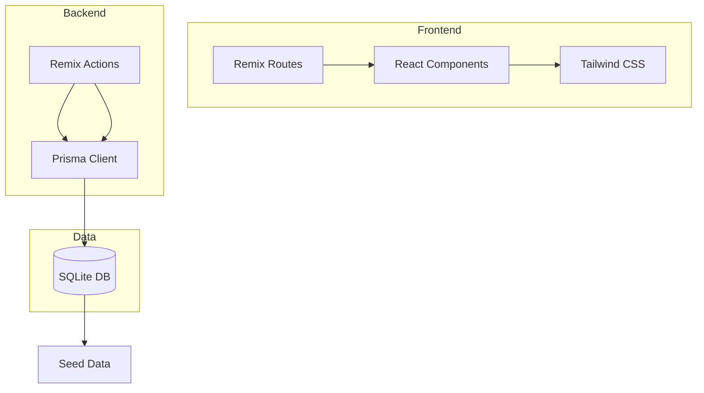
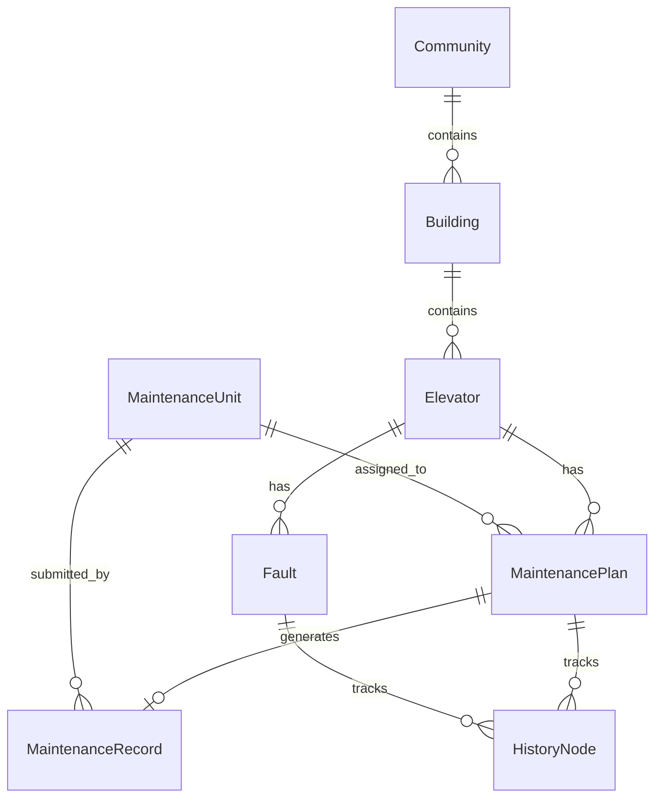

# 物业电梯维保计划执行与故障复查系统 - 技术架构文档

## 1. 架构设计

### 1.1 技术栈

| 层级 | 技术选型 |
|------|----------|
| 框架 | Remix (React Router v7) |
| 语言 | TypeScript |
| 数据库 | SQLite (通过 Prisma ORM) |
| 样式 | Tailwind CSS |
| 图表 | 内联SVG + CSS动画 |
| 图标 | Lucide React |

### 1.2 系统架构图



### 1.3 数据模型ER图



---

## 2. 路由定义

| 路由 | 页面说明 |
|------|----------|
| `/` | 首页仪表盘，展示统计概览 |
| `/elevators` | 电梯列表页 |
| `/elevators/:id` | 电梯详情页（含维保项、故障、历史节点） |
| `/plans` | 维保计划列表 |
| `/plans/new` | 创建新维保计划 |
| `/records/:id` | 维保记录详情 |
| `/faults` | 故障列表 |
| `/faults/:id` | 故障详情 |
| `/kanban` | 多维度聚合看板 |
| `/api/*` | API路由（如有需要） |

---

## 3. 数据模型定义

### 3.1 数据表结构

#### Community (小区)
| 字段 | 类型 | 说明 |
|------|------|------|
| id | String (PK) | UUID |
| name | String | 小区名称 |
| address | String | 地址 |
| createdAt | DateTime | 创建时间 |

#### Building (楼栋)
| 字段 | 类型 | 说明 |
|------|------|------|
| id | String (PK) | UUID |
| name | String | 楼栋名称 |
| communityId | String (FK) | 所属小区 |
| createdAt | DateTime | 创建时间 |

#### Elevator (电梯)
| 字段 | 类型 | 说明 |
|------|------|------|
| id | String (PK) | UUID |
| code | String | 电梯编号 |
| model | String | 电梯型号 |
| buildingId | String (FK) | 所属楼栋 |
| installDate | Date | 安装日期 |
| status | Enum | 正常/维保中/故障 |
| createdAt | DateTime | 创建时间 |

#### MaintenanceUnit (维保单位)
| 字段 | 类型 | 说明 |
|------|------|------|
| id | String (PK) | UUID |
| name | String | 单位名称 |
| contact | String | 联系电话 |
| createdAt | DateTime | 创建时间 |

#### MaintenancePlan (维保计划)
| 字段 | 类型 | 说明 |
|------|------|------|
| id | String (PK) | UUID |
| elevatorId | String (FK) | 电梯 |
| maintenanceUnitId | String (FK) | 维保单位 |
| planDate | Date | 计划维保日期 |
| dueDate | Date | 截止日期 |
| status | Enum | 待执行/执行中/待复查/已归档/已退回 |
| riskLevel | Enum | 正常/关注/警告/危险 |
| createdAt | DateTime | 创建时间 |

#### MaintenanceRecord (维保记录)
| 字段 | 类型 | 说明 |
|------|------|------|
| id | String (PK) | UUID |
| planId | String (FK) | 关联计划 |
| maintenanceUnitId | String (FK) | 提交单位 |
| items | JSON | 维保项清单 |
| submitDate | DateTime | 提交时间 |
| attachmentUrl | String? | 附件占位 |
| createdAt | DateTime | 创建时间 |

#### Fault (故障)
| 字段 | 类型 | 说明 |
|------|------|------|
| id | String (PK) | UUID |
| elevatorId | String (FK) | 电梯 |
| faultType | Enum | 电梯困人/门故障/通讯故障/其他 |
| description | String | 故障描述 |
| emergencyLevel | Enum | 一般/紧急/非常紧急 |
| status | Enum | 待处理/处理中/待复查/已解决 |
| reporter | String | 上报人 |
| reportDate | DateTime | 上报时间 |
| resolvedDate | DateTime? | 解决时间 |
| isOverdue | Boolean | 是否超期 |
| hasComplaint | Boolean | 是否有业主投诉 |
| createdAt | DateTime | 创建时间 |

#### HistoryNode (历史节点)
| 字段 | 类型 | 说明 |
|------|------|------|
| id | String (PK) | UUID |
| elevatorId | String (FK) | 电梯 |
| type | Enum | 计划创建/执行/复查/归档/退回/故障登记/故障处理 |
| title | String | 节点标题 |
| description | String? | 描述 |
| operator | String | 操作人 |
| operatorRole | Enum | 物业管理员/维保单位/安全管理员/项目经理 |
| createdAt | DateTime | 创建时间 |

---

## 4. 核心功能实现

### 4.1 超期风险预警逻辑

```typescript
// 计算风险等级
function calculateRiskLevel(dueDate: Date, status: string): RiskLevel {
  const today = new Date();
  const daysOverdue = differenceInDays(today, dueDate);

  if (daysOverdue <= 0) return 'normal';
  if (daysOverdue <= 3) return 'attention';
  if (daysOverdue <= 7) return 'warning';
  return 'danger';
}
```

### 4.2 看板聚合逻辑

| 聚合维度 | 实现方式 |
|----------|----------|
| 按小区 | GROUP BY community.name |
| 按维保单位 | GROUP BY maintenanceUnit.name |
| 按故障类型 | GROUP BY fault.faultType |
| 按超期天数 | CASE WHEN days BETWEEN 0 AND 3 THEN '0-3天' ... |

---

## 5. 预置数据

### 5.1 小区数据
1. 阳光花园 - 上海市浦东新区张江镇
2. 幸福里 - 上海市静安区南京西路
3. 锦绣城 - 上海市徐汇区漕河泾

### 5.2 维保单位数据
1. 东方电梯维保公司
2. 中电梯业服务
3. 安达电梯维护
4. 顺发电梯保养

### 5.3 样本任务
| 电梯 | 状态类型 | 说明 |
|------|----------|------|
| 阳光花园1号楼电梯A | 正常维保 | 计划执行中 |
| 阳光花园1号楼电梯B | 维保超期 | 超期5天未维保 |
| 幸福里2号楼电梯A | 故障未修复 | 电梯困人，超期24小时 |
| 锦绣城3号楼电梯A | 业主投诉 | 业主投诉异响 |

---

## 6. 项目结构

```
app/
├── routes/
│   ├── _index.tsx              # 首页
│   ├── elevators._index.tsx   # 电梯列表
│   ├── elevators.$id.tsx      # 电梯详情
│   ├── plans._index.tsx        # 维保计划列表
│   ├── plans.new.tsx           # 创建计划
│   ├── records.$id.tsx         # 维保记录
│   ├── faults._index.tsx       # 故障列表
│   ├── faults.$id.tsx          # 故障详情
│   └── kanban.tsx              # 看板
├── components/
│   ├── Sidebar.tsx
│   ├── StatusBadge.tsx
│   ├── RiskAlert.tsx
│   ├── HistoryTimeline.tsx
│   └── KanbanBoard.tsx
├── lib/
│   ├── db.server.ts            # Prisma客户端
│   └── utils.ts                # 工具函数
├── styles/
│   └── tailwind.css
└── root.tsx

prisma/
├── schema.prisma
├── seed.ts                     # 种子数据
└── dev.db                      # SQLite数据库

```
