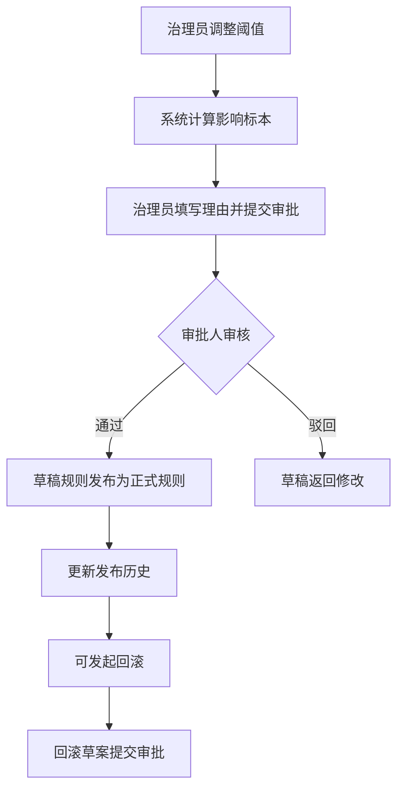

## 1. 产品概述

地衣标本阈值治理工具（地衣标本参数审阅舱）——为地衣标本采集数据提供阈值组治理能力。用户可调整采集海拔、附着基质、孢子密度、湿度暴露四类阈值，实时查看哪些记录从"通过"变为"警告"或"阻断"，每次调整必须填写理由并提交审批。支持审批流程、发布历史、回滚草案，以及跨季节复测后归属变化的追踪。

- 目标用户：地衣标本数据治理员、审批负责人
- 核心价值：让阈值变更过程可追溯、可审批、可回滚，防止误调导致数据质量退化

## 2. 核心功能

### 2.1 用户角色

| 角色 | 进入方式 | 核心权限 |
|------|----------|----------|
| 治理员 | 默认进入 | 调整阈值、提交审批、查看影响分析 |
| 审批人 | 指定审批人 | 审批通过/驳回、查看发布历史、回滚 |

### 2.2 功能模块

1. **阈值矩阵页**：四维阈值组编辑（海拔、基质、孢子密度、湿度暴露），实时计算影响数量
2. **影响样本列表页**：展示当前草稿规则下各标本的归属变化（通过→警告→阻断）
3. **审批记录页**：审批流程列表、审批详情、理由记录
4. **发布历史与回滚页**：已发布规则版本列表、回滚草案

### 2.3 页面详情

| 页面名称 | 模块名称 | 功能描述 |
|----------|----------|----------|
| 阈值矩阵 | 阈值编辑区 | 四维阈值滑块/输入框，调整时实时触发影响计算 |
| 阈值矩阵 | 当前规则概览 | 展示当前生效的已发布规则 vs 草稿规则对比 |
| 阈值矩阵 | 影响概览卡 | 显示影响标本数量：新增警告数、新增阻断数 |
| 影响样本 | 变更标本表 | 每条记录展示：标本编号、采集点、原归属、新归属、变更维度 |
| 影响样本 | 跨季节标注 | 同一采集点跨季节复测的标本高亮标注，展示归属变化轨迹 |
| 审批记录 | 审批列表 | 每条审批：提交时间、提交人、理由、状态（待审批/已通过/已驳回） |
| 审批记录 | 审批详情 | 展示阈值变更diff、影响标本数、审批意见 |
| 发布历史 | 版本时间线 | 已发布规则的版本号、发布时间、变更摘要 |
| 发布历史 | 回滚草案 | 选择历史版本生成回滚草案，需审批后生效 |

## 3. 核心流程

1. 治理员在阈值矩阵页面调整某一维度的阈值参数
2. 系统实时计算受影响标本数量，更新影响概览卡
3. 治理员填写调整理由，提交审批
4. 审批人查看审批详情（阈值变更diff + 影响标本列表）
5. 审批人通过/驳回审批
6. 审批通过后，草稿规则成为新的已发布规则
7. 在发布历史中可查看所有已发布版本，支持回滚

## 4. 用户界面设计

### 4.1 设计风格

- 主色调：深松绿（#1B4332）+ 浅苔绿（#95D5B2），呼应地衣自然生态
- 强调色：琥珀黄（#E9C46A）用于警告，赭红（#E76F51）用于阻断
- 按钮风格：圆角8px，微阴影，hover时加深
- 字体：Noto Serif SC（标题）+ Noto Sans SC（正文）
- 布局风格：左侧导航 + 右侧主内容区，卡片式布局

### 4.2 页面设计概览

| 页面名称 | 模块名称 | UI元素 |
|----------|----------|--------|
| 阈值矩阵 | 阈值编辑区 | 四行卡片，每行含维度名称、滑块、数值输入、阈值区间标注 |
| 阈值矩阵 | 规则对比 | 左右对比卡片：当前正式 vs 草稿，变更维度高亮 |
| 阈值矩阵 | 影响概览卡 | 三列统计卡（通过→警告、通过→阻断、警告→阻断），数字大字显示 |
| 影响样本 | 变更标本表 | 表格：编号、采集点、季节、原归属标签、新归属标签、变更维度标签 |
| 影响样本 | 跨季节标注 | 跨季节复测行左侧显示季节连接线图标，hover展示归属变化轨迹 |
| 审批记录 | 审批列表 | 时间线布局，每条含状态徽标、理由摘要、操作按钮 |
| 审批记录 | 审批详情 | 弹窗/面板：阈值diff对比表 + 影响标本摘要 + 审批意见输入 |
| 发布历史 | 版本时间线 | 竖向时间线，每个节点含版本号、发布时间、变更摘要 |
| 发布历史 | 回滚草案 | 选择历史版本后生成回滚卡片，显示将回滚至的规则 + 影响预览 |

### 4.3 响应式

- 桌面优先设计，最小宽度1280px
- 表格在窄屏时支持横向滚动
- 卡片布局在小屏幕下从多列变单列

## 5. 特殊场景：跨季节复测归属变化

同一采集点在不同季节（如春季/秋季）采集的地衣标本，在阈值调整后可能出现归属变化：
- 春季采集标本：因湿度暴露值低，在旧阈值下"通过"，新阈值下"警告"
- 秋季复测标本：因孢子密度值高，在旧阈值下"警告"，新阈值下"阻断"
- 系统需标注同一采集点跨季节的关联标本，展示归属变化轨迹，辅助治理员理解阈值调整对同一点不同季节数据的差异化影响
