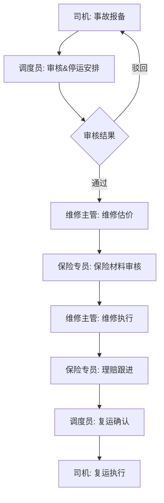

# 运输车队事故报备与维修理赔协同系统 PRD

## 1. 项目概述

### 1.1 项目背景
运输车队在日常运营中，车辆事故处理涉及多个角色协同，流程繁琐，信息传递效率低。本系统旨在实现事故报备、维修安排、保险理赔的全流程数字化协同。

### 1.2 目标用户
- **司机**：事故报备、现场材料上传、复运确认
- **调度员**：事故审核、停运安排、复运审批
- **维修主管**：维修估价、维修进度跟踪
- **保险专员**：保险材料审核、理赔进度管理

### 1.3 核心价值
- 事故处理流程标准化、透明化
- 多角色在线协同，减少沟通成本
- 理赔进度实时追踪
- 车辆停运状态可视化管理

## 2. 用户角色与权限

| 角色 | 权限范围 |
|------|----------|
| 司机 | 事故报备、上传现场照片、查看处理进度、确认复运 |
| 调度员 | 审核事故、安排停运、查看看板、审批复运 |
| 维修主管 | 维修估价、更新维修状态、上传维修凭证 |
| 保险专员 | 审核保险材料、更新理赔进度、上传理赔文件 |

## 3. 核心业务流程

## 4. 功能模块清单

### 4.1 事故管理模块
- 事故报备表单（时间、地点、原因、涉事车辆、人员伤亡）
- 事故列表（按状态、时间筛选）
- 事故详情页（完整信息+时间线）
- 现场材料上传（照片、视频、描述）

### 4.2 车辆停运看板
- 停运车辆列表（卡片式展示）
- 停运原因分类
- 预计复运时间
- 停运时长统计

### 4.3 维修管理模块
- 维修估价表单
- 维修进度更新
- 维修材料清单
- 维修凭证上传

### 4.4 保险理赔模块
- 保险材料补充
- 理赔进度追踪
- 理赔金额记录
- 理赔文件管理

### 4.5 异常反馈模块
- 异常问题提报
- 问题指派处理
- 异常记录查询

## 5. 数据模型概览

### 核心实体
- **事故(Accident)**：事故基本信息、状态、关联车辆
- **车辆(Vehicle)**：车牌号、车型、状态
- **用户(User)**：角色、姓名、联系方式
- **维修记录(Repair)**：估价、进度、费用
- **理赔记录(Claim)**：保险单号、理赔金额、状态
- **材料附件(Attachment)**：文件路径、类型、关联实体

## 6. 页面清单

| 页面名称 | 功能说明 |
|---------|---------|
| 登录页 | 角色选择登录 |
| 仪表盘 | 数据概览、待办事项 |
| 事故列表页 | 多维度筛选、搜索 |
| 事故详情页 | 完整信息、时间线、操作区 |
| 事故报备页 | 表单填写、材料上传 |
| 车辆看板页 | 停运车辆卡片展示 |
| 维修估价页 | 估价表单、材料清单 |
| 理赔详情页 | 理赔进度、材料管理 |
| 异常反馈页 | 问题提报列表和表单 |

## 7. 非功能需求

### 7.1 性能要求
- 页面首屏加载 < 2s
- 列表查询响应 < 500ms
- 文件上传支持分片

### 7.2 体验要求
- 完整的加载状态（骨架屏）
- 空状态友好提示
- 错误状态清晰引导
- 表单实时校验

### 7.3 安全要求
- 基于角色的访问控制
- 文件上传类型限制
- 操作日志记录
