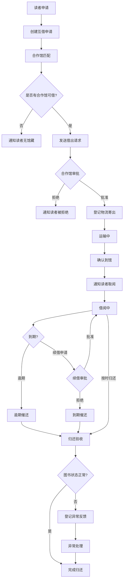

## 1. 产品概述

图书馆馆际互借与逾期追踪系统，面向读者服务馆员、合作馆联系人和流通部主管，实现从读者申请、合作馆匹配、借出审批、物流登记、到馆通知、续借申请、逾期催还到归还验收的全流程闭环管理，解决馆际借阅流程分散、状态追踪困难、逾期催还缺乏系统性等问题。

## 2. 核心功能

### 2.1 用户角色

| 角色 | 注册方式 | 核心权限 |
|------|----------|----------|
| 读者服务馆员 | 管理员分配账号 | 创建互借申请、登记物流、确认到馆、处理续借、验收归还 |
| 合作馆联系人 | 管理员分配账号 | 审批借出请求、确认寄出、处理续借审批 |
| 流通部主管 | 管理员分配账号 | 全局数据查看、逾期催还管理、异常处理、统计报表 |

### 2.2 功能模块

1. **仪表盘首页**：关键指标概览、近期动态、待办事项
2. **互借申请管理**：申请列表、新建申请、申请详情、状态流转
3. **馆际流转看板**：看板视图展示所有申请的流转状态
4. **逾期追踪**：逾期列表、催还操作、逾期天数统计
5. **合作馆管理**：合作馆信息维护、馆藏匹配
6. **异常反馈**：异常记录、处理状态、反馈登记

### 2.3 页面详情

| 页面名称 | 模块名称 | 功能描述 |
|----------|----------|----------|
| 仪表盘首页 | 统计卡片 | 显示待处理申请数、进行中借阅数、逾期数、本月完成数 |
| 仪表盘首页 | 近期动态 | 最新申请、审批、到馆、归还等操作记录时间线 |
| 仪表盘首页 | 待办事项 | 当前用户需要处理的事项列表 |
| 互借申请列表 | 筛选栏 | 按状态、合作馆、日期范围、读者姓名筛选 |
| 互借申请列表 | 申请表格 | 展示申请编号、书名、读者、来源馆、状态、创建时间 |
| 互借申请列表 | 批量操作 | 批量催还、批量导出 |
| 新建申请 | 读者信息 | 输入或选择读者信息 |
| 新建申请 | 图书信息 | 输入图书ISBN、书名、作者等 |
| 新建申请 | 合作馆选择 | 系统自动匹配或手动选择合作馆 |
| 申请详情 | 基本信息 | 申请完整信息展示 |
| 申请详情 | 状态流转时间线 | 从申请到归还的每一步状态及操作人、时间 |
| 申请详情 | 操作按钮 | 根据当前状态显示可执行操作（审批、寄出、到馆、续借、归还等） |
| 申请详情 | 物流信息 | 物流单号、寄出时间、到达时间 |
| 馆际流转看板 | 看板列 | 待匹配、已匹配、审批中、运输中、借阅中、逾期、已归还 |
| 馆际流转看板 | 卡片 | 每张卡片显示申请摘要信息，可拖拽查看详情 |
| 逾期追踪 | 逾期列表 | 按逾期天数排序，显示读者、图书、借出馆、逾期天数 |
| 逾期追踪 | 催还操作 | 发送催还通知、标记催还状态 |
| 逾期追踪 | 逾期统计 | 按馆、按月统计逾期趋势 |
| 合作馆管理 | 合作馆列表 | 合作馆名称、地址、联系方式、在借数量 |
| 合作馆管理 | 馆藏查询 | 输入ISBN查询哪些合作馆藏有此书 |
| 异常反馈 | 异常列表 | 图书损坏、丢失、拒收等异常记录 |
| 异常反馈 | 处理登记 | 记录异常处理方案和结果 |

## 3. 核心流程

读者向本馆提交馆际互借请求，馆员创建申请后系统自动匹配馆藏可用的合作馆；合作馆联系人审批借出请求，审批通过后登记物流寄出；图书到馆后通知读者取阅；借阅期间可申请续借；到期未还则系统自动标记逾期并触发催还流程；归还时馆员验收图书状态，若发现异常则登记异常反馈。

## 4. 用户界面设计

### 4.1 设计风格

- **主色调**：深靛蓝 (#1e3a5f) 体现专业严谨，辅以暖琥珀 (#d4930d) 作为强调色
- **按钮风格**：圆角 8px，主要操作使用实心填充，次要操作使用描边
- **字体**：标题使用 Noto Serif SC（衬线体彰显文化气息），正文使用 Noto Sans SC
- **布局风格**：左侧导航栏 + 右侧内容区，卡片式信息模块
- **图标风格**：使用 Lucide 线性图标，24px，1.5px 描边

### 4.2 页面设计概览

| 页面名称 | 模块名称 | UI 元素 |
|----------|----------|---------|
| 仪表盘首页 | 统计卡片 | 四宫格卡片，深靛蓝背景渐变，白色数字大号显示，图标右下角装饰 |
| 仪表盘首页 | 近期动态 | 左侧竖线时间线，圆形状态指示器，浅灰背景卡片 |
| 仪表盘首页 | 待办事项 | 列表项带左侧状态色条，hover 微抬升阴影 |
| 互借申请列表 | 筛选栏 | 水平排列的下拉选择器和日期选择，搜索输入框带图标 |
| 互借申请列表 | 申请表格 | 斑马纹表格，状态列使用彩色标签，行 hover 高亮 |
| 新建申请 | 表单 | 分步表单，顶部步骤条指示进度，输入框聚焦时靛蓝描边 |
| 申请详情 | 状态流转时间线 | 横向步骤条，已完成步骤实心圆+连线，当前步骤脉冲动画 |
| 申请详情 | 操作按钮 | 底部固定操作栏，主按钮靛蓝实心，次按钮描边 |
| 馆际流转看板 | 看板列 | 纵向分列，列头带状态色条和计数，卡片间有间距 |
| 馆际流转看板 | 卡片 | 白色圆角卡片，顶部状态色条，书名加粗，元信息小字灰色 |
| 逾期追踪 | 逾期列表 | 逾期天数用渐变色标识（黄→橙→红），催还按钮醒目 |
| 合作馆管理 | 合作馆列表 | 卡片网格布局，每张卡片展示馆名、地址、联系方式 |
| 异常反馈 | 异常列表 | 左侧类型图标，右侧处理状态标签 |

### 4.3 响应式设计

- 桌面优先设计，最小宽度 1024px
- 看板在平板以下切换为列表视图
- 表格在窄屏支持横向滚动
- 表单在移动端改为纵向全宽排列

### 4.4 状态流转视觉设计

申请状态使用统一的色彩体系：
- 待匹配：灰色 (#6b7280)
- 已匹配：蓝色 (#3b82f6)
- 审批中：靛蓝 (#6366f1)
- 已批准：青色 (#06b6d4)
- 运输中：琥珀 (#d4930d)
- 已到馆：绿色 (#22c55e)
- 借阅中：蓝绿 (#14b8a6)
- 续借中：紫色 (#a855f7)
- 逾期：红色 (#ef4444)
- 已归还：石板灰 (#475569)
- 已拒绝：玫红 (#e11d48)
- 异常：橙色 (#f97316)
