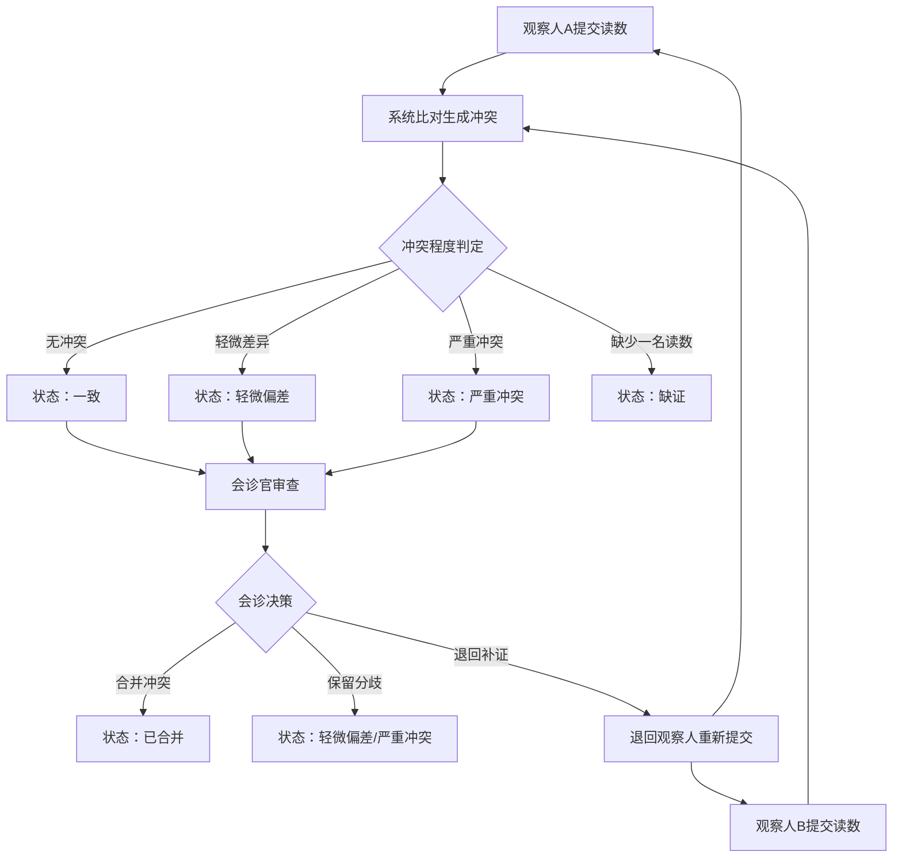
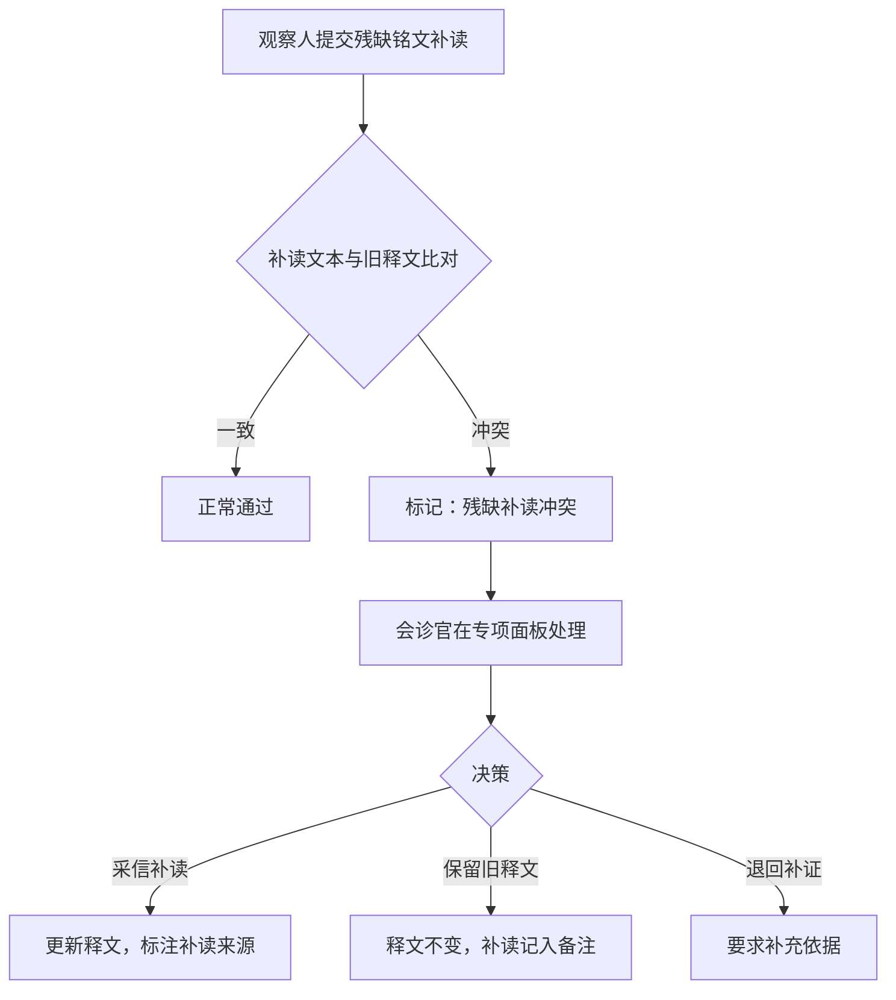

## 1. 产品概述

古井铭牌批次异常会诊工具是一套面向文物考古领域专业人士的协作审读平台，用于对同一批次古井铭牌由两名观察人独立提交的读数进行系统化比对、冲突识别与会诊决策。系统通过并排展示双方观察记录、自动标记冲突字段、支持合并/分歧/退回操作，解决铭牌拓片释读中的主观差异问题，确保铭文数据的权威性与可追溯性。

- 目标用户：考古研究所铭牌整理人员、文物数字化审核专家
- 核心价值：将传统纸质会诊流程数字化，减少人工比对失误，提供可追溯的冲突决策链

## 2. 核心功能

### 2.1 用户角色

| 角色 | 进入方式 | 核心权限 |
|------|----------|----------|
| 观察人 | 姓名登录 | 提交批次读数、查看自己的提交记录 |
| 会诊官 | 姓名登录 + 会诊权限 | 审查冲突、做出采信结论、退回补证 |

### 2.2 功能模块

1. **批次总览页**：批次列表、状态筛选、搜索、批次状态标签（一致/轻微偏差/严重冲突/缺证/已合并）
2. **读数提交页**：观察人填写铭牌批次读数表单
3. **会诊对比页**：并排展示两名观察人读数、冲突高亮、会诊操作面板
4. **会诊记录页**：历史会诊结论查看、决策链追溯

### 2.3 页面详情

| 页面名称 | 模块名称 | 功能描述 |
|----------|----------|----------|
| 批次总览页 | 状态筛选栏 | 按五种状态筛选批次，支持搜索批次编号 |
| 批次总览页 | 批次卡片列表 | 展示批次编号、铭牌名称、当前状态、观察人、冲突字段数 |
| 批次总览页 | 快捷操作 | 一键进入会诊、查看记录 |
| 读数提交页 | 铭牌信息区 | 批次编号、铭牌名称、观察人姓名 |
| 读数提交页 | 拓片观察区 | 拓片清晰度（清晰/较清晰/模糊/极模糊）、拓印图上传/预览 |
| 读数提交页 | 锈蚀与残缺区 | 锈蚀级别（无/轻微/中度/重度）、铭文残缺（无/局部/严重/全损） |
| 读数提交页 | 井圈与释文区 | 井圈方位（东/南/西/北/东南/东北/西南/西北）、释文文本框 |
| 读数提交页 | 补读标注区 | 残缺铭文补读文本、补读依据（仅当铭文残缺≠无时显示） |
| 会诊对比页 | 双栏对比区 | 左右并排展示观察人A与B的全部字段，冲突字段红色高亮 |
| 会诊对比页 | 冲突字段摘要 | 仅列出冲突字段的对比表，快速定位差异 |
| 会诊对比页 | 采信结论区 | 逐字段选择采信A/采信B/合并/保留分歧，填写会诊备注 |
| 会诊对比页 | 会诊操作栏 | 提交会诊结论（合并冲突）、保留分歧、退回补证 |
| 会诊对比页 | 残缺补读冲突区 | 当补读文本与旧释文冲突时的专项处理面板 |
| 会诊记录页 | 结论时间线 | 按时间倒序展示会诊结论、操作人、决策详情 |
| 会诊记录页 | 字段决策追溯 | 查看每个字段的历史决策链 |

## 3. 核心流程

观察人A和观察人B分别独立提交同一批次的读数 → 系统自动逐字段比对生成冲突清单 → 根据冲突程度判定批次状态 → 会诊官打开会诊对比页，逐字段审查冲突 → 会诊官选择采信结论并提交 → 系统保存结论并重算批次状态。

特殊场景流程：当铭文残缺时，观察人提交补读文本 → 补读文本与旧释文自动比对 → 若冲突则标记为"残缺铭文补读冲突" → 会诊官在专项面板中处理。

## 4. 用户界面设计

### 4.1 设计风格

- **主色调**：古铜色 `#8B6914`、宣纸米 `#F5F0E8`、墨色 `#2C2416`
- **辅助色**：朱砂红 `#C74438`（冲突标记）、靛蓝 `#3D5A80`（操作按钮）、松绿 `#4A7C59`（已合并状态）
- **字体**：标题用「思源宋体」风格衬线体，正文用「霞鹜文楷」风格，营造古籍考据氛围
- **布局**：桌面优先，宽屏双栏对比，窄屏折叠为标签页切换
- **卡片风格**：仿古卷轴边框，微纹理背景，暗角渐变
- **图标风格**：简约线条风格，融入古器物元素

### 4.2 页面设计概览

| 页面名称 | 模块名称 | UI元素 |
|----------|----------|--------|
| 批次总览页 | 状态筛选栏 | 胶囊式标签按钮，古铜描边，选中态填色 |
| 批次总览页 | 批次卡片 | 宣纸底色卡片，左侧色条标识状态，右上角冲突数角标 |
| 读数提交页 | 表单整体 | 仿古籍竖排风格的横排表单，墨色标签，米色输入框 |
| 读数提交页 | 拓印图区 | 虚线拖放区，古铜色边框，缩略图预览 |
| 会诊对比页 | 双栏对比 | 左A右B，冲突行朱砂红底色，一致行淡绿底色 |
| 会诊对比页 | 冲突摘要 | 表格式，仅显示冲突行，每行带操作下拉 |
| 会诊对比页 | 采信操作 | 单选按钮组：采信A/采信B/合并/保留分歧 |
| 会诊对比页 | 残缺补读冲突区 | 独立面板，旧释文与补读文本高亮差量标注 |
| 会诊记录页 | 时间线 | 竖向时间线，节点为古铜圆点，展开详情卡片 |

### 4.3 响应式策略

- 桌面端（≥1280px）：双栏并排对比，侧边冲突摘要
- 平板端（768-1279px）：双栏缩窄，冲突摘要折叠为抽屉
- 移动端（<768px）：标签页切换A/B读数，冲突摘要置顶

### 4.4 数据集设计

预置五个批次覆盖全部状态：

| 批次编号 | 铭牌名称 | 观察人A | 观察人B | 状态 |
|----------|----------|---------|---------|------|
| GJ-2024-001 | 龙泉古井铭 | 张守正 | 李铭远 | 一致 |
| GJ-2024-002 | 青石巷井铭 | 张守正 | 李铭远 | 轻微偏差 |
| GJ-2024-003 | 双泉井铭 | 张守正 | 李铭远 | 严重冲突 |
| GJ-2024-004 | 翠微井铭 | 张守正 | — | 缺证 |
| GJ-2024-005 | 涌金井铭 | 张守正 | 李铭远 | 已合并 |
