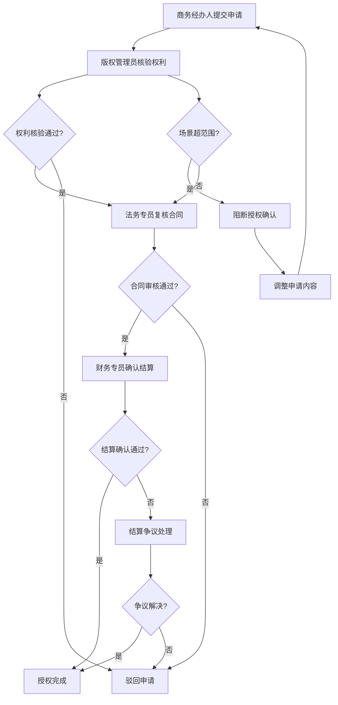

# 版权音乐商用授权申请与播放场景核验平台 - 产品需求文档

## 1. 产品概述

版权音乐商用授权申请与播放场景核验平台是一个全流程音乐版权管理系统，旨在解决音乐商用授权过程中的权利核验、场景合规、合同管理和结算归档等核心问题。平台服务于音乐版权方和使用方，通过标准化流程确保授权合规性，降低版权风险。

**目标用户：** 音乐版权公司、广告代理商、影视制作公司、品牌营销团队
**核心价值：** 提升授权效率、确保合规性、降低法律风险、优化结算流程

## 2. 核心功能

### 2.1 用户角色

| 角色 | 注册方式 | 核心权限 |
|------|---------|---------|
| 商务经办人 | 管理员创建 | 提交授权申请、查看申请进度、下载授权文件 |
| 版权管理员 | 管理员创建 | 核验曲库权利、确认授权范围、审核场景合规性 |
| 法务专员 | 管理员创建 | 复核合同条款、确认法律风险、审批合同 |
| 财务专员 | 管理员创建 | 确认结算金额、处理结算争议、归档结算记录 |
| 系统管理员 | 系统初始化 | 用户管理、权限配置、系统设置 |

### 2.2 功能模块

1. **授权申请页面**：申请表单、曲库搜索、场景选择、期限设置
2. **授权审核页面**：审核列表、权利核验、场景合规检查、审批操作
3. **授权详情页面**：曲目信息、客户信息、使用场景、授权期限、合同文件、历史节点
4. **结算管理页面**：结算列表、金额确认、争议处理、归档操作
5. **复盘分析页面**：数据统计、异常分析、趋势图表、导出报告

### 2.3 页面详情

| 页面名称 | 模块名称 | 功能描述 |
|---------|---------|---------|
| 授权申请页面 | 曲库搜索 | 按曲目名称、艺术家、版权方搜索可用音乐 |
| 授权申请页面 | 申请表单 | 填写客户信息、使用场景、授权期限、预算范围 |
| 授权申请页面 | 场景选择 | 选择授权场景类型（广告、影视、直播等） |
| 授权审核页面 | 审核列表 | 展示待审核申请，支持按状态、时间筛选 |
| 授权审核页面 | 权利核验 | 显示曲库权利信息、授权历史、权利冲突检测 |
| 授权审核页面 | 场景合规检查 | 自动检测场景是否超范围，显示合规性提示 |
| 授权审核页面 | 审批操作 | 通过、驳回、转交、备注等操作 |
| 授权详情页面 | 曲目信息 | 曲目名称、艺术家、版权方、权利类型、授权范围 |
| 授权详情页面 | 客户信息 | 客户名称、行业、联系方式、历史授权记录 |
| 授权详情页面 | 使用场景 | 场景类型、使用范围、地域限制、平台限制 |
| 授权详情页面 | 授权期限 | 起止时间、授权时长、续期选项 |
| 授权详情页面 | 合同文件 | 合同PDF、附件、签署状态、版本历史 |
| 授权详情页面 | 历史节点 | 时间线展示审批流程、操作记录、备注信息 |
| 结算管理页面 | 结算列表 | 展示待结算项目，支持按状态、金额筛选 |
| 结算管理页面 | 金额确认 | 显示结算金额、分成比例、税费信息 |
| 结算管理页面 | 争议处理 | 处理结算比例争议，记录协商过程 |
| 结算管理页面 | 归档操作 | 确认结算完成，归档相关文件 |
| 复盘分析页面 | 数据统计 | 按客户行业、曲库、异常原因、授权周期聚合统计 |
| 复盘分析页面 | 异常分析 | 场景超范围、期限冲突、结算争议等异常情况分析 |
| 复盘分析页面 | 趋势图表 | 授权数量、金额、异常率等趋势可视化 |
| 复盘分析页面 | 导出报告 | 生成PDF/Excel格式的复盘报告 |

## 3. 核心流程

### 3.1 授权申请流程

商务经办人提交客户需求后，系统自动创建授权申请单。版权管理员核验曲库权利，确认曲目可用性和授权范围。法务专员复核合同条款，确认法律风险。财务专员确认结算金额和分成比例。任何环节发现问题可驳回至上一环节或直接终止申请。场景超范围时系统自动阻断授权确认，需重新调整申请内容。

### 3.2 场景核验流程

系统自动检测申请的使用场景是否在曲库授权范围内。若场景超范围，系统显示警告并阻断后续流程。版权管理员可手动确认场景合规性或要求申请人调整场景范围。

### 3.3 结算归档流程

授权完成后，财务专员确认结算金额和分成比例。若存在争议，启动争议处理流程，记录协商过程。结算确认后，系统自动归档相关文件和记录，生成结算报告。

## 4. 用户界面设计

### 4.1 设计风格

**主色调：**
- 主色：深蓝色 #1E3A8A（专业、信任、版权保护）
- 辅助色：金色 #D97706（价值、版权、高端）
- 成功色：绿色 #059669
- 警告色：橙色 #EA580C
- 错误色：红色 #DC2626

**按钮风格：**
- 主要按钮：圆角（8px）、渐变背景、悬停时阴影加深
- 次要按钮：圆角（8px）、边框样式、悬停时背景变化
- 危险按钮：红色背景、白色文字

**字体：**
- 标题字体：思源黑体 / Noto Sans SC（粗体、专业感）
- 正文字体：思源黑体 / Noto Sans SC（常规、易读）
- 字号：标题 24-32px、副标题 18-20px、正文 14-16px

**布局风格：**
- 卡片式布局，圆角（12px）
- 左侧导航栏（固定宽度 240px）
- 顶部工具栏（高度 64px）
- 内容区域（自适应宽度）

**图标风格：**
- 线性图标（2px 线宽）
- 圆角风格
- 与文字对齐

### 4.2 页面设计概览

| 页面名称 | 模块名称 | UI 元素 |
|---------|---------|---------|
| 授权申请页面 | 曲库搜索 | 搜索框、筛选器、结果卡片网格布局、悬停动画 |
| 授权申请页面 | 申请表单 | 分步表单、输入验证、实时提示、进度指示器 |
| 授权审核页面 | 审核列表 | 表格布局、状态标签、操作按钮、分页器 |
| 授权审核页面 | 权利核验 | 信息卡片、权利树状图、冲突高亮、时间线 |
| 授权详情页面 | 曲目信息 | 信息卡片、标签组、元数据列表、相关链接 |
| 授权详情页面 | 历史节点 | 垂直时间线、节点图标、状态颜色、备注气泡 |
| 结算管理页面 | 结算列表 | 数据表格、金额高亮、状态徽章、批量操作 |
| 复盘分析页面 | 数据统计 | 图表卡片、数据网格、筛选面板、导出按钮 |

### 4.3 响应式设计

采用桌面优先设计策略，确保在 1440px 及以上宽度的显示器上有最佳体验。在平板设备（768px-1439px）上采用侧边栏折叠、内容区域自适应的布局。在移动设备（<768px）上采用单列布局、底部导航的设计。

### 4.4 交互细节

**动画效果：**
- 页面加载：渐入动画（300ms）
- 卡片悬停：阴影加深、轻微上移（200ms）
- 按钮点击：涟漪效果
- 表单验证：错误抖动、成功打勾
- 时间线：节点依次出现（stagger 动画）

**反馈机制：**
- 加载状态：骨架屏、进度条
- 成功操作：Toast 提示（绿色）
- 错误提示：Toast 提示（红色）、表单内联错误
- 确认操作：模态对话框

## 5. 数据样本

### 5.1 预置样本数据

平台预置以下四种典型场景的样本数据，用于演示和测试：

1. **正常授权样本**
   - 客户：某知名广告公司
   - 曲目：《阳光旋律》
   - 场景：电视广告
   - 期限：2024-01-01 至 2024-12-31
   - 状态：已完成

2. **场景超范围样本**
   - 客户：某电商平台
   - 曲目：《夜色温柔》
   - 场景：直播带货（超出授权范围）
   - 阻断原因：曲库仅授权电视广告和线上视频，不包含直播场景
   - 状态：待调整

3. **授权期限冲突样本**
   - 客户：某影视制作公司
   - 曲目：《激情燃烧》
   - 冲突：申请期限与现有授权重叠
   - 状态：待协调

4. **结算比例争议样本**
   - 客户：某品牌营销公司
   - 曲目：《青春记忆》
   - 争议：版权方与代理商分成比例分歧
   - 状态：争议处理中

### 5.2 曲库数据

预置至少 20 首曲目的曲库数据，包含不同风格、艺术家、版权方，覆盖多种授权场景。

## 6. 非功能性需求

### 6.1 性能要求

- 页面加载时间：< 2 秒
- 搜索响应时间：< 500ms
- 表单提交响应：< 1 秒
- 支持并发用户：100+

### 6.2 安全要求

- 用户身份认证：基于角色的访问控制
- 数据加密：敏感信息加密存储
- 操作日志：记录所有关键操作
- 数据备份：每日自动备份

### 6.3 可用性要求

- 系统可用性：99.5%
- 错误提示：清晰、友好、可操作
- 帮助文档：在线帮助、操作指引