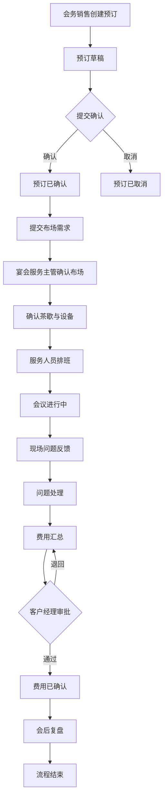

## 1. 产品概述

酒店会务会议室预订与服务工单系统，面向会务销售、宴会服务主管和客户经理，将会议室预订、布场需求、茶歇设备、服务人员排班、现场问题反馈、费用确认和会后复盘串联为完整闭环流程，解决会务全流程信息割裂、状态不透明、跨角色协作低效的问题。

## 2. 核心功能

### 2.1 用户角色

| 角色 | 核心权限 |
|------|----------|
| 会务销售 | 创建/编辑预订、发起布场与茶歇需求、查看费用与复盘 |
| 宴会服务主管 | 确认布场方案、排班服务人员、处理现场问题反馈、填写会后复盘 |
| 客户经理 | 确认费用、查看会议状态与进度、审批异常变更 |

### 2.2 功能模块

1. **工作台首页**: 全局概览、待办事项、近期会议日历、异常提醒
2. **会议室管理**: 会议室列表、容量/设备筛选、日程日历视图
3. **预订管理**: 创建/编辑预订、状态流转（草稿→已确认→进行中→已完成→已取消）
4. **布场需求**: 关联预订的布场工单、布局方案、特殊要求、图片附件
5. **茶歇与设备**: 茶歇套餐选择、额外设备申请、数量与时间确认
6. **服务人员排班**: 按日期和会议室安排服务人员、排班日历视图
7. **现场问题反馈**: 提交异常、指派处理人、状态跟踪（待处理→处理中→已解决）
8. **费用确认**: 自动汇总费用明细、客户经理审批、调整记录
9. **会后复盘**: 会议评价、问题总结、改进建议、附件归档

### 2.3 页面详情

| 页面名称 | 模块名称 | 功能描述 |
|----------|----------|----------|
| 工作台首页 | 待办提醒 | 显示当前用户待办事项列表，按紧急程度排序 |
| 工作台首页 | 近期日历 | 展示7日内会议安排日历视图，点击可跳转详情 |
| 工作台首页 | 异常提醒 | 显示未解决的现场问题反馈，高亮紧急项 |
| 会议室列表 | 筛选区 | 按楼层、容量、设备类型筛选会议室 |
| 会议室列表 | 卡片列表 | 展示会议室名称、容量、当前状态、今日排期 |
| 会议室日程 | 日历视图 | 按周/日展示会议室预订情况，色块区分状态 |
| 预订列表 | 列表区 | 展示所有预订记录，支持按状态、日期、客户筛选 |
| 预订详情 | 基本信息区 | 展示预订基本信息、状态流转时间线 |
| 预订详情 | 关联工单 | 展示布场、茶歇、排班等关联工单卡片 |
| 预订详情 | 费用概览 | 展示费用汇总与审批状态 |
| 预订表单 | 基本信息表 | 填写客户、会议室、时间、参会人数等 |
| 布场需求 | 需求列表 | 展示某预订下的所有布场工单 |
| 布场需求 | 需求表单 | 填写布局类型、特殊要求、期望完成时间 |
| 茶歇设备 | 套餐选择 | 选择茶歇套餐，自定义修改项 |
| 茶歇设备 | 设备申请 | 填写额外设备需求与数量 |
| 排班管理 | 排班日历 | 按日期展示人员排班，拖拽调整 |
| 排班管理 | 人员列表 | 展示可用服务人员及其技能标签 |
| 问题反馈 | 反馈列表 | 展示所有现场问题，按状态分类 |
| 问题反馈 | 反馈表单 | 提交问题描述、紧急程度、图片附件 |
| 费用确认 | 费用明细 | 展示所有费用项，支持调整 |
| 费用确认 | 审批操作 | 客户经理确认或退回费用 |
| 会后复盘 | 复盘表单 | 填写评分、问题总结、改进建议 |
| 会后复盘 | 历史复盘 | 查看往期会议复盘记录 |

## 3. 核心流程

预订创建 → 布场需求提交 → 茶歇设备确认 → 服务人员排班 → 会议进行 → 现场问题反馈 → 费用确认 → 会后复盘

## 4. 用户界面设计

### 4.1 设计风格

- 主色调: 深青色 (#0F766E) + 琥珀金 (#D97706) 点缀
- 辅助色: 浅灰底 (#F8FAFC)，白色卡片，红色警示 (#DC2626)
- 按钮风格: 圆角 (8px)，主操作实心填充，次操作描边
- 字体: 系统中文字体栈 (PingFang SC / Microsoft YaHei / sans-serif)
- 布局风格: 顶部导航 + 侧边菜单 + 内容区卡片布局
- 图标风格: 线性图标 (Lucide Icons)，2px 描边
- 状态标签: 彩色圆角标签，不同状态对应不同色系

### 4.2 页面设计概览

| 页面名称 | 模块名称 | UI 元素 |
|----------|----------|---------|
| 工作台首页 | 待办提醒 | 卡片列表，左侧色条标记紧急程度，右侧状态标签 |
| 工作台首页 | 近期日历 | 周视图日历，色块表示会议，悬停显示摘要 |
| 会议室列表 | 卡片列表 | 双列卡片，顶部图片，底部状态标签与快捷操作 |
| 会议室日程 | 日历视图 | 全幅周视图，时间轴纵列，预订色块横跨时间范围 |
| 预订详情 | 状态时间线 | 垂直时间线，节点显示状态变更与操作人 |
| 预订详情 | 关联工单 | 横向卡片组，图标+标题+状态 |
| 布场需求 | 需求表单 | 分段表单，布局类型下拉+多选+富文本描述 |
| 排班管理 | 排班日历 | 网格日历，单元格内人员头像+姓名 |
| 问题反馈 | 反馈列表 | 列表项带紧急程度色标，状态标签筛选栏 |
| 费用确认 | 费用明细 | 表格式明细，底部汇总行，操作栏审批按钮 |

### 4.3 响应式

桌面优先设计，最小宽度 1024px，导航固定左侧，内容区自适应宽度。HTMX 局部刷新避免全页重载，加载状态使用骨架屏与旋转指示器。

### 4.4 交互细节

- 列表页: 支持分页、筛选、搜索，HTMX 无刷新更新
- 表单页: 实时校验，保存草稿，提交确认弹窗
- 状态流转: 按钮操作触发，二次确认，成功后 toast 提示
- 日历视图: 点击色块跳转预订详情，支持周/日切换
- 空状态: 插图 + 引导文案 + 创建按钮
- 错误状态: 红色提示条 + 重试按钮
- 加载状态: 骨架屏占位 + HTMX indicator 旋转图标
