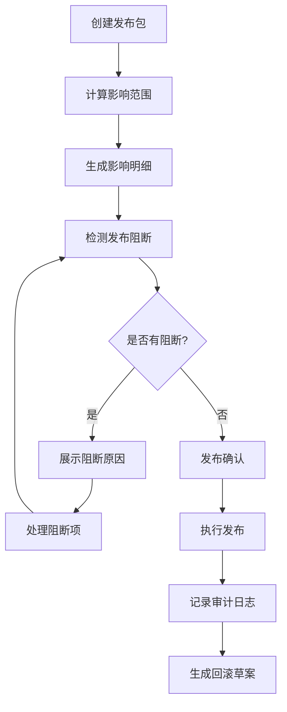
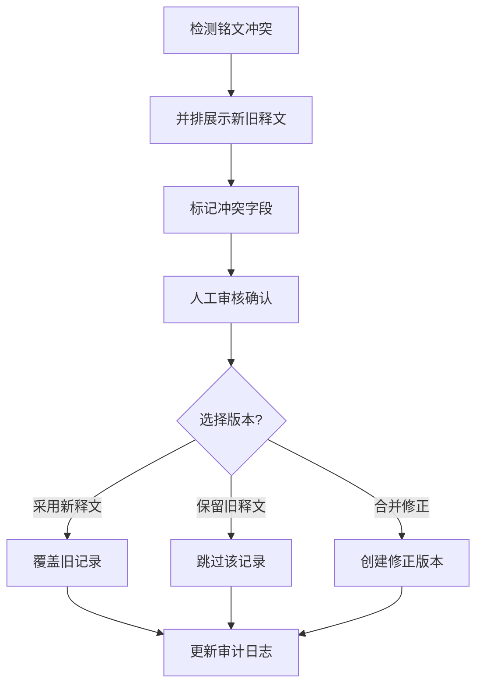

## 1. 产品概述

古井铭牌版本发布看板是面向文物考古领域的版本管理系统，用于管理古井铭牌拓片数据的版本发布与差异追踪。系统围绕拓片清晰度、锈蚀级别、铭文残缺、井圈方位四大维度组织发布包，提供影响范围计算、发布阻断检测、回滚预案和全链路审计能力。

- **目标用户**：文物考古研究员、数据管理员、版本发布专员
- **核心价值**：确保铭牌数据版本发布的可追溯性、安全性和可控性，解决残缺铭文补读与旧释文冲突等复杂场景

## 2. 核心功能

### 2.1 用户角色

| 角色 | 注册方式 | 核心权限 |
|------|----------|----------|
| 版本管理员 | 系统分配 | 发布包管理、发布确认、回滚操作、审计日志查看 |
| 数据研究员 | 系统分配 | 版本记录查看、影响明细分析、冲突比对 |
| 只读用户 | 系统分配 | 发布包浏览、版本记录查询 |

### 2.2 功能模块

1. **发布包列表**：四大维度发布包概览，发布状态、影响样本数、阻断标记
2. **影响明细**：受影响样本清单、需重算导出批次、锁定记录统计
3. **阻断原因**：发布阻断项详情，包括锁定记录、冲突铭文、待审核项
4. **回滚草案**：自动生成回滚方案，影响范围评估，回滚步骤预览
5. **审计日志**：全操作轨迹记录，版本变更历史，操作人溯源

### 2.3 页面详情

| 页面名称 | 模块名称 | 功能描述 |
|----------|----------|----------|
| 发布看板首页 | 发布包卡片列表 | 4个发布包卡片，展示发布状态、版本号、影响样本数、阻断数 |
| 发布看板首页 | 版本时间轴 | 12条版本记录的时间线展示，支持筛选和状态标记 |
| 影响明细页 | 受影响样本 | 样本列表，差异标记，导出批次重算标记 |
| 影响明细页 | 锁定记录 | 因锁定无法覆盖的记录列表，锁定原因展示 |
| 阻断原因页 | 阻断项列表 | 发布阻断项分类展示，冲突详情，解锁/解决操作入口 |
| 阻断原因页 | 铭文冲突比对 | 残缺铭文补读与旧释文冲突的并排对比视图 |
| 回滚草案页 | 回滚方案 | 自动生成的回滚步骤，影响评估，执行按钮 |
| 审计日志页 | 操作日志 | 全量操作记录，操作人、时间、操作类型筛选 |

## 3. 核心流程

### 3.1 版本发布流程

### 3.2 铭文冲突处理流程

## 4. 用户界面设计

### 4.1 设计风格

- **主色调**：赭石色 (#8B4513) 作为主色，呼应文物考古主题；搭配宣纸米白 (#F5E6D3) 作为背景色
- **辅助色**：青铜绿 (#4A7C59) 表示成功/已发布，朱砂红 (#C23B22) 表示阻断/警告，石青蓝 (#2C5F8C) 表示进行中
- **字体**：标题使用具有金石感的衬线字体，正文使用清晰易读的无衬线字体
- **布局风格**：古籍卷轴式布局，卡片采用仿古拓片边框效果，竖向时间轴设计
- **视觉元素**：拓片纹理背景、印章式状态标记、竹简式列表分隔
- **图标风格**：线性古风图标，配合铭文篆刻风格的装饰元素

### 4.2 页面设计概览

| 页面名称 | 模块名称 | UI 元素 |
|----------|----------|---------|
| 发布看板首页 | 发布包卡片 | 仿古卷轴卡片、印章状态标记、拓片纹理装饰、悬停微动效 |
| 发布看板首页 | 版本时间轴 | 竖向时间轴、版本节点标记、滑动展开详情、渐变色连接 |
| 影响明细页 | 样本列表 | 表格布局、差异高亮行、锁定标记、批次标签 |
| 阻断原因页 | 冲突比对 | 左右分栏对比、冲突字段标红、差异连接线、选择操作 |
| 回滚草案页 | 步骤清单 | 编号步骤卡片、风险等级标记、执行进度条 |
| 审计日志页 | 日志列表 | 时间倒序、操作人头像、操作类型标签、搜索筛选 |

### 4.3 响应式

- **桌面优先**：以 1440px 宽度为基准设计，支持大屏展示
- **平板适配**：1024px 以下调整为单列布局，侧边栏收折
- **触控优化**：按钮最小尺寸 44px，列表项增加点击区域

### 4.4 动效与交互

- **页面入场**：卷轴展开式动画，内容从上至下渐显
- **卡片悬停**：轻微上浮 + 阴影加深 + 边框色变化
- **时间轴滚动**：版本节点依次点亮的滚动触发动画
- **状态切换**：印章盖下的按压动效
- **冲突比对**：差异字段的脉冲高亮提示
