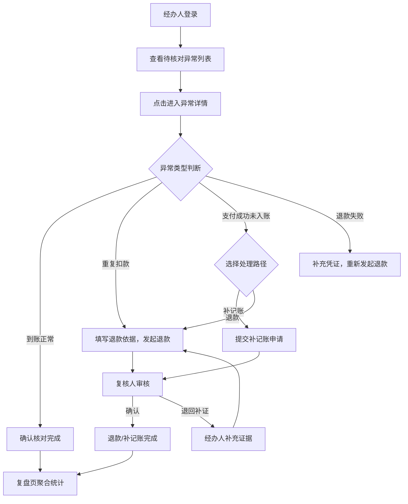

## 1. 产品概述

园区餐卡充值异常与退款核对系统，面向园区财务团队，解决餐卡充值过程中出现的重复扣款、未入账、退款失败等异常的核对与退款处理闭环问题。目标用户为财务经办人和复核人，核心价值是将分散在各支付渠道的异常记录集中呈现、规范核对流程、确保退款可追溯。

## 2. 核心功能

### 2.1 用户角色

| 角色 | 注册方式 | 核心权限 |
|------|----------|----------|
| 财务经办人 | 管理员分配账号 | 核对支付流水、发起退款、补记账操作 |
| 复核人 | 管理员分配账号 | 确认退款结论、退回补证 |

### 2.2 功能模块

1. **异常列表页（首页）**：首屏直接展示待核对充值异常列表，支持按异常类型、支付渠道筛选，不展示营销说明
2. **异常详情页**：展示餐卡号、支付流水、入账状态、退款依据、责任人、处理历史；支付成功未入账时提供补记账或退款两条处理路径
3. **复盘页**：按异常类型、支付渠道、处理耗时、退款结果聚合统计，支持回溯到对应记录

### 2.3 页面详情

| 页面名称 | 模块名称 | 功能描述 |
|----------|----------|----------|
| 异常列表页 | 待核对异常列表 | 展示所有待核对异常记录，含异常类型标签、餐卡号、金额、支付渠道、创建时间、当前状态 |
| 异常列表页 | 筛选栏 | 按异常类型（到账正常/重复扣款/支付成功未入账/退款失败）、支付渠道、状态筛选 |
| 异常列表页 | 统计概览 | 顶部统计卡片：待核对数、处理中数、已完成数、退款总金额 |
| 异常详情页 | 基本信息区 | 餐卡号、持卡人、充值金额、支付流水号、支付渠道、交易时间 |
| 异常详情页 | 入账状态区 | 入账状态标识、入账时间（若已入账）、异常类型标签 |
| 异常详情页 | 退款依据区 | 退款原因、关联凭证、退款金额、退款账户 |
| 异常详情页 | 处理路径区（支付成功未入账） | 两条路径：补记账（直接入账）或退款（原路退回） |
| 异常详情页 | 操作区 | 经办人：核对确认/发起退款/补记账；复核人：确认/退回补证 |
| 异常详情页 | 处理历史时间线 | 展示从异常创建到当前的所有操作记录，含操作人、操作类型、时间、备注 |
| 复盘页 | 异常类型分布图 | 按四类异常类型的数量分布统计 |
| 复盘页 | 支付渠道分布图 | 按微信/支付宝/银行卡等渠道的异常分布 |
| 复盘页 | 处理耗时分析 | 各异常类型平均处理时长、最长/最短耗时 |
| 复盘页 | 退款结果汇总 | 退款成功/退款失败/退款中的数量及金额汇总 |
| 复盘页 | 记录回溯 | 点击聚合数据可跳转至对应异常记录列表 |

## 3. 核心流程

财务经办人登录后首屏看到待核对异常列表，点击某条记录进入详情页核对支付流水信息。根据异常类型选择处理方式：

- **到账正常**：确认后标记为已核对完成
- **重复扣款**：填写退款依据，发起退款申请，等待复核人确认
- **支付成功未入账**：选择补记账（直接入账到餐卡）或退款（原路退回），提交后等待复核人确认
- **退款失败**：补充退款失败原因和凭证，重新发起退款

复核人在待复核列表中查看经办人提交的退款/补记账申请，确认退款结论或退回要求补充证据。退回后经办人需补充凭证重新提交。

## 4. 用户界面设计

### 4.1 设计风格

- **主色调**：深灰蓝 (#1e293b) 作为主背景，搭配琥珀橙 (#f59e0b) 作为警告/异常高亮色，翡翠绿 (#10b981) 作为正常/完成状态色
- **次色调**：浅灰白 (#f8fafc) 用于卡片背景，红色 (#ef4444) 用于退款失败标识
- **按钮风格**：圆角按钮 (rounded-lg)，主操作用实心填充，次操作用描边样式
- **字体**：使用 DM Sans 作为界面字体，Tabular Nums 用于数字对齐
- **布局风格**：侧边导航 + 主内容区，卡片式内容组织
- **图标风格**：Lucide 图标库，线条风格

### 4.2 页面设计概览

| 页面名称 | 模块名称 | UI元素 |
|----------|----------|--------|
| 异常列表页 | 统计概览 | 四列统计卡片，数字使用大号粗体，标签使用小号灰色文字 |
| 异常列表页 | 筛选栏 | 水平排列的下拉筛选器和搜索框，带边框 |
| 异常列表页 | 异常列表 | 表格布局，行悬浮高亮，异常类型用彩色标签区分，状态用徽章标识 |
| 异常详情页 | 基本信息区 | 双列布局展示字段，标签+值形式 |
| 异常详情页 | 处理路径区 | 两个并排卡片，各含图标+标题+描述+操作按钮，悬浮抬升效果 |
| 异常详情页 | 处理历史 | 左侧时间线，右侧内容卡片，带连接线 |
| 复盘页 | 图表区 | 2x2 网格布局的统计卡片，含可视化图表 |
| 复盘页 | 记录列表 | 可折叠的数据表格，点击行跳转 |

### 4.3 响应式

- 桌面优先设计，最小宽度 1280px
- 在中等屏幕下统计卡片从四列变两列
- 表格在窄屏下支持水平滚动

### 4.4 3D场景指导

不适用
