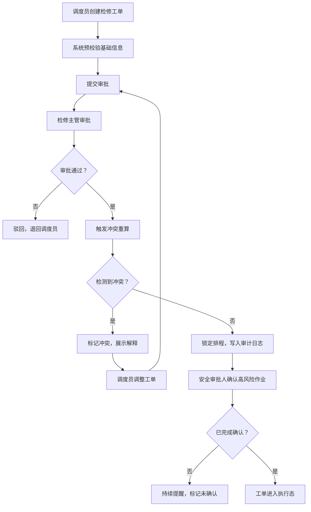

## 1. 产品概述

桅骨风车检修排程与备件占用系统是面向海上风力发电运维团队的专业作业管理系统，用于统一管理风车检修工单、协调停机窗口、追踪备件库存占用、管控安全风险，并自动检测多维度冲突。

- 核心价值：消除人工排程的备件冲突与停机窗口重叠，确保高风险作业完成确认流程，提升运维效率与安全合规性
- 目标用户：运维调度员、检修主管、安全审批人、备件管理员

## 2. 核心功能

### 2.1 用户角色

| 角色 | 登录方式 | 核心权限 |
|------|----------|----------|
| 运维调度员 | 本地账号 | 创建/编辑检修单、查看日历与矩阵、提交审批 |
| 检修主管 | 本地账号 | 审批工单、锁定排程、查看冲突、导出报表 |
| 安全审批人 | 本地账号 | 确认高风险作业、查看安全风险记录 |
| 备件管理员 | 本地账号 | 管理备件批号与库存、查看占用矩阵 |

### 2.2 功能模块

1. **检修日历视图**：按日期展示所有检修工单，区分状态与风险等级，支持日期切换与工单详情弹窗
2. **工单队列管理**：工单列表、筛选器（状态/塔段/班组/风险等级）、新建/编辑工单表单、状态流转
3. **备件占用矩阵**：备件批号 × 日期矩阵视图，高亮多单重叠占用，支持按备件与塔段筛选
4. **冲突检测与解释**：实时检测备件占用冲突、停机窗口冲突、高风险作业未确认，提供解释与关联工单
5. **审批记录**：工单审批历史、操作人、时间戳、审批意见、锁定状态变更记录
6. **导出预览**：检修排程报表、备件占用报告导出预览（JSON/CSV格式）
7. **审计日志**：全量操作记录（创建/修改/审批/冲突重算），支持时间范围筛选

### 2.3 页面详情

| 页面名称 | 模块名称 | 功能描述 |
|----------|----------|----------|
| 主控制台 | 顶部导航 | 系统名称、当前用户、全局搜索、刷新按钮 |
| 主控制台 | 检修日历 | 月视图日历，工单按状态着色，点击查看详情 |
| 主控制台 | 工单队列 | 可筛选工单列表，支持快速编辑、审批、锁定 |
| 主控制台 | 备件占用矩阵 | 行列矩阵展示占用情况，冲突单元格闪烁高亮 |
| 主控制台 | 冲突面板 | 实时冲突列表，类型标签、严重程度、解释文本 |
| 主控制台 | 审批记录 | 审批历史时间线，支持工单跳转 |
| 主控制台 | 导出预览 | 预览导出数据、选择格式、执行下载 |
| 新建/编辑工单 | 工单表单 | 风车编号、塔段位置、停机窗口、备件批号、技师班组、安全风险等级、备注 |
| 工单详情 | 详情弹窗 | 完整工单信息、审批历史、冲突关联、操作按钮 |

## 3. 核心流程

## 4. 用户界面设计

### 4.1 设计风格

- 主色调：深海蓝 `#0A1628` 搭配 工业铜 `#B87333` 点缀，辅以告警红 `#D64545`、安全绿 `#2E8B57`、警戒橙 `#E67E22`
- 按钮风格：硬朗直角、轻微金属质感、带边框与投影
- 字体：标题使用 `Bebas Neue` 粗体工业风，正文使用 `JetBrains Mono` 等宽技术字体
- 布局风格：多面板仪表盘式布局，分区明确，辅助线与网格增强工业感
- 图标风格：线性+工业风，使用 SVG 图标，状态标识使用带衬线的几何图形

### 4.2 页面设计概览

| 页面名称 | 模块名称 | UI 元素 |
|----------|----------|----------|
| 主控制台 | 检修日历 | 月视图网格，日期格内堆叠工单色块，悬停显示摘要，选中态高亮边框 |
| 主控制台 | 工单队列 | 表格布局，状态标签着色，风险等级图标，行内操作按钮，筛选器置顶 |
| 主控制台 | 备件占用矩阵 | 热力图样式，单元格深浅表示占用数量，冲突单元格呼吸动画，悬停展示明细 |
| 主控制台 | 冲突面板 | 卡片式列表，严重程度色条，冲突解释文本块，关联工单可点击跳转 |
| 主控制台 | 审批记录 | 垂直时间线，节点图标表示操作类型，时间戳与操作人 |
| 工单表单 | 工单表单 | 分区标签式表单，必填项红星标记，备件自动补全，日期时间选择器 |

### 4.3 响应式

桌面端优先设计，主控制台采用 3 列布局（左侧日历+工单，中间矩阵，右侧冲突+审批）；中等屏幕切换为上下堆叠；移动端折叠面板，采用抽屉式导航。

### 4.4 视觉细节

- 背景采用深海蓝渐变叠加微妙的等距网格纹理
- 关键数值与状态标签使用微发光效果（text-shadow / box-shadow glow）
- 冲突元素使用脉冲呼吸动画
- 面板切换使用滑入过渡，时长 200ms
- 表单提交与审批操作配合轻微缩放反馈
