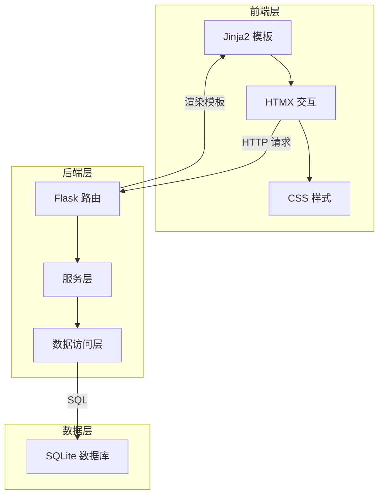
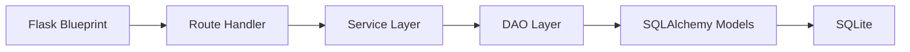
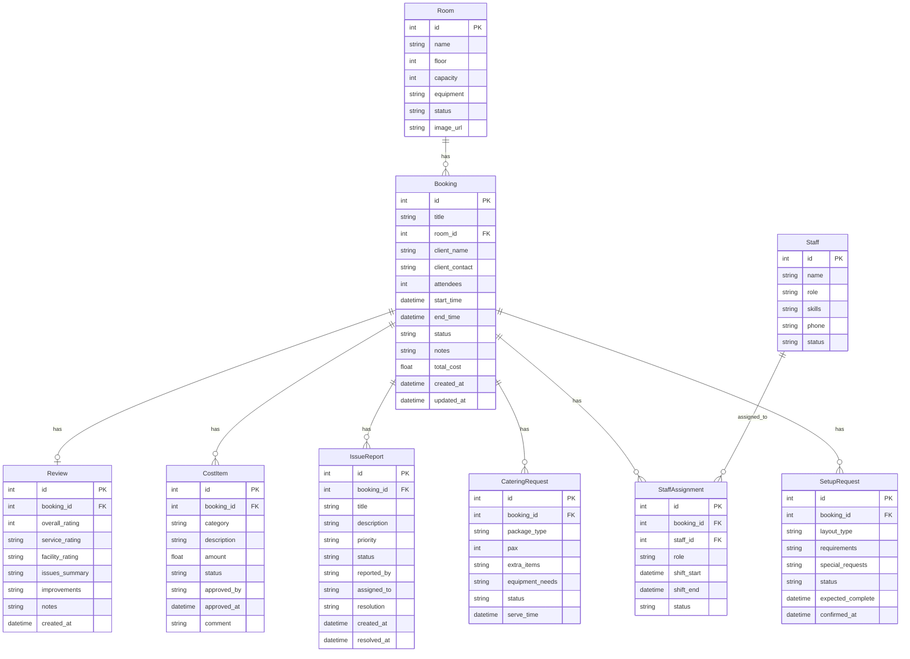

## 1. 架构设计



## 2. 技术说明

- 前端: Jinja2 模板引擎 + HTMX (局部刷新) + Alpine.js (轻量交互) + Tailwind CSS (样式)
- 后端: Flask 3.x (Python Web 框架)
- 数据库: SQLite 3 (单文件数据库，适合轻量部署)
- ORM: Flask-SQLAlchemy (数据库操作)
- 初始化工具: 手动搭建项目结构
- 无编译型工具链，纯 Python 运行

## 3. 路由定义

| 路由 | 方法 | 用途 |
|------|------|------|
| `/` | GET | 工作台首页 |
| `/rooms` | GET | 会议室列表 |
| `/rooms/<id>` | GET | 会议室详情与日程 |
| `/rooms/<id>/schedule` | GET | 会议室日程日历数据 (HTMX) |
| `/bookings` | GET | 预订列表 |
| `/bookings/new` | GET/POST | 创建预订 |
| `/bookings/<id>` | GET | 预订详情 |
| `/bookings/<id>/edit` | GET/POST | 编辑预订 |
| `/bookings/<id>/status` | POST | 更新预订状态 |
| `/bookings/<id>/delete` | POST | 删除预订 |
| `/setups` | GET | 布场需求列表 |
| `/setups/new` | GET/POST | 创建布场需求 |
| `/setups/<id>` | GET | 布场需求详情 |
| `/setups/<id>/confirm` | POST | 确认布场方案 |
| `/caterings` | GET | 茶歇设备列表 |
| `/caterings/new` | GET/POST | 创建茶歇设备需求 |
| `/caterings/<id>` | GET | 茶歇设备详情 |
| `/caterings/<id>/confirm` | POST | 确认茶歇设备 |
| `/staffs` | GET | 排班管理 |
| `/staffs/schedule` | GET/POST | 排班日历数据与更新 |
| `/staffs/<id>` | GET | 人员详情 |
| `/issues` | GET | 问题反馈列表 |
| `/issues/new` | GET/POST | 创建问题反馈 |
| `/issues/<id>` | GET | 问题反馈详情 |
| `/issues/<id>/resolve` | POST | 处理问题 |
| `/costs` | GET | 费用确认列表 |
| `/costs/<id>` | GET | 费用详情 |
| `/costs/<id>/approve` | POST | 审批费用 |
| `/costs/<id>/adjust` | POST | 调整费用 |
| `/reviews` | GET | 复盘列表 |
| `/reviews/new` | GET/POST | 创建复盘 |
| `/reviews/<id>` | GET | 复盘详情 |
| `/api/calendar` | GET | 日历 API (JSON) |

## 4. API 定义

### 4.1 预订状态流转

```
POST /bookings/<id>/status
Body: { "status": "confirmed" | "in_progress" | "completed" | "cancelled" }
Response: HTML 片段 (更新状态标签)
```

### 4.2 日历数据

```
GET /api/calendar?start=2025-01-01&end=2025-01-31
Response: JSON [{ "id": 1, "title": "XX公司年会", "start": "...", "end": "...", "color": "..." }]
```

### 4.3 问题反馈处理

```
POST /issues/<id>/resolve
Body: { "resolution": "处理说明", "status": "resolved" }
Response: HTML 片段 (更新问题状态)
```

### 4.4 费用审批

```
POST /costs/<id>/approve
Body: { "action": "approve" | "reject", "comment": "审批意见" }
Response: HTML 片段 (更新审批状态)
```

## 5. 服务端架构



- 使用 Flask Blueprint 组织模块: bookings, setups, caterings, staffs, issues, costs, reviews
- Service 层封装业务逻辑
- DAO 层封装数据库查询
- 模板使用 Jinja2 继承与组件化

## 6. 数据模型

### 6.1 数据模型定义



### 6.2 数据定义语言

```sql
CREATE TABLE room (
    id INTEGER PRIMARY KEY AUTOINCREMENT,
    name VARCHAR(100) NOT NULL,
    floor INTEGER NOT NULL,
    capacity INTEGER NOT NULL,
    equipment TEXT DEFAULT '',
    status VARCHAR(20) DEFAULT 'available',
    image_url VARCHAR(255) DEFAULT ''
);

CREATE TABLE staff (
    id INTEGER PRIMARY KEY AUTOINCREMENT,
    name VARCHAR(100) NOT NULL,
    role VARCHAR(50) NOT NULL,
    skills TEXT DEFAULT '',
    phone VARCHAR(20) DEFAULT '',
    status VARCHAR(20) DEFAULT 'available'
);

CREATE TABLE booking (
    id INTEGER PRIMARY KEY AUTOINCREMENT,
    title VARCHAR(200) NOT NULL,
    room_id INTEGER NOT NULL REFERENCES room(id),
    client_name VARCHAR(100) NOT NULL,
    client_contact VARCHAR(50) DEFAULT '',
    attendees INTEGER DEFAULT 0,
    start_time DATETIME NOT NULL,
    end_time DATETIME NOT NULL,
    status VARCHAR(20) DEFAULT 'draft',
    notes TEXT DEFAULT '',
    total_cost REAL DEFAULT 0.0,
    created_at DATETIME DEFAULT CURRENT_TIMESTAMP,
    updated_at DATETIME DEFAULT CURRENT_TIMESTAMP
);

CREATE TABLE setup_request (
    id INTEGER PRIMARY KEY AUTOINCREMENT,
    booking_id INTEGER NOT NULL REFERENCES booking(id),
    layout_type VARCHAR(50) NOT NULL,
    requirements TEXT DEFAULT '',
    special_requests TEXT DEFAULT '',
    status VARCHAR(20) DEFAULT 'pending',
    expected_complete DATETIME,
    confirmed_at DATETIME
);

CREATE TABLE catering_request (
    id INTEGER PRIMARY KEY AUTOINCREMENT,
    booking_id INTEGER NOT NULL REFERENCES booking(id),
    package_type VARCHAR(50) NOT NULL,
    pax INTEGER DEFAULT 0,
    extra_items TEXT DEFAULT '',
    equipment_needs TEXT DEFAULT '',
    status VARCHAR(20) DEFAULT 'pending',
    serve_time DATETIME
);

CREATE TABLE staff_assignment (
    id INTEGER PRIMARY KEY AUTOINCREMENT,
    booking_id INTEGER NOT NULL REFERENCES booking(id),
    staff_id INTEGER NOT NULL REFERENCES staff(id),
    role VARCHAR(50) NOT NULL,
    shift_start DATETIME NOT NULL,
    shift_end DATETIME NOT NULL,
    status VARCHAR(20) DEFAULT 'assigned'
);

CREATE TABLE issue_report (
    id INTEGER PRIMARY KEY AUTOINCREMENT,
    booking_id INTEGER NOT NULL REFERENCES booking(id),
    title VARCHAR(200) NOT NULL,
    description TEXT DEFAULT '',
    priority VARCHAR(20) DEFAULT 'medium',
    status VARCHAR(20) DEFAULT 'open',
    reported_by VARCHAR(100) DEFAULT '',
    assigned_to VARCHAR(100) DEFAULT '',
    resolution TEXT DEFAULT '',
    created_at DATETIME DEFAULT CURRENT_TIMESTAMP,
    resolved_at DATETIME
);

CREATE TABLE cost_item (
    id INTEGER PRIMARY KEY AUTOINCREMENT,
    booking_id INTEGER NOT NULL REFERENCES booking(id),
    category VARCHAR(50) NOT NULL,
    description VARCHAR(200) DEFAULT '',
    amount REAL NOT NULL DEFAULT 0.0,
    status VARCHAR(20) DEFAULT 'pending',
    approved_by VARCHAR(100) DEFAULT '',
    approved_at DATETIME,
    comment TEXT DEFAULT ''
);

CREATE TABLE review (
    id INTEGER PRIMARY KEY AUTOINCREMENT,
    booking_id INTEGER NOT NULL REFERENCES booking(id),
    overall_rating INTEGER DEFAULT 0,
    service_rating INTEGER DEFAULT 0,
    facility_rating INTEGER DEFAULT 0,
    issues_summary TEXT DEFAULT '',
    improvements TEXT DEFAULT '',
    notes TEXT DEFAULT '',
    created_at DATETIME DEFAULT CURRENT_TIMESTAMP
);

CREATE INDEX idx_booking_room ON booking(room_id);
CREATE INDEX idx_booking_status ON booking(status);
CREATE INDEX idx_booking_time ON booking(start_time, end_time);
CREATE INDEX idx_setup_booking ON setup_request(booking_id);
CREATE INDEX idx_catering_booking ON catering_request(booking_id);
CREATE INDEX idx_staff_assignment_booking ON staff_assignment(booking_id);
CREATE INDEX idx_staff_assignment_staff ON staff_assignment(staff_id);
CREATE INDEX idx_issue_booking ON issue_report(booking_id);
CREATE INDEX idx_issue_status ON issue_report(status);
CREATE INDEX idx_cost_booking ON cost_item(booking_id);
CREATE INDEX idx_review_booking ON review(booking_id);
```
