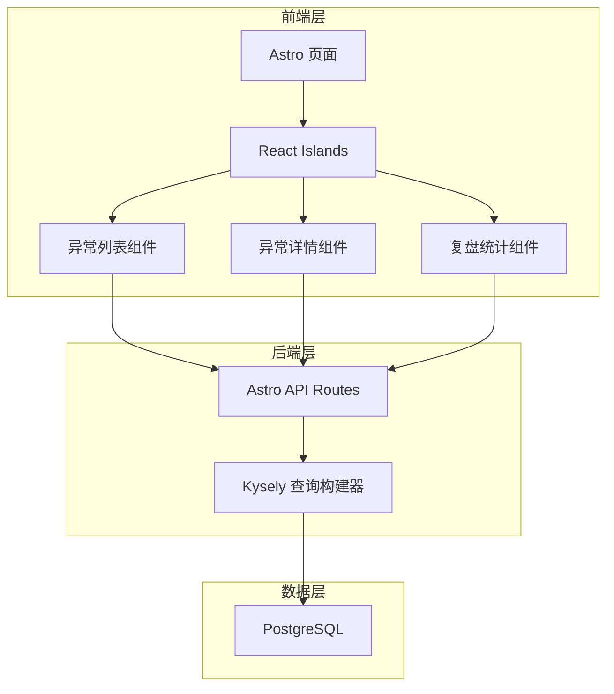
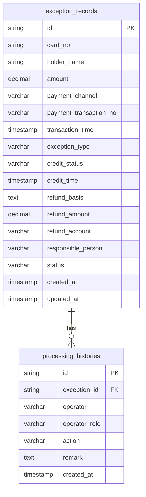

## 1. 架构设计



## 2. 技术说明

- **前端**: Astro@4 + React@18 + Tailwind CSS@3 + TypeScript
- **构建工具**: Astro CLI（内置 Vite）
- **后端**: Astro Server Routes（API Endpoints）
- **数据库**: PostgreSQL + Kysely（类型安全查询构建器）
- **状态管理**: React useState/useReducer（Islands 内局部状态）
- **图标**: lucide-react

## 3. 路由定义

| 路由 | 用途 |
|------|------|
| `/` | 异常列表页，首屏直接展示待核对充值异常 |
| `/detail/[id]` | 异常详情页，展示单条异常的完整信息和操作 |
| `/review` | 复盘页，按多维度聚合统计 |

## 4. API 定义

```typescript
interface ExceptionRecord {
  id: string
  cardNo: string
  holderName: string
  amount: number
  paymentChannel: "wechat" | "alipay" | "bank_card"
  paymentTransactionNo: string
  transactionTime: string
  exceptionType: "normal" | "duplicate_deduction" | "paid_not_credited" | "refund_failed"
  creditStatus: "credited" | "not_credited" | "partially_credited"
  creditTime: string | null
  refundBasis: string | null
  refundAmount: number | null
  refundAccount: string | null
  responsiblePerson: string
  status: "pending" | "verifying" | "refund_submitted" | "supplement_submitted" | "reviewing" | "returned" | "completed"
  createdAt: string
  updatedAt: string
}

interface ProcessingHistory {
  id: string
  exceptionId: string
  operator: string
  operatorRole: "handler" | "reviewer"
  action: "created" | "verified" | "refund_submitted" | "supplement_submitted" | "review_confirmed" | "returned_for_evidence" | "evidence_supplemented" | "completed"
  remark: string
  createdAt: string
}

interface AggregateStats {
  byExceptionType: { type: string; count: number; totalAmount: number }[]
  byPaymentChannel: { channel: string; count: number; totalAmount: number }[]
  processingTime: { type: string; avgHours: number; maxHours: number; minHours: number }[]
  refundResult: { result: string; count: number; totalAmount: number }[]
}
```

### API 端点

| 方法 | 路径 | 请求 | 响应 |
|------|------|------|------|
| GET | `/api/exceptions` | `?type=&channel=&status=&page=&limit=` | `{ data: ExceptionRecord[], total: number }` |
| GET | `/api/exceptions/[id]` | - | `ExceptionRecord & { histories: ProcessingHistory[] }` |
| POST | `/api/exceptions/[id]/verify` | `{ operator: string }` | `ExceptionRecord` |
| POST | `/api/exceptions/[id]/refund` | `{ operator: string, basis: string, amount: number, account: string }` | `ExceptionRecord` |
| POST | `/api/exceptions/[id]/supplement` | `{ operator: string, remark: string }` | `ExceptionRecord` |
| POST | `/api/exceptions/[id]/review` | `{ operator: string, action: "confirm" | "return", remark: string }` | `ExceptionRecord` |
| GET | `/api/stats` | - | `AggregateStats` |
| GET | `/api/stats/records` | `?type=&channel=&result=` | `{ data: ExceptionRecord[] }` |

## 5. 服务端架构图


## 6. 数据模型

### 6.1 数据模型定义



### 6.2 数据定义语言

```sql
CREATE TABLE exception_records (
  id UUID PRIMARY KEY DEFAULT gen_random_uuid(),
  card_no VARCHAR(20) NOT NULL,
  holder_name VARCHAR(50) NOT NULL,
  amount DECIMAL(10,2) NOT NULL,
  payment_channel VARCHAR(20) NOT NULL CHECK (payment_channel IN ('wechat', 'alipay', 'bank_card')),
  payment_transaction_no VARCHAR(64) NOT NULL,
  transaction_time TIMESTAMP NOT NULL,
  exception_type VARCHAR(30) NOT NULL CHECK (exception_type IN ('normal', 'duplicate_deduction', 'paid_not_credited', 'refund_failed')),
  credit_status VARCHAR(20) NOT NULL CHECK (credit_status IN ('credited', 'not_credited', 'partially_credited')),
  credit_time TIMESTAMP,
  refund_basis TEXT,
  refund_amount DECIMAL(10,2),
  refund_account VARCHAR(64),
  responsible_person VARCHAR(50) NOT NULL,
  status VARCHAR(30) NOT NULL DEFAULT 'pending' CHECK (status IN ('pending', 'verifying', 'refund_submitted', 'supplement_submitted', 'reviewing', 'returned', 'completed')),
  created_at TIMESTAMP NOT NULL DEFAULT NOW(),
  updated_at TIMESTAMP NOT NULL DEFAULT NOW()
);

CREATE TABLE processing_histories (
  id UUID PRIMARY KEY DEFAULT gen_random_uuid(),
  exception_id UUID NOT NULL REFERENCES exception_records(id) ON DELETE CASCADE,
  operator VARCHAR(50) NOT NULL,
  operator_role VARCHAR(20) NOT NULL CHECK (operator_role IN ('handler', 'reviewer')),
  action VARCHAR(40) NOT NULL CHECK (action IN ('created', 'verified', 'refund_submitted', 'supplement_submitted', 'review_confirmed', 'returned_for_evidence', 'evidence_supplemented', 'completed')),
  remark TEXT NOT NULL DEFAULT '',
  created_at TIMESTAMP NOT NULL DEFAULT NOW()
);

CREATE INDEX idx_exception_records_status ON exception_records(status);
CREATE INDEX idx_exception_records_type ON exception_records(exception_type);
CREATE INDEX idx_exception_records_channel ON exception_records(payment_channel);
CREATE INDEX idx_processing_histories_exception_id ON processing_histories(exception_id);
```
