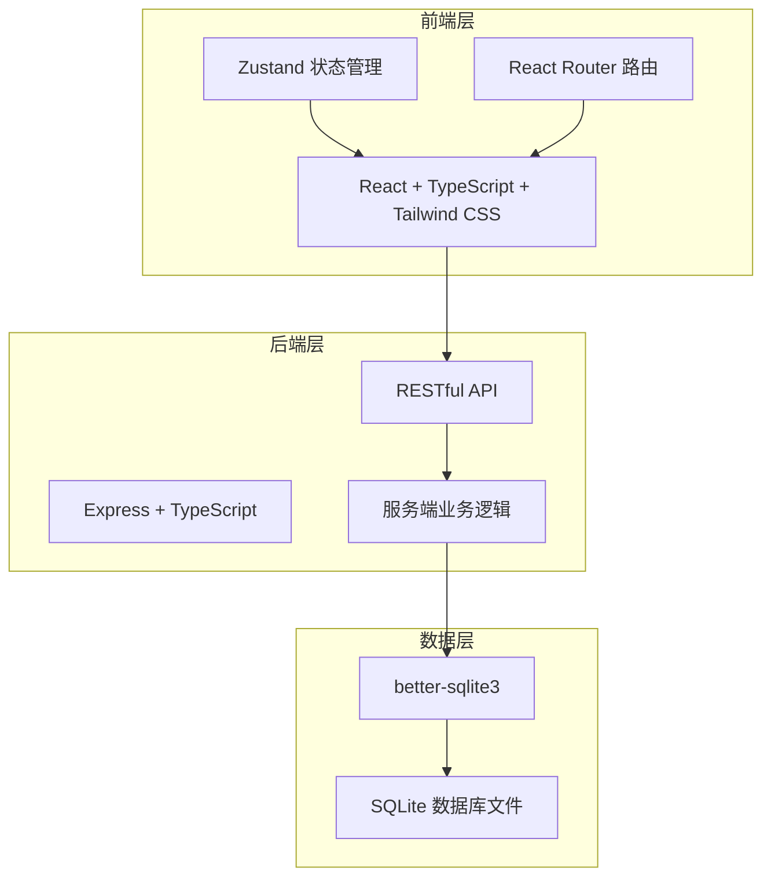
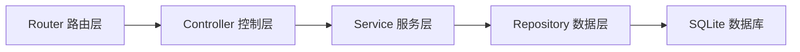
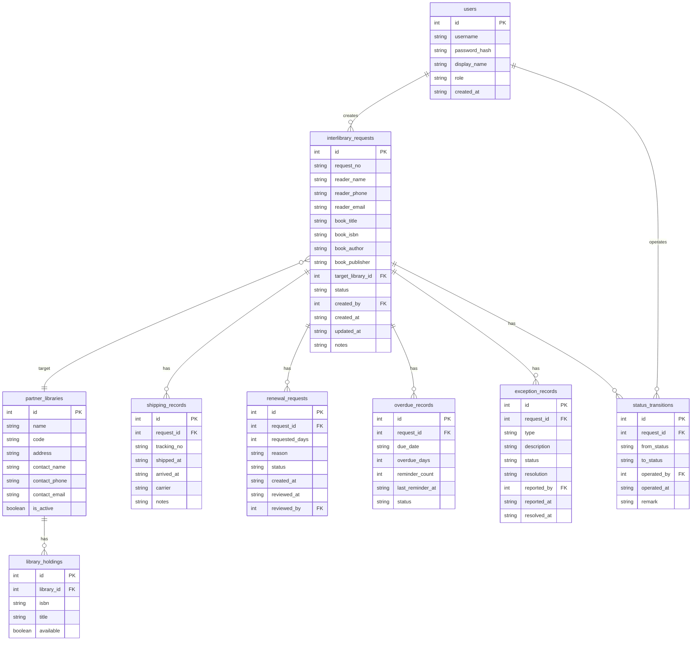

## 1. 架构设计



## 2. 技术说明

- **前端**：React@18 + TypeScript + Tailwind CSS + Zustand + React Router
- **初始化工具**：vite-init (react-express-ts 模板)
- **后端**：Express@4 + TypeScript (ESM 模块)
- **数据库**：SQLite (better-sqlite3)，零配置嵌入式数据库
- **认证**：基于角色的简易会话认证（内存 Session）

## 3. 路由定义

| 路由 | 用途 |
|------|------|
| / | 仪表盘首页，统计概览和待办事项 |
| /requests | 互借申请列表，支持筛选和搜索 |
| /requests/new | 新建互借申请表单 |
| /requests/:id | 申请详情页，含状态时间线和操作按钮 |
| /kanban | 馆际流转看板，看板视图展示所有申请 |
| /overdue | 逾期追踪列表和催还管理 |
| /libraries | 合作馆管理列表 |
| /exceptions | 异常反馈记录和处理 |

## 4. API 定义

### 4.1 互借申请

```typescript
interface InterlibraryRequest {
  id: number
  requestNo: string
  readerName: string
  readerPhone: string
  readerEmail: string
  bookTitle: string
  bookIsbn: string
  bookAuthor: string
  bookPublisher: string
  targetLibraryId: number | null
  status: RequestStatus
  createdAt: string
  updatedAt: string
  notes: string
}

type RequestStatus =
  | "pending_match"
  | "matched"
  | "under_review"
  | "approved"
  | "rejected"
  | "in_transit"
  | "arrived"
  | "on_loan"
  | "renewing"
  | "overdue"
  | "returned"
  | "exception"

interface CreateRequestInput {
  readerName: string
  readerPhone: string
  readerEmail: string
  bookTitle: string
  bookIsbn: string
  bookAuthor: string
  bookPublisher: string
  notes?: string
}
```

### 4.2 物流记录

```typescript
interface ShippingRecord {
  id: number
  requestId: number
  trackingNo: string
  shippedAt: string
  arrivedAt: string | null
  carrier: string
  notes: string
}
```

### 4.3 续借申请

```typescript
interface RenewalRequest {
  id: number
  requestId: number
  requestedDays: number
  reason: string
  status: "pending" | "approved" | "rejected"
  createdAt: string
  reviewedAt: string | null
  reviewedBy: number | null
}
```

### 4.4 逾期记录

```typescript
interface OverdueRecord {
  id: number
  requestId: number
  dueDate: string
  overdueDays: number
  reminderCount: number
  lastReminderAt: string | null
  status: "active" | "resolved"
}
```

### 4.5 异常记录

```typescript
interface ExceptionRecord {
  id: number
  requestId: number
  type: "damaged" | "lost" | "refused" | "other"
  description: string
  status: "open" | "processing" | "resolved"
  resolution: string | null
  reportedBy: number
  reportedAt: string
  resolvedAt: string | null
}
```

### 4.6 合作馆

```typescript
interface PartnerLibrary {
  id: number
  name: string
  code: string
  address: string
  contactName: string
  contactPhone: string
  contactEmail: string
  isActive: boolean
}
```

### 4.7 状态流转记录

```typescript
interface StatusTransition {
  id: number
  requestId: number
  fromStatus: string
  toStatus: string
  operatedBy: number
  operatedAt: string
  remark: string
}
```

### 4.8 API 端点

| 方法 | 路径 | 说明 |
|------|------|------|
| GET | /api/requests | 获取互借申请列表（支持筛选） |
| GET | /api/requests/:id | 获取申请详情 |
| POST | /api/requests | 创建互借申请 |
| PUT | /api/requests/:id/status | 更新申请状态 |
| GET | /api/requests/:id/transitions | 获取状态流转历史 |
| POST | /api/requests/:id/renewal | 提交续借申请 |
| PUT | /api/renewals/:id | 审批续借 |
| POST | /api/requests/:id/ship | 登记物流信息 |
| PUT | /api/requests/:id/arrive | 确认到馆 |
| PUT | /api/requests/:id/return | 归还验收 |
| GET | /api/overdue | 获取逾期列表 |
| POST | /api/overdue/:id/remind | 发送催还通知 |
| GET | /api/libraries | 获取合作馆列表 |
| GET | /api/libraries/:id | 获取合作馆详情 |
| POST | /api/libraries | 创建合作馆 |
| PUT | /api/libraries/:id | 更新合作馆 |
| GET | /api/exceptions | 获取异常列表 |
| POST | /api/exceptions | 创建异常记录 |
| PUT | /api/exceptions/:id | 更新异常处理状态 |
| GET | /api/dashboard/stats | 获取仪表盘统计数据 |
| GET | /api/dashboard/activities | 获取近期动态 |
| GET | /api/dashboard/todos | 获取待办事项 |
| POST | /api/match/:isbn | 根据 ISBN 匹配合作馆 |

## 5. 服务端架构图



## 6. 数据模型

### 6.1 数据模型定义



### 6.2 数据定义语言

```sql
CREATE TABLE users (
  id INTEGER PRIMARY KEY AUTOINCREMENT,
  username TEXT NOT NULL UNIQUE,
  password_hash TEXT NOT NULL,
  display_name TEXT NOT NULL,
  role TEXT NOT NULL CHECK(role IN ('librarian', 'partner', 'supervisor')),
  created_at TEXT NOT NULL DEFAULT (datetime('now'))
);

CREATE TABLE partner_libraries (
  id INTEGER PRIMARY KEY AUTOINCREMENT,
  name TEXT NOT NULL,
  code TEXT NOT NULL UNIQUE,
  address TEXT NOT NULL,
  contact_name TEXT NOT NULL,
  contact_phone TEXT NOT NULL,
  contact_email TEXT NOT NULL,
  is_active INTEGER NOT NULL DEFAULT 1
);

CREATE TABLE library_holdings (
  id INTEGER PRIMARY KEY AUTOINCREMENT,
  library_id INTEGER NOT NULL REFERENCES partner_libraries(id),
  isbn TEXT NOT NULL,
  title TEXT NOT NULL,
  available INTEGER NOT NULL DEFAULT 1,
  UNIQUE(library_id, isbn)
);

CREATE TABLE interlibrary_requests (
  id INTEGER PRIMARY KEY AUTOINCREMENT,
  request_no TEXT NOT NULL UNIQUE,
  reader_name TEXT NOT NULL,
  reader_phone TEXT NOT NULL,
  reader_email TEXT NOT NULL,
  book_title TEXT NOT NULL,
  book_isbn TEXT NOT NULL,
  book_author TEXT NOT NULL DEFAULT '',
  book_publisher TEXT NOT NULL DEFAULT '',
  target_library_id INTEGER REFERENCES partner_libraries(id),
  status TEXT NOT NULL DEFAULT 'pending_match',
  created_by INTEGER NOT NULL REFERENCES users(id),
  created_at TEXT NOT NULL DEFAULT (datetime('now')),
  updated_at TEXT NOT NULL DEFAULT (datetime('now')),
  notes TEXT NOT NULL DEFAULT ''
);

CREATE TABLE shipping_records (
  id INTEGER PRIMARY KEY AUTOINCREMENT,
  request_id INTEGER NOT NULL REFERENCES interlibrary_requests(id),
  tracking_no TEXT NOT NULL,
  shipped_at TEXT NOT NULL,
  arrived_at TEXT,
  carrier TEXT NOT NULL DEFAULT '',
  notes TEXT NOT NULL DEFAULT ''
);

CREATE TABLE renewal_requests (
  id INTEGER PRIMARY KEY AUTOINCREMENT,
  request_id INTEGER NOT NULL REFERENCES interlibrary_requests(id),
  requested_days INTEGER NOT NULL,
  reason TEXT NOT NULL DEFAULT '',
  status TEXT NOT NULL DEFAULT 'pending' CHECK(status IN ('pending', 'approved', 'rejected')),
  created_at TEXT NOT NULL DEFAULT (datetime('now')),
  reviewed_at TEXT,
  reviewed_by INTEGER REFERENCES users(id)
);

CREATE TABLE overdue_records (
  id INTEGER PRIMARY KEY AUTOINCREMENT,
  request_id INTEGER NOT NULL REFERENCES interlibrary_requests(id),
  due_date TEXT NOT NULL,
  overdue_days INTEGER NOT NULL DEFAULT 0,
  reminder_count INTEGER NOT NULL DEFAULT 0,
  last_reminder_at TEXT,
  status TEXT NOT NULL DEFAULT 'active' CHECK(status IN ('active', 'resolved'))
);

CREATE TABLE exception_records (
  id INTEGER PRIMARY KEY AUTOINCREMENT,
  request_id INTEGER NOT NULL REFERENCES interlibrary_requests(id),
  type TEXT NOT NULL CHECK(type IN ('damaged', 'lost', 'refused', 'other')),
  description TEXT NOT NULL,
  status TEXT NOT NULL DEFAULT 'open' CHECK(status IN ('open', 'processing', 'resolved')),
  resolution TEXT,
  reported_by INTEGER NOT NULL REFERENCES users(id),
  reported_at TEXT NOT NULL DEFAULT (datetime('now')),
  resolved_at TEXT
);

CREATE TABLE status_transitions (
  id INTEGER PRIMARY KEY AUTOINCREMENT,
  request_id INTEGER NOT NULL REFERENCES interlibrary_requests(id),
  from_status TEXT NOT NULL,
  to_status TEXT NOT NULL,
  operated_by INTEGER NOT NULL REFERENCES users(id),
  operated_at TEXT NOT NULL DEFAULT (datetime('now')),
  remark TEXT NOT NULL DEFAULT ''
);

CREATE INDEX idx_requests_status ON interlibrary_requests(status);
CREATE INDEX idx_requests_created_at ON interlibrary_requests(created_at);
CREATE INDEX idx_requests_target_library ON interlibrary_requests(target_library_id);
CREATE INDEX idx_overdue_status ON overdue_records(status);
CREATE INDEX idx_exceptions_status ON exception_records(status);
CREATE INDEX idx_holdings_isbn ON library_holdings(isbn);
CREATE INDEX idx_transitions_request ON status_transitions(request_id);
```
