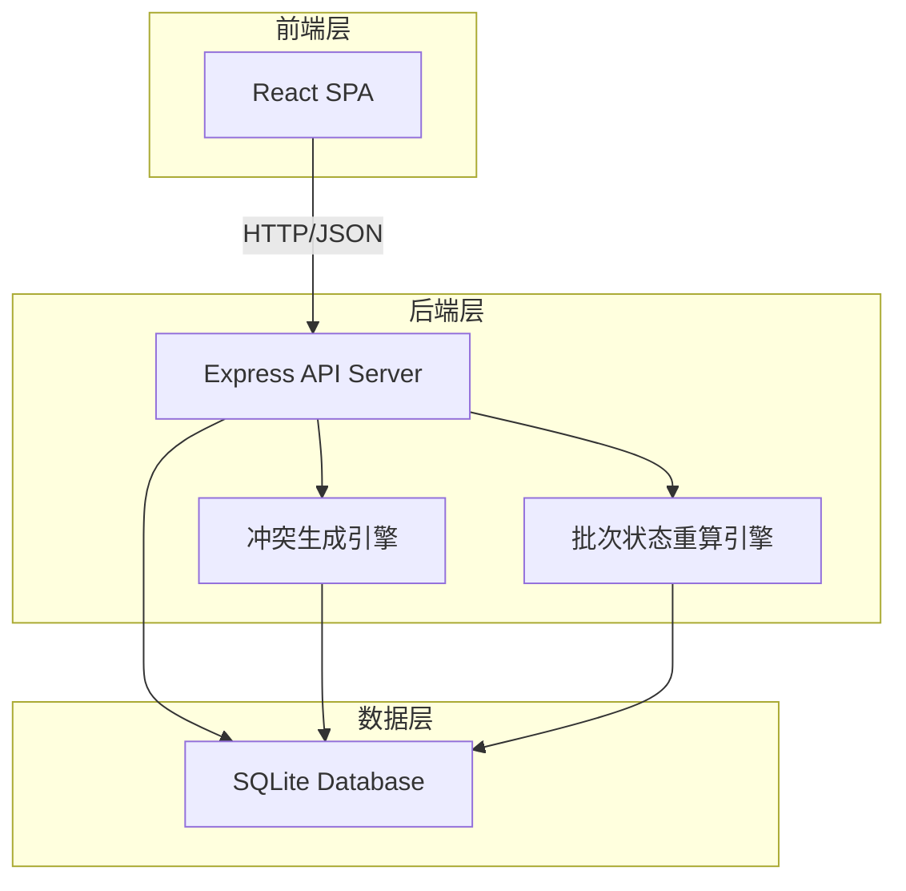
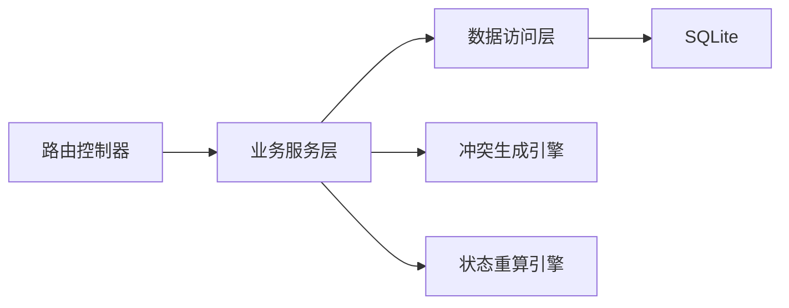
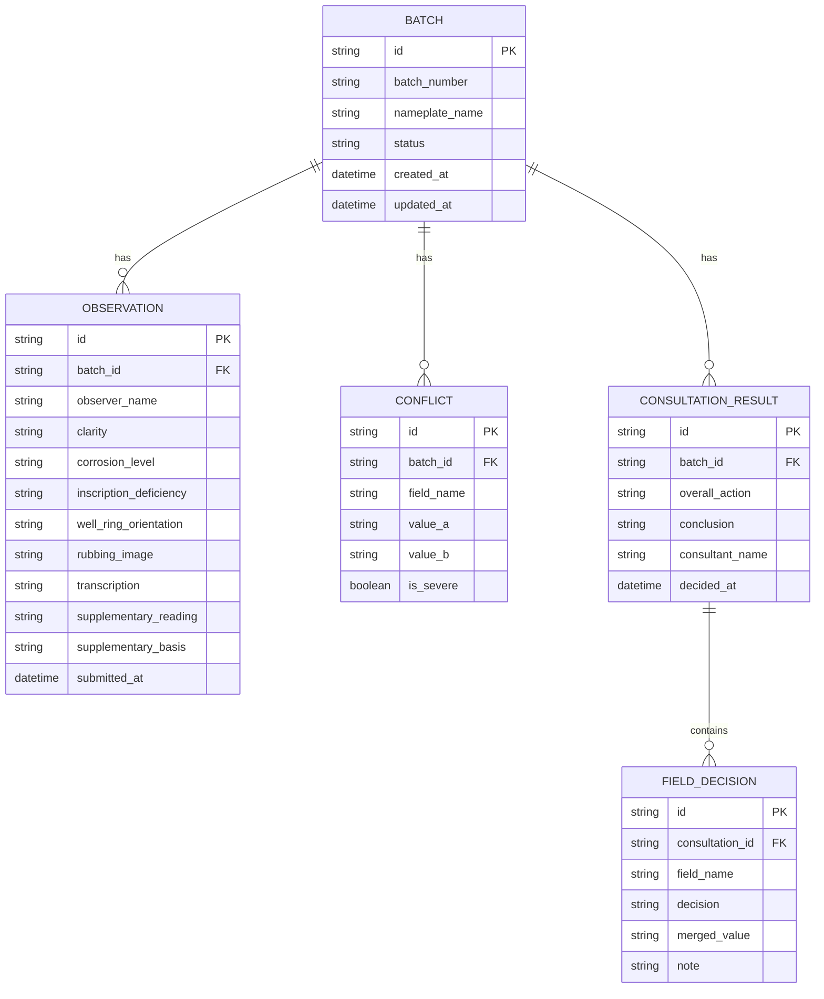

## 1. 架构设计



## 2. 技术说明

- 前端：React@18 + TypeScript + TailwindCSS@3 + Vite
- 初始化工具：Vite
- 后端：Express@4 + TypeScript + better-sqlite3
- 数据库：SQLite（单文件，无需外部服务）
- 状态管理：React Context + useReducer
- 路由：React Router v6

## 3. 路由定义

| 路由 | 用途 |
|------|------|
| `/` | 批次总览页，列表与筛选 |
| `/submit/:batchId` | 读数提交页 |
| `/consult/:batchId` | 会诊对比页 |
| `/history/:batchId` | 会诊记录页 |

## 4. API 定义

### 4.1 数据类型

```typescript
type BatchStatus = "consistent" | "minor_deviation" | "severe_conflict" | "insufficient_evidence" | "merged"

type Clarity = "clear" | "fairly_clear" | "blurry" | "very_blurry"
type CorrosionLevel = "none" | "slight" | "moderate" | "severe"
type InscriptionDeficiency = "none" | "partial" | "severe" | "total_loss"
type WellRingOrientation = "east" | "south" | "west" | "north" | "southeast" | "northeast" | "southwest" | "northwest"

type ConsultationDecision = "accept_a" | "accept_b" | "merge" | "keep_dissent"

interface Observation {
  id: string
  batchId: string
  observerName: string
  clarity: Clarity
  corrosionLevel: CorrosionLevel
  inscriptionDeficiency: InscriptionDeficiency
  wellRingOrientation: WellRingOrientation
  rubbingImage: string
  transcription: string
  supplementaryReading: string
  supplementaryBasis: string
  submittedAt: string
}

interface ConflictField {
  fieldName: string
  fieldLabel: string
  valueA: string
  valueB: string
  isSevere: boolean
}

interface ConsultationResult {
  id: string
  batchId: string
  fieldDecisions: FieldDecision[]
  overallAction: "merge" | "keep_dissent" | "return_for_evidence"
  conclusion: string
  consultantName: string
  decidedAt: string
}

interface FieldDecision {
  fieldName: string
  decision: ConsultationDecision
  mergedValue?: string
  note?: string
}

interface Batch {
  id: string
  batchNumber: string
  nameplateName: string
  status: BatchStatus
  observations: Observation[]
  conflicts: ConflictField[]
  consultationResults: ConsultationResult[]
  createdAt: string
  updatedAt: string
}
```

### 4.2 API 端点

| 方法 | 路径 | 请求体 | 响应 | 说明 |
|------|------|--------|------|------|
| GET | `/api/batches` | — | `Batch[]` | 获取批次列表，支持 `?status=` 筛选 |
| GET | `/api/batches/:id` | — | `Batch` | 获取批次详情含观察与冲突 |
| POST | `/api/batches/:id/observations` | `Observation` | `Batch` | 提交观察读数 |
| POST | `/api/batches/:id/conflicts/generate` | — | `ConflictField[]` | 生成冲突清单 |
| POST | `/api/batches/:id/consult` | `ConsultationResult` | `Batch` | 提交会诊结论 |
| GET | `/api/batches/:id/history` | — | `ConsultationResult[]` | 获取会诊历史 |
| POST | `/api/batches/:id/return` | `{ note: string }` | `Batch` | 退回补证 |

## 5. 服务器架构



### 5.1 冲突生成引擎

逐字段比对两名观察人的读数，判定冲突严重等级：
- **拓片清晰度、锈蚀级别、铭文残缺、井圈方位**：枚举值不同即标记为冲突；相差两级及以上为"严重"
- **释文**：文本差异>50%为"严重"，否则为"非严重"
- **残缺铭文补读 vs 旧释文**：补读文本与释文重叠部分不一致时标记为"残缺补读冲突"，固定为严重

### 5.2 状态重算引擎

根据冲突清单和会诊结论重算批次状态：
- 无观察人 → 缺证
- 仅一名观察人 → 缺证
- 两名观察人、零冲突 → 一致
- 两名观察人、仅非严重冲突 → 轻微偏差
- 两名观察人、存在严重冲突 → 严重冲突
- 会诊结论为"合并冲突" → 已合并
- 会诊结论为"保留分歧" → 保持原冲突状态

## 6. 数据模型

### 6.1 数据模型图



### 6.2 数据定义语言

```sql
CREATE TABLE batches (
  id TEXT PRIMARY KEY,
  batch_number TEXT NOT NULL UNIQUE,
  nameplate_name TEXT NOT NULL,
  status TEXT NOT NULL DEFAULT 'insufficient_evidence',
  created_at TEXT NOT NULL DEFAULT (datetime('now')),
  updated_at TEXT NOT NULL DEFAULT (datetime('now'))
);

CREATE TABLE observations (
  id TEXT PRIMARY KEY,
  batch_id TEXT NOT NULL REFERENCES batches(id),
  observer_name TEXT NOT NULL,
  clarity TEXT NOT NULL,
  corrosion_level TEXT NOT NULL,
  inscription_deficiency TEXT NOT NULL,
  well_ring_orientation TEXT NOT NULL,
  rubbing_image TEXT DEFAULT '',
  transcription TEXT DEFAULT '',
  supplementary_reading TEXT DEFAULT '',
  supplementary_basis TEXT DEFAULT '',
  submitted_at TEXT NOT NULL DEFAULT (datetime('now'))
);

CREATE TABLE conflicts (
  id TEXT PRIMARY KEY,
  batch_id TEXT NOT NULL REFERENCES batches(id),
  field_name TEXT NOT NULL,
  field_label TEXT NOT NULL,
  value_a TEXT NOT NULL,
  value_b TEXT NOT NULL,
  is_severe INTEGER NOT NULL DEFAULT 0
);

CREATE TABLE consultation_results (
  id TEXT PRIMARY KEY,
  batch_id TEXT NOT NULL REFERENCES batches(id),
  overall_action TEXT NOT NULL,
  conclusion TEXT DEFAULT '',
  consultant_name TEXT NOT NULL,
  decided_at TEXT NOT NULL DEFAULT (datetime('now'))
);

CREATE TABLE field_decisions (
  id TEXT PRIMARY KEY,
  consultation_id TEXT NOT NULL REFERENCES consultation_results(id),
  field_name TEXT NOT NULL,
  decision TEXT NOT NULL,
  merged_value TEXT DEFAULT '',
  note TEXT DEFAULT ''
);
```
