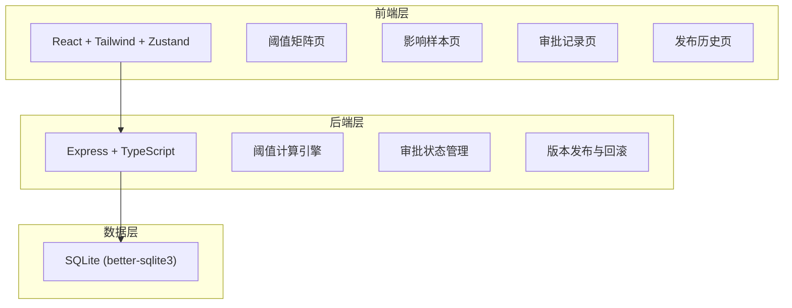
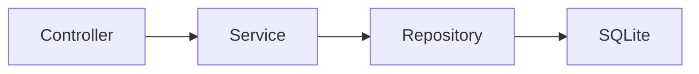
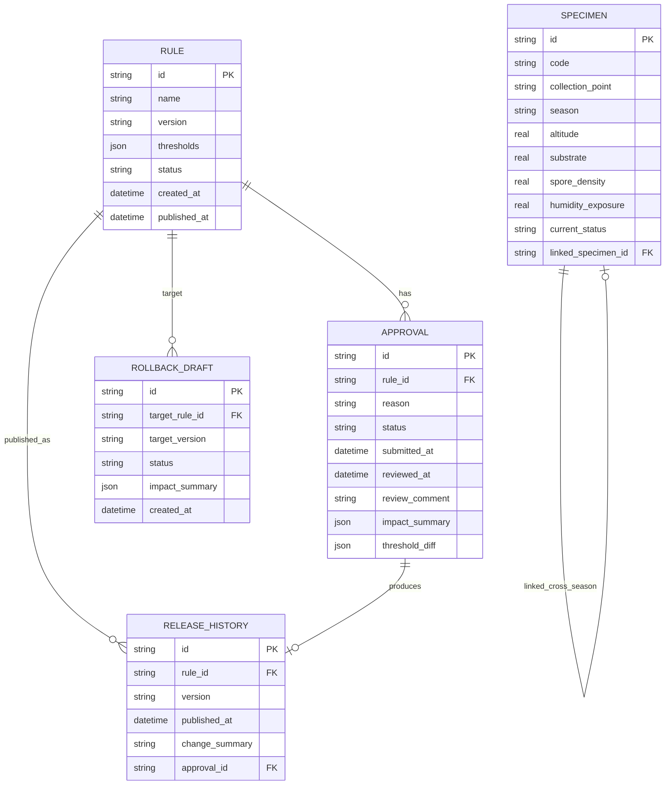

## 1. 架构设计



## 2. 技术说明

- 前端：React@18 + Tailwind CSS@3 + Vite + Zustand
- 初始化工具：vite-init
- 后端：Express@4 + TypeScript (ESM)
- 数据库：SQLite (better-sqlite3)，轻量级内嵌数据库，无需额外服务

## 3. 路由定义

| 路由 | 用途 |
|------|------|
| / | 阈值矩阵页（主页） |
| /impact | 影响样本列表页 |
| /approvals | 审批记录页 |
| /history | 发布历史与回滚页 |

## 4. API定义

### 4.1 规则管理

```
GET    /api/rules                   # 获取所有规则（已发布+草稿）
GET    /api/rules/:id               # 获取单条规则详情
POST   /api/rules/draft             # 更新草稿规则（含阈值调整）
POST   /api/rules/draft/submit      # 提交草稿规则审批
```

### 4.2 影响计算

```
GET    /api/impact?draftRuleId=:id  # 计算草稿规则的影响标本列表
GET    /api/impact/summary          # 影响统计概览（按变更类型分组）
```

### 4.3 审批管理

```
GET    /api/approvals                # 获取审批记录列表
POST   /api/approvals                # 创建审批记录
PUT    /api/approvals/:id/approve    # 审批通过
PUT    /api/approvals/:id/reject     # 审批驳回
```

### 4.4 发布与回滚

```
GET    /api/history                  # 获取发布历史
POST   /api/history/rollback         # 创建回滚草案
POST   /api/history/rollback/:id/submit  # 提交回滚审批
```

### 4.5 标本数据

```
GET    /api/specimens                # 获取标本列表（支持过滤）
```

### 4.6 TypeScript类型定义

```typescript
type Status = 'pass' | 'warn' | 'block';

interface ThresholdDimension {
  passMax: number;
  warnMax: number;
}

interface ThresholdGroup {
  altitude: ThresholdDimension;    // 采集海拔 (m)
  substrate: ThresholdDimension;   // 附着基质 (编码 0-10)
  sporeDensity: ThresholdDimension; // 孢子密度 (个/mm²)
  humidityExposure: ThresholdDimension; // 湿度暴露 (%)
}

interface Rule {
  id: string;
  name: string;
  version: string;
  thresholds: ThresholdGroup;
  status: 'published' | 'draft';
  createdAt: string;
  publishedAt?: string;
}

interface Specimen {
  id: string;
  code: string;
  collectionPoint: string;
  season: 'spring' | 'summer' | 'autumn' | 'winter';
  altitude: number;
  substrate: number;
  sporeDensity: number;
  humidityExposure: number;
  currentStatus: Status;
  linkedSpecimenId?: string;
}

interface ImpactResult {
  specimenId: string;
  code: string;
  collectionPoint: string;
  season: string;
  originalStatus: Status;
  newStatus: Status;
  changedDimensions: string[];
  isCrossSeason: boolean;
}

interface Approval {
  id: string;
  ruleId: string;
  ruleName: string;
  reason: string;
  status: 'pending' | 'approved' | 'rejected';
  submittedAt: string;
  reviewedAt?: string;
  reviewComment?: string;
  impactSummary: {
    toWarn: number;
    toBlock: number;
    warnToBlock: number;
  };
  thresholdDiff: Partial<ThresholdGroup>;
}

interface ReleaseHistory {
  id: string;
  ruleId: string;
  ruleName: string;
  version: string;
  publishedAt: string;
  changeSummary: string;
  approvalId: string;
}

interface RollbackDraft {
  id: string;
  targetRuleId: string;
  targetVersion: string;
  status: 'draft' | 'pending_approval' | 'approved' | 'rejected';
  impactSummary: {
    toWarn: number;
    toBlock: number;
    warnToBlock: number;
  };
  createdAt: string;
}
```

## 5. 服务端架构



- Controller：处理HTTP请求/响应，参数校验
- Service：业务逻辑（阈值计算、审批流转、版本管理）
- Repository：数据访问层（SQL操作）

## 6. 数据模型

### 6.1 ER图



### 6.2 DDL

```sql
CREATE TABLE rule (
    id TEXT PRIMARY KEY,
    name TEXT NOT NULL,
    version TEXT NOT NULL,
    thresholds TEXT NOT NULL,
    status TEXT NOT NULL CHECK(status IN ('published', 'draft')),
    created_at TEXT NOT NULL DEFAULT (datetime('now')),
    published_at TEXT
);

CREATE TABLE specimen (
    id TEXT PRIMARY KEY,
    code TEXT NOT NULL UNIQUE,
    collection_point TEXT NOT NULL,
    season TEXT NOT NULL CHECK(season IN ('spring', 'summer', 'autumn', 'winter')),
    altitude REAL NOT NULL,
    substrate REAL NOT NULL,
    spore_density REAL NOT NULL,
    humidity_exposure REAL NOT NULL,
    current_status TEXT NOT NULL DEFAULT 'pass' CHECK(current_status IN ('pass', 'warn', 'block')),
    linked_specimen_id TEXT,
    FOREIGN KEY (linked_specimen_id) REFERENCES specimen(id)
);

CREATE TABLE approval (
    id TEXT PRIMARY KEY,
    rule_id TEXT NOT NULL,
    reason TEXT NOT NULL,
    status TEXT NOT NULL DEFAULT 'pending' CHECK(status IN ('pending', 'approved', 'rejected')),
    submitted_at TEXT NOT NULL DEFAULT (datetime('now')),
    reviewed_at TEXT,
    review_comment TEXT,
    impact_summary TEXT NOT NULL,
    threshold_diff TEXT NOT NULL,
    FOREIGN KEY (rule_id) REFERENCES rule(id)
);

CREATE TABLE release_history (
    id TEXT PRIMARY KEY,
    rule_id TEXT NOT NULL,
    version TEXT NOT NULL,
    published_at TEXT NOT NULL DEFAULT (datetime('now')),
    change_summary TEXT NOT NULL,
    approval_id TEXT NOT NULL,
    FOREIGN KEY (rule_id) REFERENCES rule(id),
    FOREIGN KEY (approval_id) REFERENCES approval(id)
);

CREATE TABLE rollback_draft (
    id TEXT PRIMARY KEY,
    target_rule_id TEXT NOT NULL,
    target_version TEXT NOT NULL,
    status TEXT NOT NULL DEFAULT 'draft' CHECK(status IN ('draft', 'pending_approval', 'approved', 'rejected')),
    impact_summary TEXT NOT NULL,
    created_at TEXT NOT NULL DEFAULT (datetime('now')),
    FOREIGN KEY (target_rule_id) REFERENCES rule(id)
);
```

## 7. 阈值计算引擎逻辑

对于每个标本的每个维度，按以下规则判定归属：

```
if value <= threshold.passMax:
    dimensionStatus = 'pass'
elif value <= threshold.warnMax:
    dimensionStatus = 'warn'
else:
    dimensionStatus = 'block'

标本最终归属 = 所有维度中最严重的状态
优先级：block > warn > pass
```

## 8. 预置数据设计

### 8.1 已发布规则 v1.0（初始规则）

| 维度 | 通过上限 | 警告上限 |
|------|----------|----------|
| 采集海拔 (m) | 3000 | 4500 |
| 附着基质 (编码) | 5 | 8 |
| 孢子密度 (个/mm²) | 200 | 500 |
| 湿度暴露 (%) | 60 | 80 |

### 8.2 已发布规则 v1.1（当前正式规则）

| 维度 | 通过上限 | 警告上限 |
|------|----------|----------|
| 采集海拔 (m) | 2500 | 4000 |
| 附着基质 (编码) | 4 | 7 |
| 孢子密度 (个/mm²) | 150 | 400 |
| 湿度暴露 (%) | 50 | 75 |

### 8.3 草稿规则 v2.0（待审批）

| 维度 | 通过上限 | 警告上限 |
|------|----------|----------|
| 采集海拔 (m) | 2000 | 3500 |
| 附着基质 (编码) | 3 | 6 |
| 孢子密度 (个/mm²) | 100 | 300 |
| 湿度暴露 (%) | 40 | 65 |

### 8.4 标本数据

预置15条标本记录，包含3组跨季节复测关联（6条标本），覆盖不同归属状态，确保阈值调整后有明显影响变化。
