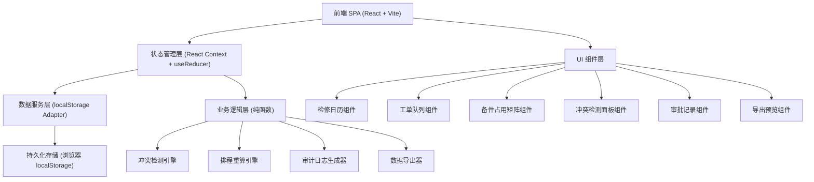
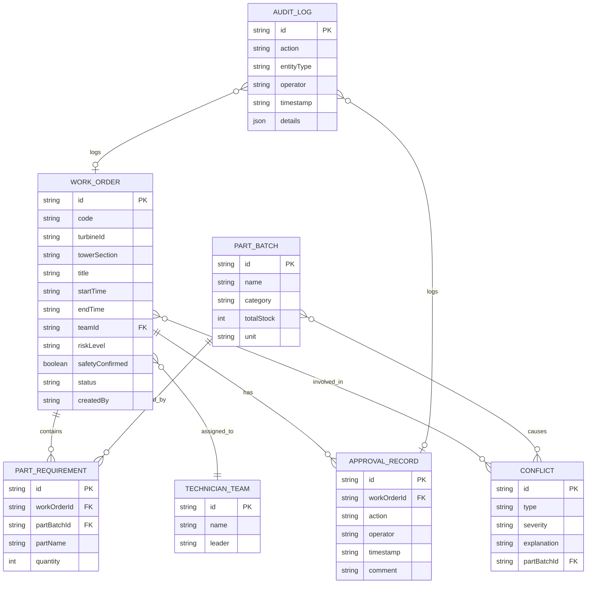

## 1. 架构设计



## 2. 技术说明

- 前端：React@18 + TypeScript + Vite
- 样式：TailwindCSS@3 + CSS 自定义属性（设计令牌）
- 状态管理：React Context + useReducer（多 Context 分层：工单、备件、冲突、审批、UI）
- 数据持久化：localStorage（按数据域分 key 存储，支持版本迁移）
- 日期处理：date-fns（轻量级，树摇友好）
- 图标：Lucide React（线性工业风）
- 后端：无（纯前端 SPA，所有业务逻辑运行于浏览器端，localStorage 模拟后端持久化）
- 数据预置：应用初始化时检测 localStorage，若为空则注入 12 条预置工单数据

## 3. 路由定义

| 路由 | 用途 |
|------|------|
| `/` | 主控制台（所有模块聚合展示，默认入口） |
| `/work-order/:id` | 工单详情页（深度链接） |

## 4. 核心类型定义

```typescript
// 工单状态
type WorkOrderStatus = 'draft' | 'pending' | 'approved' | 'locked' | 'in_progress' | 'completed' | 'delayed' | 'rejected' | 'missing_parts';

// 风险等级
type RiskLevel = 'low' | 'medium' | 'high' | 'critical';

// 塔段位置
type TowerSection = 'foundation' | 'tower_lower' | 'tower_middle' | 'tower_upper' | 'nacelle' | 'hub' | 'blade_1' | 'blade_2' | 'blade_3';

// 检修工单
interface WorkOrder {
  id: string;
  code: string;           // 工单编号 WG-2026-0001
  turbineId: string;      // 风车编号 WT-A01 ~ WT-A12
  towerSection: TowerSection;
  title: string;
  description: string;
  startTime: string;      // ISO
  endTime: string;        // ISO
  parts: PartRequirement[];
  teamId: string;
  riskLevel: RiskLevel;
  riskDescription: string;
  safetyConfirmed: boolean;
  status: WorkOrderStatus;
  createdAt: string;
  updatedAt: string;
  createdBy: string;
  approvedBy?: string;
  approvedAt?: string;
  lockedAt?: string;
  rejectionReason?: string;
}

// 备件需求
interface PartRequirement {
  partBatchId: string;    // 备件批号
  partName: string;
  quantity: number;
}

// 备件批号定义
interface PartBatch {
  id: string;
  name: string;
  category: string;
  totalStock: number;
  unit: string;
}

// 技师班组
interface TechnicianTeam {
  id: string;
  name: string;
  members: string[];
  leader: string;
}

// 审批记录
interface ApprovalRecord {
  id: string;
  workOrderId: string;
  action: 'submit' | 'approve' | 'reject' | 'lock' | 'unlock' | 'safety_confirm' | 'delay';
  operator: string;
  operatorRole: string;
  timestamp: string;
  comment: string;
}

// 冲突类型
type ConflictType = 'part_overlap' | 'window_overlap' | 'safety_unconfirmed' | 'part_shortage';

interface Conflict {
  id: string;
  type: ConflictType;
  severity: 'warning' | 'critical';
  title: string;
  explanation: string;
  workOrderIds: string[];
  partBatchId?: string;
  detectedAt: string;
}

// 审计日志
interface AuditLog {
  id: string;
  action: string;
  entityType: 'work_order' | 'part_batch' | 'approval' | 'conflict_recalc' | 'export';
  entityId?: string;
  operator: string;
  timestamp: string;
  details: Record<string, unknown>;
}

// 全局状态
interface AppState {
  workOrders: WorkOrder[];
  partBatches: PartBatch[];
  teams: TechnicianTeam[];
  conflicts: Conflict[];
  approvals: ApprovalRecord[];
  auditLogs: AuditLog[];
  filters: {
    status?: WorkOrderStatus[];
    turbineId?: string;
    teamId?: string;
    riskLevel?: RiskLevel[];
    dateRange?: [string, string];
  };
  ui: {
    selectedDate: string;
    selectedWorkOrderId?: string;
    showWorkOrderModal: boolean;
    showExportModal: boolean;
    activeTab: 'calendar' | 'queue' | 'matrix';
  };
}
```

## 5. 数据模型 ER 图



## 6. 冲突检测算法说明

### 6.1 备件占用冲突（part_overlap）
对每个备件批号，收集所有在时间上有重叠且状态 ≥ approved 的工单。若同一批号在重叠时段内累计需求数量 > 库存总量，触发冲突。

### 6.2 停机窗口冲突（window_overlap）
对同一风车，检查任意两个工单的 [startTime, endTime] 是否存在区间重叠。若重叠且均为非 draft/rejected 状态，触发冲突。

### 6.3 高风险作业未确认（safety_unconfirmed）
风险等级为 high 或 critical 的工单，若状态 ≥ approved 但 safetyConfirmed = false，触发冲突。

### 6.4 备件缺货（part_shortage）
工单所需任一备件的 totalStock < 该工单需求量（不计其他工单占用），触发冲突。

重算触发时机：工单创建/编辑、审批、状态变更、手动刷新按钮。

## 7. 预置数据清单

12 条预置工单，覆盖状态：
- 2 条 draft（草稿）
- 2 条 pending（待审批，其中 1 条含备件冲突）
- 2 条 approved（已审批，其中 1 条高风险未确认）
- 2 条 locked（已锁定，其中 1 条存在停机窗口冲突）
- 1 条 delayed（延期）
- 1 条 rejected（已驳回）
- 1 条 missing_parts（缺备件）
- 1 条 completed（已完成）

预置 8 个备件批号、4 个技师班组。
