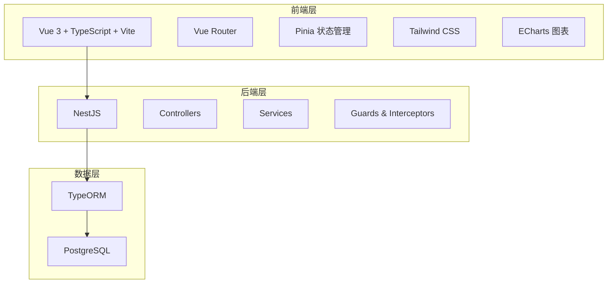
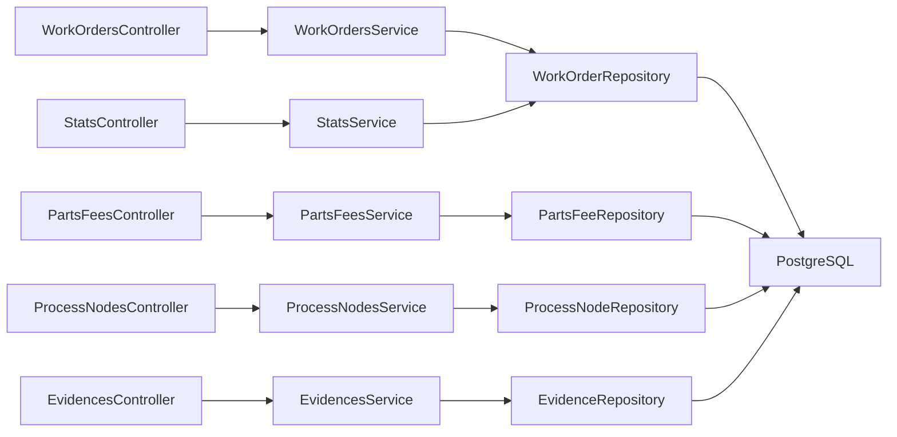
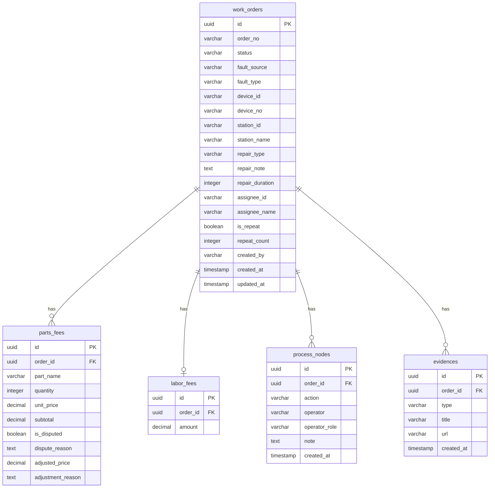

## 1. 架构设计



## 2. 技术说明

- 前端：Vue 3 + TypeScript + Vite + Tailwind CSS + Pinia + Vue Router + ECharts
- 初始化工具：vite-init（vue-ts 模板）
- 后端：NestJS + TypeORM
- 数据库：PostgreSQL
- 图标库：Lucide Vue Next

## 3. 路由定义

| 路由 | 用途 |
|------|------|
| / | 工单列表页，展示所有工单和状态看板 |
| /order/:id | 工单详情页，展示故障信息、维修动作、配件费用、证据、处理节点 |
| /settlement/:id | 费用结算页，费用明细、争议处理、费用调整 |
| /review | 复盘统计页，按故障类型、站点、耗时、返工聚合分析 |

## 4. API 定义

### 4.1 工单相关

```typescript
interface WorkOrder {
  id: string
  orderNo: string
  status: WorkOrderStatus
  faultSource: FaultSource
  faultType: FaultType
  deviceId: string
  deviceNo: string
  stationId: string
  stationName: string
  repairType: RepairType | null
  repairNote: string
  repairDuration: number | null
  assigneeId: string | null
  assigneeName: string | null
  isRepeat: boolean
  repeatCount: number
  createdBy: string
  createdAt: string
  updatedAt: string
}

enum WorkOrderStatus {
  PENDING = "pending",
  ASSIGNED = "assigned",
  REPAIRING = "repairing",
  PENDING_SETTLEMENT = "pending_settlement",
  DISPUTED = "disputed",
  ARCHIVED = "archived"
}

enum FaultSource {
  MONITOR_ALERT = "monitor_alert",
  USER_REPORT = "user_report",
  PATROL_FOUND = "patrol_found"
}

enum FaultType {
  COMMUNICATION_FAULT = "communication_fault",
  CHARGING_FAULT = "charging_fault",
  POWER_FAULT = "power_fault",
  GUN_FAULT = "gun_fault",
  SCREEN_FAULT = "screen_fault",
  OTHER = "other"
}

enum RepairType {
  REMOTE_RECOVERY = "remote_recovery",
  ON_SITE_REPAIR = "on_site_repair"
}
```

### 4.2 配件费用相关

```typescript
interface PartsFee {
  id: string
  orderId: string
  partName: string
  quantity: number
  unitPrice: number
  subtotal: number
  isDisputed: boolean
  disputeReason: string | null
  adjustedPrice: number | null
  adjustmentReason: string | null
}

interface LaborFee {
  id: string
  orderId: string
  amount: number
}
```

### 4.3 处理节点相关

```typescript
interface ProcessNode {
  id: string
  orderId: string
  action: string
  operator: string
  operatorRole: string
  note: string
  createdAt: string
}
```

### 4.4 证据相关

```typescript
interface Evidence {
  id: string
  orderId: string
  type: "image" | "log"
  title: string
  url: string
  createdAt: string
}
```

### 4.5 API 端点

| 方法 | 路径 | 用途 |
|------|------|------|
| GET | /api/orders | 获取工单列表（支持筛选） |
| GET | /api/orders/:id | 获取工单详情 |
| POST | /api/orders | 创建工单 |
| PUT | /api/orders/:id/assign | 派工 |
| PUT | /api/orders/:id/repair | 填写维修信息 |
| PUT | /api/orders/:id/submit-settlement | 提交结算 |
| PUT | /api/orders/:id/confirm | 结算确认（归档） |
| PUT | /api/orders/:id/dispute | 标记争议 |
| PUT | /api/orders/:id/adjust | 调整费用 |
| PUT | /api/orders/:id/return | 退回工单 |
| GET | /api/orders/stats | 复盘统计数据 |
| GET | /api/parts-fees/:orderId | 获取配件费用 |
| POST | /api/parts-fees | 添加配件费用 |
| PUT | /api/parts-fees/:id | 更新配件费用 |
| GET | /api/process-nodes/:orderId | 获取处理节点 |
| GET | /api/evidences/:orderId | 获取证据列表 |

## 5. 服务端架构图



## 6. 数据模型

### 6.1 数据模型定义



### 6.2 数据定义语言

```sql
CREATE TABLE work_orders (
  id UUID PRIMARY KEY DEFAULT gen_random_uuid(),
  order_no VARCHAR(32) NOT NULL UNIQUE,
  status VARCHAR(32) NOT NULL DEFAULT 'pending',
  fault_source VARCHAR(32) NOT NULL,
  fault_type VARCHAR(32) NOT NULL,
  device_id VARCHAR(64) NOT NULL,
  device_no VARCHAR(64) NOT NULL,
  station_id VARCHAR(64) NOT NULL,
  station_name VARCHAR(128) NOT NULL,
  repair_type VARCHAR(32),
  repair_note TEXT,
  repair_duration INTEGER,
  assignee_id VARCHAR(64),
  assignee_name VARCHAR(64),
  is_repeat BOOLEAN NOT NULL DEFAULT FALSE,
  repeat_count INTEGER NOT NULL DEFAULT 0,
  created_by VARCHAR(64) NOT NULL,
  created_at TIMESTAMP NOT NULL DEFAULT NOW(),
  updated_at TIMESTAMP NOT NULL DEFAULT NOW()
);

CREATE TABLE parts_fees (
  id UUID PRIMARY KEY DEFAULT gen_random_uuid(),
  order_id UUID NOT NULL REFERENCES work_orders(id) ON DELETE CASCADE,
  part_name VARCHAR(128) NOT NULL,
  quantity INTEGER NOT NULL DEFAULT 1,
  unit_price DECIMAL(10,2) NOT NULL,
  subtotal DECIMAL(10,2) NOT NULL,
  is_disputed BOOLEAN NOT NULL DEFAULT FALSE,
  dispute_reason TEXT,
  adjusted_price DECIMAL(10,2),
  adjustment_reason TEXT
);

CREATE TABLE labor_fees (
  id UUID PRIMARY KEY DEFAULT gen_random_uuid(),
  order_id UUID NOT NULL REFERENCES work_orders(id) ON DELETE CASCADE,
  amount DECIMAL(10,2) NOT NULL
);

CREATE TABLE process_nodes (
  id UUID PRIMARY KEY DEFAULT gen_random_uuid(),
  order_id UUID NOT NULL REFERENCES work_orders(id) ON DELETE CASCADE,
  action VARCHAR(64) NOT NULL,
  operator VARCHAR(64) NOT NULL,
  operator_role VARCHAR(32) NOT NULL,
  note TEXT,
  created_at TIMESTAMP NOT NULL DEFAULT NOW()
);

CREATE TABLE evidences (
  id UUID PRIMARY KEY DEFAULT gen_random_uuid(),
  order_id UUID NOT NULL REFERENCES work_orders(id) ON DELETE CASCADE,
  type VARCHAR(16) NOT NULL,
  title VARCHAR(256) NOT NULL,
  url VARCHAR(512) NOT NULL,
  created_at TIMESTAMP NOT NULL DEFAULT NOW()
);

CREATE INDEX idx_work_orders_status ON work_orders(status);
CREATE INDEX idx_work_orders_station ON work_orders(station_id);
CREATE INDEX idx_work_orders_fault_type ON work_orders(fault_type);
CREATE INDEX idx_work_orders_created_at ON work_orders(created_at);
CREATE INDEX idx_parts_fees_order_id ON parts_fees(order_id);
CREATE INDEX idx_process_nodes_order_id ON process_nodes(order_id);
CREATE INDEX idx_evidences_order_id ON evidences(order_id);
CREATE INDEX idx_work_orders_device_no ON work_orders(device_no);
```
