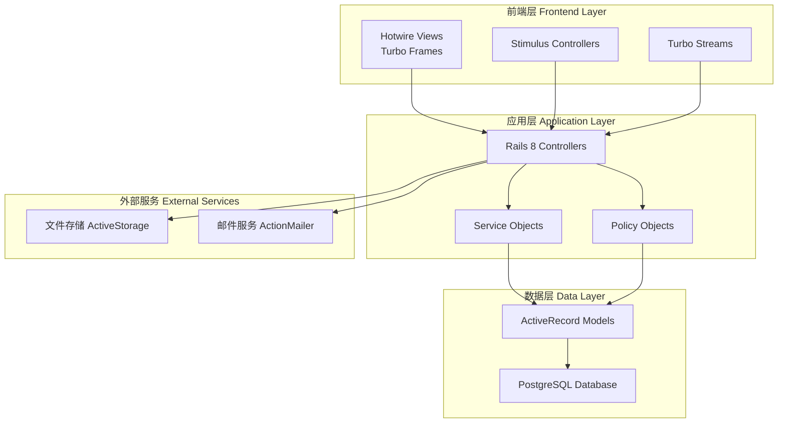
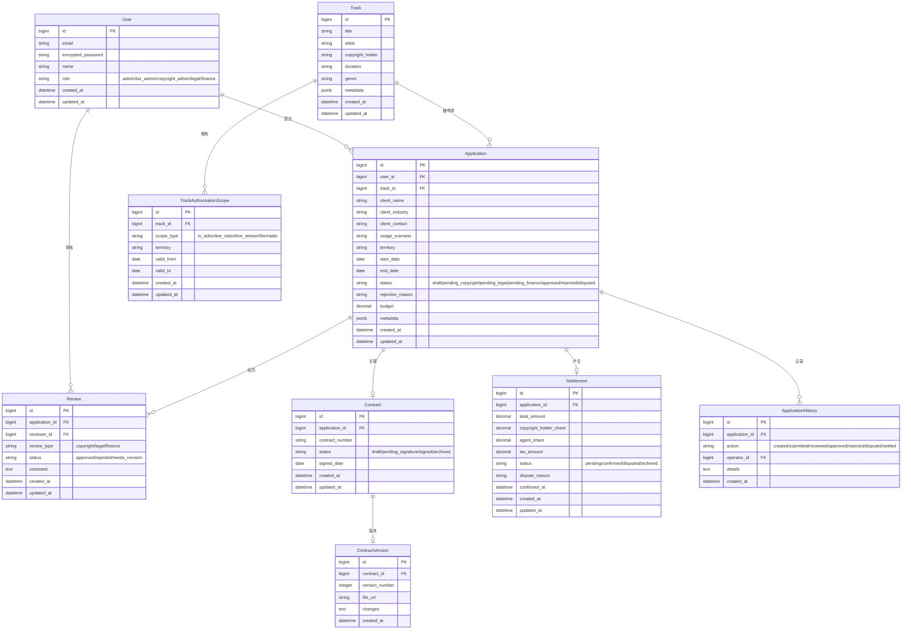
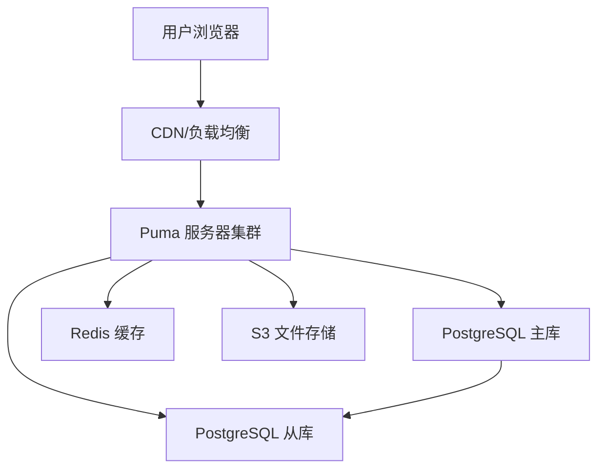

# 版权音乐商用授权申请与播放场景核验平台 - 技术架构文档

## 1. 架构设计



## 2. 技术栈说明

### 2.1 后端技术栈

- **框架：** Ruby on Rails 8.0
- **语言：** Ruby 3.3+
- **数据库：** PostgreSQL 16
- **Web 服务器：** Puma
- **进程管理：** Kamal（生产环境）

### 2.2 前端技术栈

- **视图层：** Hotwire (Turbo + Stimulus)
- **样式：** Tailwind CSS 3.4
- **JavaScript：** ES6+ (通过 importmap)
- **图标：** Heroicons

### 2.3 开发工具

- **版本控制：** Git
- **依赖管理：** Bundler + npm
- **测试框架：** RSpec + Capybara
- **代码质量：** RuboCop + Brakeman

## 3. 路由定义

| 路由 | HTTP 方法 | 用途 | 控制器#动作 |
|------|----------|------|------------|
| / | GET | 首页/仪表盘 | dashboard#index |
| /auth/login | GET | 登录页面 | sessions#new |
| /auth/login | POST | 登录处理 | sessions#create |
| /auth/logout | DELETE | 登出 | sessions#destroy |
| /applications | GET | 授权申请列表 | applications#index |
| /applications/new | GET | 新建申请表单 | applications#new |
| /applications | POST | 创建申请 | applications#create |
| /applications/:id | GET | 申请详情 | applications#show |
| /applications/:id/edit | GET | 编辑申请 | applications#edit |
| /applications/:id | PATCH | 更新申请 | applications#update |
| /applications/:id/review | POST | 审核申请 | applications#review |
| /applications/:id/approve | POST | 通过申请 | applications#approve |
| /applications/:id/reject | POST | 驳回申请 | applications#reject |
| /tracks | GET | 曲库列表 | tracks#index |
| /tracks/:id | GET | 曲目详情 | tracks#show |
| /tracks/search | GET | 曲目搜索 | tracks#search |
| /contracts | GET | 合同列表 | contracts#index |
| /contracts/:id | GET | 合同详情 | contracts#show |
| /settlements | GET | 结算列表 | settlements#index |
| /settlements/:id | GET | 结算详情 | settlements#show |
| /settlements/:id/confirm | POST | 确认结算 | settlements#confirm |
| /settlements/:id/dispute | POST | 发起争议 | settlements#dispute |
| /analytics | GET | 复盘分析 | analytics#index |
| /admin/users | GET | 用户管理 | admin/users#index |
| /admin/users | POST | 创建用户 | admin/users#create |

## 4. 数据模型

### 4.1 数据模型定义



### 4.2 数据定义语言

```sql
-- 用户表
CREATE TABLE users (
    id BIGSERIAL PRIMARY KEY,
    email VARCHAR(255) NOT NULL UNIQUE,
    encrypted_password VARCHAR(255) NOT NULL,
    name VARCHAR(100) NOT NULL,
    role VARCHAR(20) NOT NULL CHECK (role IN ('admin', 'biz_admin', 'copyright_admin', 'legal', 'finance')),
    created_at TIMESTAMP NOT NULL DEFAULT CURRENT_TIMESTAMP,
    updated_at TIMESTAMP NOT NULL DEFAULT CURRENT_TIMESTAMP
);

CREATE INDEX idx_users_email ON users(email);
CREATE INDEX idx_users_role ON users(role);

-- 曲目表
CREATE TABLE tracks (
    id BIGSERIAL PRIMARY KEY,
    title VARCHAR(255) NOT NULL,
    artist VARCHAR(255) NOT NULL,
    copyright_holder VARCHAR(255) NOT NULL,
    duration INTEGER NOT NULL,
    genre VARCHAR(50),
    metadata JSONB DEFAULT '{}',
    created_at TIMESTAMP NOT NULL DEFAULT CURRENT_TIMESTAMP,
    updated_at TIMESTAMP NOT NULL DEFAULT CURRENT_TIMESTAMP
);

CREATE INDEX idx_tracks_title ON tracks(title);
CREATE INDEX idx_tracks_artist ON tracks(artist);
CREATE INDEX idx_tracks_holder ON tracks(copyright_holder);

-- 曲目授权范围表
CREATE TABLE track_authorization_scopes (
    id BIGSERIAL PRIMARY KEY,
    track_id BIGINT NOT NULL REFERENCES tracks(id) ON DELETE CASCADE,
    scope_type VARCHAR(50) NOT NULL CHECK (scope_type IN ('tv_ad', 'online_video', 'live_stream', 'film', 'radio', 'other')),
    territory VARCHAR(100) NOT NULL,
    valid_from DATE NOT NULL,
    valid_to DATE NOT NULL,
    created_at TIMESTAMP NOT NULL DEFAULT CURRENT_TIMESTAMP,
    updated_at TIMESTAMP NOT NULL DEFAULT CURRENT_TIMESTAMP
);

CREATE INDEX idx_track_scopes_track ON track_authorization_scopes(track_id);
CREATE INDEX idx_track_scopes_type ON track_authorization_scopes(scope_type);

-- 授权申请表
CREATE TABLE applications (
    id BIGSERIAL PRIMARY KEY,
    user_id BIGINT NOT NULL REFERENCES users(id),
    track_id BIGINT NOT NULL REFERENCES tracks(id),
    client_name VARCHAR(255) NOT NULL,
    client_industry VARCHAR(100),
    client_contact VARCHAR(255),
    usage_scenario VARCHAR(50) NOT NULL CHECK (usage_scenario IN ('tv_ad', 'online_video', 'live_stream', 'film', 'radio', 'other')),
    territory VARCHAR(100) NOT NULL,
    start_date DATE NOT NULL,
    end_date DATE NOT NULL,
    status VARCHAR(20) NOT NULL DEFAULT 'draft' CHECK (status IN ('draft', 'pending_copyright', 'pending_legal', 'pending_finance', 'approved', 'rejected', 'disputed')),
    rejection_reason TEXT,
    budget DECIMAL(12, 2),
    metadata JSONB DEFAULT '{}',
    created_at TIMESTAMP NOT NULL DEFAULT CURRENT_TIMESTAMP,
    updated_at TIMESTAMP NOT NULL DEFAULT CURRENT_TIMESTAMP
);

CREATE INDEX idx_applications_user ON applications(user_id);
CREATE INDEX idx_applications_track ON applications(track_id);
CREATE INDEX idx_applications_status ON applications(status);
CREATE INDEX idx_applications_dates ON applications(start_date, end_date);

-- 审核记录表
CREATE TABLE reviews (
    id BIGSERIAL PRIMARY KEY,
    application_id BIGINT NOT NULL REFERENCES applications(id) ON DELETE CASCADE,
    reviewer_id BIGINT NOT NULL REFERENCES users(id),
    review_type VARCHAR(20) NOT NULL CHECK (review_type IN ('copyright', 'legal', 'finance')),
    status VARCHAR(20) NOT NULL CHECK (status IN ('approved', 'rejected', 'needs_revision')),
    comment TEXT,
    created_at TIMESTAMP NOT NULL DEFAULT CURRENT_TIMESTAMP,
    updated_at TIMESTAMP NOT NULL DEFAULT CURRENT_TIMESTAMP
);

CREATE INDEX idx_reviews_application ON reviews(application_id);
CREATE INDEX idx_reviews_reviewer ON reviews(reviewer_id);
CREATE INDEX idx_reviews_type ON reviews(review_type);

-- 合同表
CREATE TABLE contracts (
    id BIGSERIAL PRIMARY KEY,
    application_id BIGINT NOT NULL REFERENCES applications(id),
    contract_number VARCHAR(50) NOT NULL UNIQUE,
    status VARCHAR(20) NOT NULL DEFAULT 'draft' CHECK (status IN ('draft', 'pending_signature', 'signed', 'archived')),
    signed_date DATE,
    created_at TIMESTAMP NOT NULL DEFAULT CURRENT_TIMESTAMP,
    updated_at TIMESTAMP NOT NULL DEFAULT CURRENT_TIMESTAMP
);

CREATE INDEX idx_contracts_application ON contracts(application_id);
CREATE INDEX idx_contracts_status ON contracts(status);

-- 合同版本表
CREATE TABLE contract_versions (
    id BIGSERIAL PRIMARY KEY,
    contract_id BIGINT NOT NULL REFERENCES contracts(id) ON DELETE CASCADE,
    version_number INTEGER NOT NULL,
    file_url VARCHAR(500) NOT NULL,
    changes TEXT,
    created_at TIMESTAMP NOT NULL DEFAULT CURRENT_TIMESTAMP
);

CREATE INDEX idx_contract_versions_contract ON contract_versions(contract_id);

-- 结算表
CREATE TABLE settlements (
    id BIGSERIAL PRIMARY KEY,
    application_id BIGINT NOT NULL REFERENCES applications(id),
    total_amount DECIMAL(12, 2) NOT NULL,
    copyright_holder_share DECIMAL(5, 2) NOT NULL,
    agent_share DECIMAL(5, 2) NOT NULL,
    tax_amount DECIMAL(10, 2),
    status VARCHAR(20) NOT NULL DEFAULT 'pending' CHECK (status IN ('pending', 'confirmed', 'disputed', 'archived')),
    dispute_reason TEXT,
    confirmed_at TIMESTAMP,
    created_at TIMESTAMP NOT NULL DEFAULT CURRENT_TIMESTAMP,
    updated_at TIMESTAMP NOT NULL DEFAULT CURRENT_TIMESTAMP
);

CREATE INDEX idx_settlements_application ON settlements(application_id);
CREATE INDEX idx_settlements_status ON settlements(status);

-- 申请历史表
CREATE TABLE application_histories (
    id BIGSERIAL PRIMARY KEY,
    application_id BIGINT NOT NULL REFERENCES applications(id) ON DELETE CASCADE,
    action VARCHAR(20) NOT NULL CHECK (action IN ('created', 'submitted', 'reviewed', 'approved', 'rejected', 'disputed', 'settled', 'archived')),
    operator_id BIGINT REFERENCES users(id),
    details TEXT,
    created_at TIMESTAMP NOT NULL DEFAULT CURRENT_TIMESTAMP
);

CREATE INDEX idx_histories_application ON application_histories(application_id);
CREATE INDEX idx_histories_action ON application_histories(action);

-- Active Storage 附件表（Rails 内置）
CREATE TABLE active_storage_blobs (
    id BIGSERIAL PRIMARY KEY,
    key VARCHAR(255) NOT NULL UNIQUE,
    filename VARCHAR(255) NOT NULL,
    content_type VARCHAR(255),
    metadata TEXT,
    byte_size BIGINT NOT NULL,
    checksum VARCHAR(64) NOT NULL,
    created_at TIMESTAMP NOT NULL DEFAULT CURRENT_TIMESTAMP
);

CREATE TABLE active_storage_attachments (
    id BIGSERIAL PRIMARY KEY,
    name VARCHAR(255) NOT NULL,
    record_type VARCHAR(255) NOT NULL,
    record_id BIGINT NOT NULL,
    blob_id BIGINT NOT NULL REFERENCES active_storage_blobs(id),
    created_at TIMESTAMP NOT NULL DEFAULT CURRENT_TIMESTAMP
);

CREATE INDEX idx_active_storage_attachments ON active_storage_attachments(record_type, record_id, name, blob_id);
```

## 5. 服务架构

### 5.1 核心服务对象

```ruby
# 授权申请服务
class ApplicationService
  def create_application(user, params)
    # 创建申请逻辑
  end
  
  def submit_application(application)
    # 提交申请逻辑
  end
  
  def validate_scenario(application)
    # 验证场景是否超范围
  end
  
  def check_date_conflict(application)
    # 检查日期冲突
  end
end

# 审核服务
class ReviewService
  def review_copyright(application, reviewer, params)
    # 版权管理员审核
  end
  
  def review_legal(application, reviewer, params)
    # 法务审核
  end
  
  def review_finance(application, reviewer, params)
    # 财务审核
  end
end

# 结算服务
class SettlementService
  def calculate_settlement(application)
    # 计算结算金额
  end
  
  def confirm_settlement(settlement, reviewer)
    # 确认结算
  end
  
  def handle_dispute(settlement, params)
    # 处理争议
  end
end

# 复盘分析服务
class AnalyticsService
  def aggregate_by_industry(date_range)
    # 按行业聚合
  end
  
  def aggregate_by_track(date_range)
    # 按曲库聚合
  end
  
  def aggregate_by_exception(date_range)
    # 按异常原因聚合
  end
  
  def aggregate_by_cycle(date_range)
    # 按授权周期聚合
  end
end
```

### 5.2 策略对象

```ruby
# 授权策略
class ApplicationPolicy
  def initialize(user, application)
    @user = user
    @application = application
  end
  
  def index?
    true
  end
  
  def show?
    true
  end
  
  def create?
    user.biz_admin?
  end
  
  def review_copyright?
    user.copyright_admin?
  end
  
  def review_legal?
    user.legal?
  end
  
  def review_finance?
    user.finance?
  end
end
```

## 6. 视图组件架构

### 6.1 Turbo Frame 组件

```erb
<!-- 申请列表 Frame -->
<%= turbo_frame_tag "applications" do %>
  <!-- 申请列表内容 -->
<% end %>

<!-- 申请详情 Frame -->
<%= turbo_frame_tag dom_id(@application) do %>
  <!-- 申请详情内容 -->
<% end %>

<!-- 审核表单 Frame -->
<%= turbo_frame_tag "review_form" do %>
  <!-- 审核表单内容 -->
<% end %>
```

### 6.2 Stimulus Controllers

```javascript
// 场景选择控制器
// app/javascript/controllers/scenario_controller.js
export default class extends Controller {
  static targets = ["scenario", "warning"]
  
  connect() {
    this.validateScenario()
  }
  
  validateScenario() {
    // 验证场景是否超范围
  }
}

// 日期冲突检测控制器
// app/javascript/controllers/date_conflict_controller.js
export default class extends Controller {
  static targets = ["startDate", "endDate", "warning"]
  
  checkConflict() {
    // 检查日期冲突
  }
}

// 时间线控制器
// app/javascript/controllers/timeline_controller.js
export default class extends Controller {
  static targets = ["node"]
  
  connect() {
    this.animateNodes()
  }
  
  animateNodes() {
    // 时间线动画
  }
}
```

## 7. 部署架构

### 7.1 生产环境部署



### 7.2 环境配置

- **开发环境：** 本地 Docker Compose
- **测试环境：** CI/CD 自动部署
- **生产环境：** Kamal 部署到云服务器

## 8. 安全措施

### 8.1 认证授权

- 使用 Devise 进行用户认证
- 使用 Pundit 进行授权控制
- 基于角色的访问控制（RBAC）

### 8.2 数据安全

- 敏感数据加密存储（AES-256）
- HTTPS 强制加密传输
- SQL 注入防护（参数化查询）
- XSS 防护（Rails 内置）

### 8.3 操作审计

- 记录所有关键操作到 application_histories 表
- 使用 PaperTrail 或 Audited gem 进行变更追踪

## 9. 性能优化

### 9.1 数据库优化

- 为常用查询字段添加索引
- 使用数据库连接池
- 查询优化（N+1 问题避免）

### 9.2 缓存策略

- 使用 Redis 缓存热点数据
- 页面片段缓存（Russian Doll Caching）
- HTTP 缓存头设置

### 9.3 前端优化

- Turbo 预加载链接
- 图片懒加载
- CSS/JS 压缩

## 10. 测试策略

### 10.1 单元测试

- Model 测试：验证数据模型和业务逻辑
- Service 测试：验证服务对象方法
- Policy 测试：验证授权策略

### 10.2 集成测试

- Controller 测试：验证请求响应
- System 测试：验证完整用户流程

### 10.3 测试数据

使用 Factory Bot 创建测试数据，预置四种场景的样本数据用于测试。