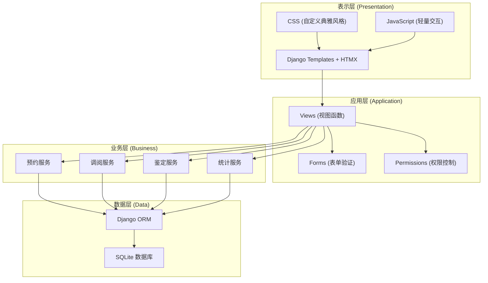
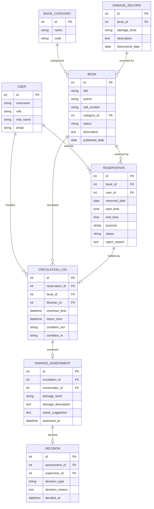

# 图书馆珍本阅览预约与损伤鉴定系统 - 技术架构文档

## 1. 架构设计



## 2. 技术描述

- **后端框架**: Django 5.x
- **前端技术**: Django Templates + HTMX + 原生 CSS
- **数据库**: SQLite 3 (开发/演示环境)
- **认证系统**: Django 内置 auth 系统 + 自定义用户角色
- **样式方案**: 自定义 CSS，典雅学术风格，CSS 变量管理主题色
- **交互增强**: HTMX 实现局部刷新、无刷新表单提交
- **图表展示**: Chart.js (CDN 引入)
- **日期处理**: Django 内置 timezone + Python datetime

## 3. 项目结构

```
rare_books/
├── manage.py
├── config/                  # 项目配置
│   ├── __init__.py
│   ├── settings.py
│   ├── urls.py
│   └── wsgi.py
├── accounts/                # 用户与角色管理
│   ├── models.py
│   ├── views.py
│   ├── forms.py
│   └── urls.py
├── catalog/                 # 书目管理
│   ├── models.py
│   ├── views.py
│   ├── forms.py
│   └── urls.py
├── reservations/            # 预约管理
│   ├── models.py
│   ├── views.py
│   ├── forms.py
│   └── urls.py
├── circulation/             # 调阅与流通
│   ├── models.py
│   ├── views.py
│   ├── forms.py
│   └── urls.py
├── conservation/            # 损伤鉴定与修复
│   ├── models.py
│   ├── views.py
│   ├── forms.py
│   └── urls.py
├── statistics/              # 统计分析
│   ├── views.py
│   └── urls.py
├── templates/               # 模板目录
│   ├── base.html
│   ├── registration/
│   ├── catalog/
│   ├── reservations/
│   ├── circulation/
│   ├── conservation/
│   └── statistics/
├── static/
│   ├── css/
│   │   └── style.css
│   └── js/
└── fixtures/                # 预置数据
    └── sample_data.json
```

## 4. 路由定义

| 路由 | 视图 | 用途 |
|------|------|------|
| `/` | `dashboard_view` | 首页仪表盘 |
| `/accounts/login/` | `LoginView` | 用户登录 |
| `/accounts/logout/` | `LogoutView` | 用户登出 |
| `/catalog/` | `book_list` | 珍本书目列表 |
| `/catalog/<int:pk>/` | `book_detail` | 珍本详情页 |
| `/reservations/` | `reservation_list` | 预约列表 |
| `/reservations/new/` | `reservation_create` | 提交预约申请 |
| `/reservations/<int:pk>/` | `reservation_detail` | 预约详情 |
| `/reservations/<int:pk>/approve/` | `reservation_approve` | 馆员审核通过 |
| `/reservations/<int:pk>/reject/` | `reservation_reject` | 馆员驳回预约 |
| `/circulation/checkout/<int:pk>/` | `checkout_book` | 办理调阅交接 |
| `/circulation/return/<int:pk>/` | `return_book` | 办理归还登记 |
| `/conservation/assess/<int:pk>/` | `damage_assessment` | 损伤鉴定 |
| `/conservation/decision/<int:pk>/` | `final_decision` | 主管最终决策 |
| `/statistics/` | `statistics_dashboard` | 统计分析页 |

## 5. 数据模型

### 5.1 ER 图



### 5.2 模型详细说明

#### User (用户模型)
- 基于 Django 内置 User 扩展，使用 `profile` 或自定义 User 模型
- 角色：`reader`(读者), `librarian`(馆员), `conservator`(修复员), `supervisor`(主管)
- 字段：真实姓名、读者类型（教师/研究生/本科生）、所属机构、资格证明文件状态

#### Book (珍本)
- 核心书目信息：书名、作者、索书号、出版信息、馆藏位置
- 状态：`in_stack`(在库), `reserved`(已预约), `checked_out`(已调出), `in_repair`(修复中), `restricted`(限制阅览)
- 关联：馆藏分类、历史损伤记录

#### Reservation (预约)
- 关联珍本与读者
- 预约日期与时段
- 阅览目的
- 状态流转：`pending`(待审核) → `approved`(已通过) / `rejected`(已驳回) → `completed`(已完成) / `cancelled`(已取消)
- 资格校验：读者类型匹配度、历史违规记录、证明材料完整性

#### CirculationLog (流通记录)
- 调阅/归还交接记录
- 调出时状态描述、归还时状态描述
- 经手馆员
- 关联预约记录

#### DamageAssessment (损伤鉴定)
- 关联流通记录
- 损伤等级：`minor`(轻微), `moderate`(中度), `severe`(严重), `critical`(损毁)
- 损伤详细描述（部位、类型、程度）
- 修复建议
- 鉴定人与鉴定时间

#### Decision (归库决策)
- 关联损伤鉴定
- 决策类型：`return_to_stack`(正常归库), `send_for_repair`(送修), `compensation`(赔付)
- 决策理由
- 主管签名与决策时间

## 6. 业务规则

### 6.1 预约资格规则
- 教师读者：可预约所有级别珍本，无需额外证明
- 研究生读者：可预约普通珍本，特藏珍本需导师推荐信
- 本科生读者：仅可预约普通珍本，且需所在学院出具的研究证明
- 有逾期未还记录的读者：暂停预约资格
- 有损伤记录未处理的读者：需完成赔付后方可再次预约

### 6.2 调阅冲突检测
- 同一珍本在同一时段只能有一个有效预约
- 调阅时段内珍本状态为 `checked_out`，不可重复预约
- 归还后有 24 小时冷却期（用于损伤鉴定与归库处理）

### 6.3 损伤鉴定流程
- 归还登记后自动生成待鉴定任务
- 修复员需在 48 小时内完成鉴定
- 鉴定完成后提交主管决策
- 主管决策后更新珍本状态

### 6.4 预置样本数据
- **正常归库样本**：一册普通珍本，完整的预约→调阅→阅览→归还→鉴定→正常归库流程
- **页面污损样本**：一册珍本鉴定为中度污损，主管决策送修
- **预约资格不足样本**：本科生读者预约特藏珍本被系统拦截，提示需要学院证明
- **调阅冲突样本**：两笔同一珍本同时段的预约，第二笔被馆员驳回

## 7. 权限控制

| 功能 | 读者 | 馆员 | 修复员 | 主管 |
|------|------|------|--------|------|
| 浏览书目 | ✓ | ✓ | ✓ | ✓ |
| 提交预约 | ✓ | - | - | - |
| 审核预约 | - | ✓ | - | ✓ |
| 办理调阅 | - | ✓ | - | - |
| 办理归还 | - | ✓ | - | - |
| 损伤鉴定 | - | - | ✓ | ✓ |
| 归库决策 | - | - | - | ✓ |
| 查看统计 | - | - | - | ✓ |
| 用户管理 | - | - | - | ✓ |
