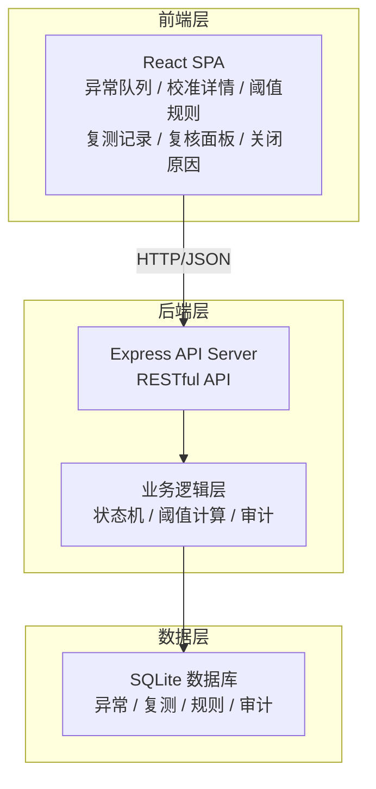
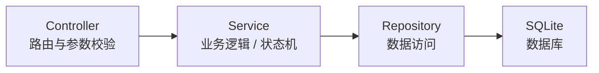
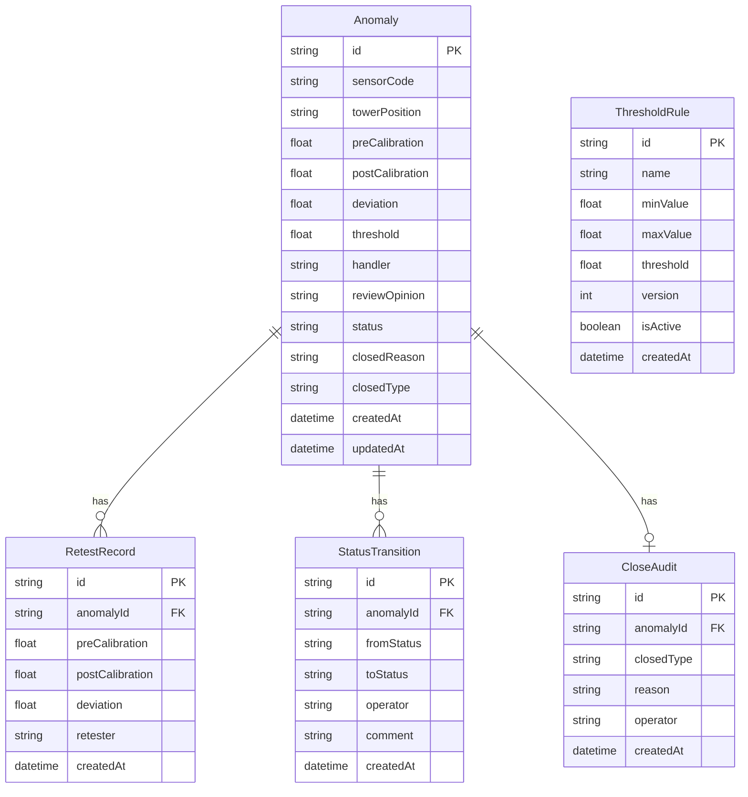

## 1. 架构设计



## 2. 技术说明

- 前端：React@18 + Tailwind CSS@3 + Vite
- 初始化工具：Vite (react-ts template)
- 后端：Express@4
- 数据库：SQLite (better-sqlite3)
- 状态管理：React Context + useReducer
- 动画：CSS Transitions + Framer Motion

## 3. 路由定义

| 路由 | 用途 |
|------|------|
| / | 异常队列（首页） |
| /anomaly/:id | 校准详情 |
| /rules | 阈值规则 |
| /retest/:anomalyId | 复测记录 |
| /review | 复核面板 |
| /close/:anomalyId | 关闭原因 |

## 4. API 定义

### 4.1 异常管理

```typescript
interface Anomaly {
  id: string
  sensorCode: string
  towerPosition: string
  preCalibration: number
  postCalibration: number
  deviation: number
  threshold: number
  handler: string
  reviewOpinion: string | null
  status: "normal" | "retest_needed" | "threshold_exceeded" | "review_missing" | "closed"
  closedReason: string | null
  closedType: "fixed" | "false_alarm" | "duplicate" | "other" | null
  createdAt: string
  updatedAt: string
}

// POST /api/anomalies - 创建异常
// GET /api/anomalies - 查询异常列表（支持状态过滤、搜索、排序）
// GET /api/anomalies/:id - 获取异常详情
// PUT /api/anomalies/:id - 更新异常
// PUT /api/anomalies/:id/close - 关闭异常
```

### 4.2 复测记录

```typescript
interface RetestRecord {
  id: string
  anomalyId: string
  preCalibration: number
  postCalibration: number
  deviation: number
  retester: string
  createdAt: string
}

// POST /api/retests - 新增复测记录
// GET /api/retests/:anomalyId - 获取某异常的复测记录
```

### 4.3 阈值规则

```typescript
interface ThresholdRule {
  id: string
  name: string
  minValue: number
  maxValue: number
  threshold: number
  version: number
  isActive: boolean
  createdAt: string
}

// GET /api/rules - 获取规则列表
// POST /api/rules - 新增规则（自动递增版本号）
// PUT /api/rules/:id - 编辑规则
// GET /api/rules/:id/versions - 获取规则版本历史
```

### 4.4 状态流转与审计

```typescript
interface StatusTransition {
  id: string
  anomalyId: string
  fromStatus: string
  toStatus: string
  operator: string
  comment: string | null
  createdAt: string
}

interface CloseAudit {
  id: string
  anomalyId: string
  closedType: string
  reason: string
  operator: string
  createdAt: string
}

// GET /api/transitions/:anomalyId - 获取状态流转记录
// GET /api/audits/:anomalyId - 获取关闭审计记录
```

## 5. 服务器架构



## 6. 数据模型

### 6.1 数据模型定义



### 6.2 数据定义语言

```sql
CREATE TABLE anomalies (
  id TEXT PRIMARY KEY,
  sensor_code TEXT NOT NULL,
  tower_position TEXT NOT NULL,
  pre_calibration REAL NOT NULL,
  post_calibration REAL NOT NULL,
  deviation REAL NOT NULL,
  threshold REAL NOT NULL,
  handler TEXT NOT NULL,
  review_opinion TEXT,
  status TEXT NOT NULL DEFAULT 'normal',
  closed_reason TEXT,
  closed_type TEXT,
  created_at TEXT NOT NULL DEFAULT (datetime('now')),
  updated_at TEXT NOT NULL DEFAULT (datetime('now'))
);

CREATE TABLE retest_records (
  id TEXT PRIMARY KEY,
  anomaly_id TEXT NOT NULL,
  pre_calibration REAL NOT NULL,
  post_calibration REAL NOT NULL,
  deviation REAL NOT NULL,
  retester TEXT NOT NULL,
  created_at TEXT NOT NULL DEFAULT (datetime('now')),
  FOREIGN KEY (anomaly_id) REFERENCES anomalies(id)
);

CREATE TABLE threshold_rules (
  id TEXT PRIMARY KEY,
  name TEXT NOT NULL,
  min_value REAL NOT NULL,
  max_value REAL NOT NULL,
  threshold REAL NOT NULL,
  version INTEGER NOT NULL DEFAULT 1,
  is_active INTEGER NOT NULL DEFAULT 1,
  created_at TEXT NOT NULL DEFAULT (datetime('now'))
);

CREATE TABLE status_transitions (
  id TEXT PRIMARY KEY,
  anomaly_id TEXT NOT NULL,
  from_status TEXT NOT NULL,
  to_status TEXT NOT NULL,
  operator TEXT NOT NULL,
  comment TEXT,
  created_at TEXT NOT NULL DEFAULT (datetime('now')),
  FOREIGN KEY (anomaly_id) REFERENCES anomalies(id)
);

CREATE TABLE close_audits (
  id TEXT PRIMARY KEY,
  anomaly_id TEXT NOT NULL,
  closed_type TEXT NOT NULL,
  reason TEXT NOT NULL,
  operator TEXT NOT NULL,
  created_at TEXT NOT NULL DEFAULT (datetime('now')),
  FOREIGN KEY (anomaly_id) REFERENCES anomalies(id)
);

CREATE INDEX idx_anomalies_status ON anomalies(status);
CREATE INDEX idx_anomalies_sensor_code ON anomalies(sensor_code);
CREATE INDEX idx_retest_records_anomaly_id ON retest_records(anomaly_id);
CREATE INDEX idx_status_transitions_anomaly_id ON status_transitions(anomaly_id);
```
