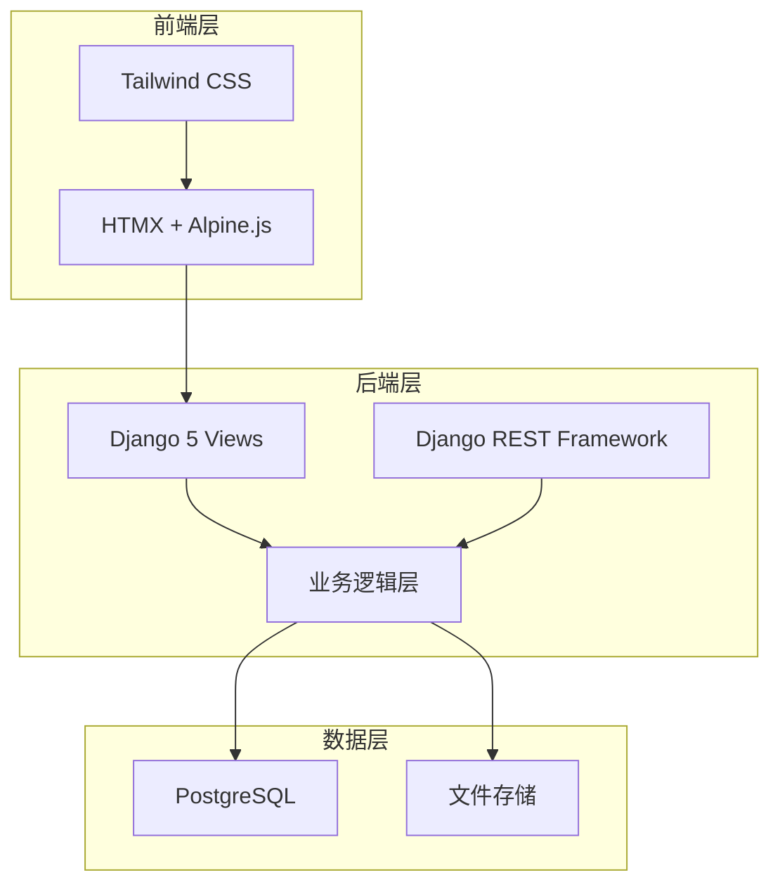
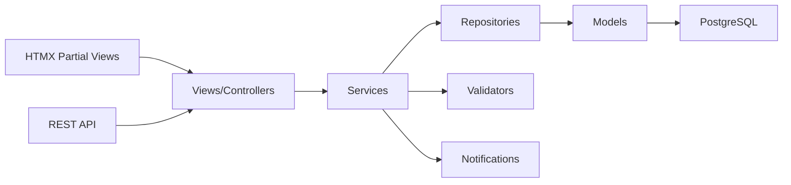
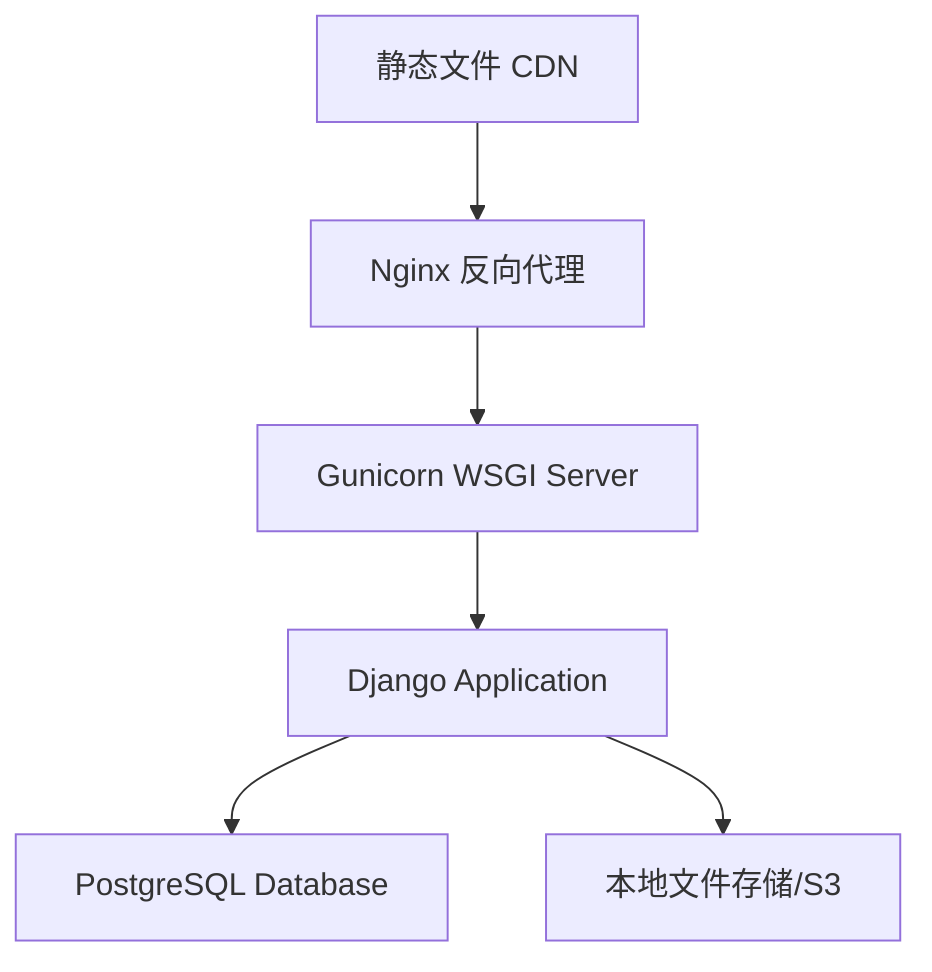

# 入境动物隔离观察与放行系统 - 技术架构文档

## 1. 架构设计



## 2. 技术栈说明

- **前端**: HTMX 1.9 + Alpine.js 3.x + Tailwind CSS 3.4
- **后端框架**: Django 5.0 + Django REST Framework 3.14
- **数据库**: PostgreSQL 16
- **初始化工具**: django-admin startproject
- **文件存储**: 本地文件系统 (生产环境可切换至 S3)
- **任务队列**: Django Background Tasks (用于异步通知)

## 3. 路由定义

| 路由 | 用途 |
|------|------|
| `/` | 首页仪表盘，显示批次概览和快捷操作 |
| `/batches/` | 批次管理页面，列表展示所有批次 |
| `/batches/<id>/` | 批次详情页面，展示完整信息和操作面板 |
| `/batches/create/` | 新建批次表单页面 |
| `/observations/` | 观察记录列表页面 |
| `/observations/create/<batch_id>/` | 为指定批次创建观察记录 |
| `/reports/` | 统计报表页面 |
| `/api/batches/` | 批次 REST API |
| `/api/observations/` | 观察记录 REST API |
| `/api/reports/` | 统计数据 API |
| `/accounts/login/` | 用户登录页面 |
| `/accounts/logout/` | 用户登出 |

## 4. API 定义

### 4.1 批次 API

```typescript
interface Batch {
    id: number;
    batch_number: string;
    animal_type: string;
    quantity: number;
    origin_country: string;
    entry_date: date;
    quarantine_site: string;
    status: 'pending' | 'quarantining' | 'reviewing' | 'approving' | 'released' | 'returned' | 'extended';
    vaccine_certificate: boolean;
    health_certificate: boolean;
    quarantine_certificate: boolean;
    created_by: number;
    created_at: datetime;
    updated_at: datetime;
}

interface BatchCreateRequest {
    animal_type: string;
    quantity: number;
    origin_country: string;
    entry_date: date;
    vaccine_certificate_file?: File;
    health_certificate_file?: File;
}

interface BatchListResponse {
    batches: Batch[];
    total: number;
    page: number;
    page_size: number;
}
```

### 4.2 观察记录 API

```typescript
interface ObservationRecord {
    id: number;
    batch: number;
    observation_date: date;
    observer: number;
    temperature: number;
    appetite: 'normal' | 'decreased' | 'none';
    mental_state: 'active' | 'normal' | 'lethargic';
    excretion: 'normal' | 'abnormal';
    abnormal_symptoms?: string;
    feeding_record: string;
    water_intake: string;
    environment_temp: number;
    environment_humidity: number;
    photos: string[];
    is_abnormal: boolean;
    created_at: datetime;
}

interface ObservationCreateRequest {
    batch_id: number;
    observation_date: date;
    temperature: number;
    appetite: string;
    mental_state: string;
    excretion: string;
    abnormal_symptoms?: string;
    feeding_record: string;
    water_intake: string;
    environment_temp: number;
    environment_humidity: number;
    photos?: File[];
}
```

### 4.3 审批 API

```typescript
interface ApprovalRequest {
    batch_id: number;
    decision: 'release' | 'extend' | 'return';
    reason?: string;
    extend_days?: number;
}

interface VeterinaryReviewRequest {
    batch_id: number;
    health_status: 'healthy' | 'attention_needed' | 'unhealthy';
    comments: string;
    signature: string;
}
```

### 4.4 统计 API

```typescript
interface StatisticsResponse {
    by_country: {
        country: string;
        batch_count: number;
        abnormal_rate: number;
    }[];
    by_animal_type: {
        animal_type: string;
        batch_count: number;
        released_count: number;
    }[];
    by_abnormal_reason: {
        reason: string;
        count: number;
    }[];
    by_quarantine_days: {
        days_range: string;
        batch_count: number;
    }[];
}
```

## 5. 服务端架构图



## 6. 数据模型

### 6.1 数据模型定义

```mermaid
erDiagram
    User ||--o{ Batch : creates
    User ||--o{ ObservationRecord : writes
    User ||--o{ ApprovalHistory : approves
    Batch ||--o{ ObservationRecord : has
    Batch ||--o{ ApprovalHistory : has
    Batch ||--o{ Document : has
    Batch ||--o{ StatusHistory : has
    
    User {
        int id PK
        string username
        string password
        string role
        string full_name
        datetime created_at
    }
    
    Batch {
        int id PK
        string batch_number UK
        string animal_type
        int quantity
        string origin_country
        date entry_date
        string quarantine_site
        string status
        boolean vaccine_certificate
        boolean health_certificate
        boolean quarantine_certificate
        int created_by FK
        datetime created_at
        datetime updated_at
    }
    
    ObservationRecord {
        int id PK
        int batch_id FK
        date observation_date
        int observer_id FK
        decimal temperature
        string appetite
        string mental_state
        string excretion
        text abnormal_symptoms
        text feeding_record
        string water_intake
        decimal environment_temp
        decimal environment_humidity
        boolean is_abnormal
        datetime created_at
    }
    
    Document {
        int id PK
        int batch_id FK
        string document_type
        string file_path
        string uploaded_by FK
        datetime uploaded_at
    }
    
    ApprovalHistory {
        int id PK
        int batch_id FK
        int approver_id FK
        string action
        text reason
        datetime action_time
    }
    
    StatusHistory {
        int id PK
        int batch_id FK
        string from_status
        string to_status
        int changed_by FK
        datetime changed_at
        text notes
    }
```



### 6.2 数据定义语言

```sql
-- 用户表
CREATE TABLE users (
    id SERIAL PRIMARY KEY,
    username VARCHAR(50) UNIQUE NOT NULL,
    password VARCHAR(255) NOT NULL,
    role VARCHAR(20) NOT NULL CHECK (role IN ('inspector', 'quarantine_staff', 'veterinarian', 'supervisor')),
    full_name VARCHAR(100) NOT NULL,
    is_active BOOLEAN DEFAULT TRUE,
    created_at TIMESTAMP DEFAULT CURRENT_TIMESTAMP,
    updated_at TIMESTAMP DEFAULT CURRENT_TIMESTAMP
);

-- 批次表
CREATE TABLE batches (
    id SERIAL PRIMARY KEY,
    batch_number VARCHAR(20) UNIQUE NOT NULL,
    animal_type VARCHAR(50) NOT NULL,
    quantity INTEGER NOT NULL,
    origin_country VARCHAR(50) NOT NULL,
    entry_date DATE NOT NULL,
    quarantine_site VARCHAR(100) NOT NULL,
    status VARCHAR(20) NOT NULL DEFAULT 'pending' CHECK (status IN ('pending', 'quarantining', 'reviewing', 'approving', 'released', 'returned', 'extended')),
    vaccine_certificate BOOLEAN DEFAULT FALSE,
    health_certificate BOOLEAN DEFAULT FALSE,
    quarantine_certificate BOOLEAN DEFAULT FALSE,
    created_by INTEGER REFERENCES users(id),
    created_at TIMESTAMP DEFAULT CURRENT_TIMESTAMP,
    updated_at TIMESTAMP DEFAULT CURRENT_TIMESTAMP
);

-- 观察记录表
CREATE TABLE observation_records (
    id SERIAL PRIMARY KEY,
    batch_id INTEGER NOT NULL REFERENCES batches(id),
    observation_date DATE NOT NULL,
    observer_id INTEGER NOT NULL REFERENCES users(id),
    temperature DECIMAL(5,2),
    appetite VARCHAR(20) CHECK (appetite IN ('normal', 'decreased', 'none')),
    mental_state VARCHAR(20) CHECK (mental_state IN ('active', 'normal', 'lethargic')),
    excretion VARCHAR(20) CHECK (excretion IN ('normal', 'abnormal')),
    abnormal_symptoms TEXT,
    feeding_record TEXT NOT NULL,
    water_intake VARCHAR(100),
    environment_temp DECIMAL(5,2),
    environment_humidity DECIMAL(5,2),
    is_abnormal BOOLEAN DEFAULT FALSE,
    created_at TIMESTAMP DEFAULT CURRENT_TIMESTAMP,
    UNIQUE(batch_id, observation_date)
);

-- 文档表
CREATE TABLE documents (
    id SERIAL PRIMARY KEY,
    batch_id INTEGER NOT NULL REFERENCES batches(id),
    document_type VARCHAR(50) NOT NULL CHECK (document_type IN ('vaccine_certificate', 'health_certificate', 'quarantine_certificate', 'photo', 'other')),
    file_path VARCHAR(255) NOT NULL,
    uploaded_by INTEGER REFERENCES users(id),
    uploaded_at TIMESTAMP DEFAULT CURRENT_TIMESTAMP
);

-- 审批历史表
CREATE TABLE approval_history (
    id SERIAL PRIMARY KEY,
    batch_id INTEGER NOT NULL REFERENCES batches(id),
    approver_id INTEGER NOT NULL REFERENCES users(id),
    action VARCHAR(20) NOT NULL CHECK (action IN ('release', 'extend', 'return', 'veterinary_review')),
    reason TEXT,
    extend_days INTEGER,
    action_time TIMESTAMP DEFAULT CURRENT_TIMESTAMP
);

-- 状态变更历史表
CREATE TABLE status_history (
    id SERIAL PRIMARY KEY,
    batch_id INTEGER NOT NULL REFERENCES batches(id),
    from_status VARCHAR(20),
    to_status VARCHAR(20) NOT NULL,
    changed_by INTEGER NOT NULL REFERENCES users(id),
    changed_at TIMESTAMP DEFAULT CURRENT_TIMESTAMP,
    notes TEXT
);

-- 创建索引
CREATE INDEX idx_batches_status ON batches(status);
CREATE INDEX idx_batches_origin_country ON batches(origin_country);
CREATE INDEX idx_batches_entry_date ON batches(entry_date);
CREATE INDEX idx_observation_records_batch ON observation_records(batch_id);
CREATE INDEX idx_observation_records_date ON observation_records(observation_date);
CREATE INDEX idx_observation_records_abnormal ON observation_records(is_abnormal);

-- 插入预置用户数据
INSERT INTO users (username, password, role, full_name) VALUES
('inspector1', 'pbkdf2_sha256\$...', 'inspector', '张检疫'),
('staff1', 'pbkdf2_sha256\$...', 'quarantine_staff', '李场员'),
('vet1', 'pbkdf2_sha256\$...', 'veterinarian', '王兽医'),
('supervisor1', 'pbkdf2_sha256\$...', 'supervisor', '赵监管');

-- 插入预置样本数据
-- 样本1: 正常放行
INSERT INTO batches (batch_number, animal_type, quantity, origin_country, entry_date, quarantine_site, status, vaccine_certificate, health_certificate, quarantine_certificate, created_by) VALUES
('BATCH-2024-001', '牛', 50, '澳大利亚', '2024-01-15', '北京隔离场A区', 'released', TRUE, TRUE, TRUE, 1);

-- 样本2: 疫苗证明缺失
INSERT INTO batches (batch_number, animal_type, quantity, origin_country, entry_date, quarantine_site, status, vaccine_certificate, health_certificate, quarantine_certificate, created_by) VALUES
('BATCH-2024-002', '羊', 100, '新西兰', '2024-01-18', '上海隔离场B区', 'approving', FALSE, TRUE, TRUE, 1);

-- 样本3: 观察异常
INSERT INTO batches (batch_number, animal_type, quantity, origin_country, entry_date, quarantine_site, status, vaccine_certificate, health_certificate, quarantine_certificate, created_by) VALUES
('BATCH-2024-003', '猪', 200, '美国', '2024-01-20', '广州隔离场C区', 'reviewing', TRUE, TRUE, FALSE, 1);

-- 样本4: 饲养记录漏填
INSERT INTO batches (batch_number, animal_type, quantity, origin_country, entry_date, quarantine_site, status, vaccine_certificate, health_certificate, quarantine_certificate, created_by) VALUES
('BATCH-2024-004', '马', 20, '德国', '2024-01-22', '深圳隔离场D区', 'quarantining', TRUE, TRUE, TRUE, 1);
```

## 7. HTMX 交互设计

### 7.1 批次列表动态加载

```html
<div hx-get="/api/batches/" 
     hx-trigger="load, search from:#search-input, filter from:.filter-select"
     hx-target="#batch-list"
     hx-indicator="#loading-spinner">
    <div id="batch-list"></div>
</div>
```

### 7.2 观察记录表单提交

```html
<form hx-post="/api/observations/" 
      hx-target="#observation-list"
      hx-swap="innerHTML"
      hx-indicator="#submit-spinner">
    <input type="hidden" name="batch_id" value="{{ batch.id }}">
    <!-- 表单字段 -->
    <button type="submit">提交观察记录</button>
</form>
```

### 7.3 放行决策实时验证

```html
<button hx-post="/api/batches/{{ batch.id }}/release/"
        hx-target="#decision-result"
        hx-confirm="确认放行该批次？"
        disabled>
    放行
</button>

<div class="alert alert-danger">
    疫苗证明缺失，无法放行！
</div>

```

## 8. 权限控制

使用 Django 内置权限系统，为不同角色分配不同权限：

- **检疫员 (inspector)**: 批次创建、查看、上传文档
- **隔离场人员 (quarantine_staff)**: 观察记录创建、编辑、查看
- **兽医 (veterinarian)**: 观察记录查看、健康复核、签署意见
- **监管负责人 (supervisor)**: 所有权限、审批决策、查看统计报表

## 9. 文件存储方案

开发环境使用本地文件系统存储上传的文档和照片：

```
media/
├── certificates/
│   ├── vaccine/
│   ├── health/
│   └── quarantine/
└── photos/
    └── observations/
```

生产环境可配置切换至云存储服务（如阿里云 OSS、AWS S3）。

## 10. 部署架构

