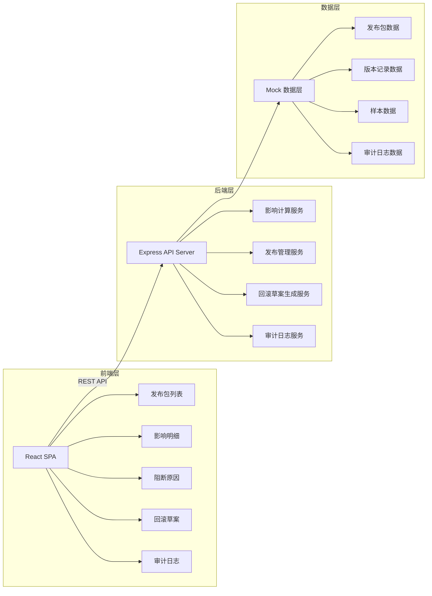
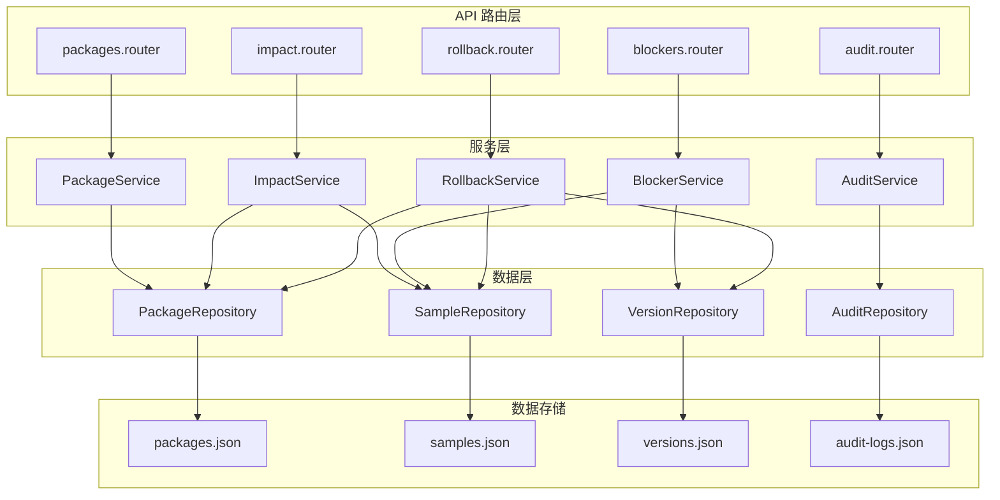
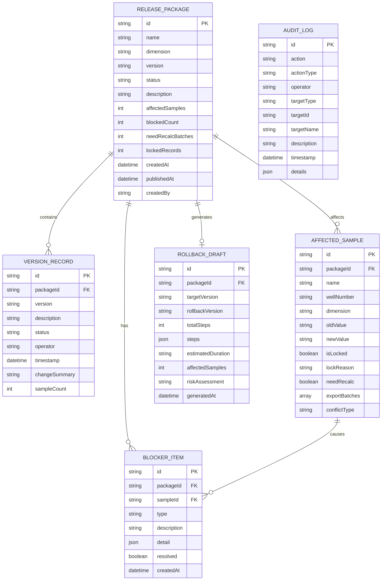

## 1. 架构设计



## 2. 技术描述

- **前端**：React@18 + TypeScript + tailwindcss@3 + vite@5
- **状态管理**：React Context + useReducer
- **路由**：React Router v6
- **后端**：Express@4 + TypeScript
- **数据**：Mock 数据（JSON 文件模拟）
- **构建工具**：Vite
- **代码规范**：ESLint + Prettier

## 3. 路由定义

| 路由路径 | 页面名称 | 功能描述 |
|----------|----------|----------|
| / | 发布看板首页 | 发布包卡片列表 + 版本时间轴 |
| /impact/:packageId | 影响明细页 | 受影响样本、锁定记录、需重算批次 |
| /blockers/:packageId | 阻断原因页 | 阻断项列表、铭文冲突比对 |
| /rollback/:packageId | 回滚草案页 | 回滚方案、影响评估、执行步骤 |
| /audit | 审计日志页 | 全量操作记录、筛选查询 |

## 4. API 定义

### 4.1 类型定义

```typescript
// 发布包维度枚举
enum PackageDimension {
  CLARITY = 'clarity',        // 拓片清晰度
  RUST_LEVEL = 'rust_level',  // 锈蚀级别
  INSCRIPTION = 'inscription', // 铭文残缺
  ORIENTATION = 'orientation'  // 井圈方位
}

// 发布状态枚举
enum ReleaseStatus {
  DRAFT = 'draft',           // 草稿
  PENDING = 'pending',       // 待发布
  BLOCKED = 'blocked',       // 有阻断
  PUBLISHED = 'published',   // 已发布
  ROLLED_BACK = 'rolled_back' // 已回滚
}

// 发布包
interface ReleasePackage {
  id: string;
  name: string;
  dimension: PackageDimension;
  version: string;
  status: ReleaseStatus;
  description: string;
  affectedSamples: number;
  blockedCount: number;
  needRecalcBatches: number;
  lockedRecords: number;
  createdAt: string;
  publishedAt?: string;
  createdBy: string;
}

// 版本记录
interface VersionRecord {
  id: string;
  packageId: string;
  version: string;
  description: string;
  status: ReleaseStatus;
  operator: string;
  timestamp: string;
  changeSummary: string;
  sampleCount: number;
}

// 受影响样本
interface AffectedSample {
  id: string;
  name: string;
  wellNumber: string;
  dimension: PackageDimension;
  oldValue: string;
  newValue: string;
  isLocked: boolean;
  lockReason?: string;
  needRecalc: boolean;
  exportBatches: string[];
  conflictType?: 'inscription' | 'lock' | 'review';
}

// 阻断项
interface BlockerItem {
  id: string;
  packageId: string;
  type: 'lock' | 'conflict' | 'review';
  sampleId: string;
  sampleName: string;
  description: string;
  detail: {
    oldValue?: string;
    newValue?: string;
    conflictFields?: string[];
    lockReason?: string;
  };
  resolved: boolean;
  createdAt: string;
}

// 回滚步骤
interface RollbackStep {
  id: string;
  stepNumber: number;
  title: string;
  description: string;
  riskLevel: 'low' | 'medium' | 'high';
  estimatedTime: string;
  status: 'pending' | 'running' | 'completed' | 'failed';
  affectedCount: number;
}

// 回滚草案
interface RollbackDraft {
  packageId: string;
  packageName: string;
  targetVersion: string;
  rollbackVersion: string;
  totalSteps: number;
  steps: RollbackStep[];
  estimatedDuration: string;
  affectedSamples: number;
  riskAssessment: string;
  generatedAt: string;
}

// 审计日志
interface AuditLog {
  id: string;
  action: string;
  actionType: 'create' | 'update' | 'publish' | 'rollback' | 'resolve' | 'review';
  operator: string;
  targetType: string;
  targetId: string;
  targetName: string;
  description: string;
  timestamp: string;
  details: Record<string, any>;
}
```

### 4.2 接口列表

| 接口路径 | 方法 | 功能描述 |
|----------|------|----------|
| /api/packages | GET | 获取发布包列表 |
| /api/packages/:id | GET | 获取发布包详情 |
| /api/packages/:id/impact | GET | 获取影响明细 |
| /api/packages/:id/blockers | GET | 获取阻断项列表 |
| /api/packages/:id/publish | POST | 确认发布 |
| /api/packages/:id/rollback-draft | GET | 获取回滚草案 |
| /api/packages/:id/rollback | POST | 执行回滚 |
| /api/blockers/:id/resolve | POST | 解决阻断项 |
| /api/audit-logs | GET | 获取审计日志列表 |
| /api/versions | GET | 获取版本记录列表 |

## 5. 服务器架构图



## 6. 数据模型

### 6.1 ER 图



### 6.2 初始数据规划

- **4 个发布包**：拓片清晰度、锈蚀级别、铭文残缺、井圈方位各一个
- **12 条版本记录**：每个发布包 3 条版本历史记录
- **样本数据**：每个发布包约 20-30 个受影响样本
- **阻断项数据**：包含锁定记录、铭文冲突等场景
- **审计日志**：约 30-50 条操作记录
